# Compass Platform — Technical Specification

**Reusable, Multi-Tenant Conversational AI Platform**

> **Status:** Draft &nbsp;|&nbsp; **Authored:** 2026-06-26 &nbsp;|&nbsp; **Author:** Ketema Harris &nbsp;|&nbsp; **Initiative:** Compass Platform &nbsp;|&nbsp; **MVP Gate:** September 1, 2026

---

## Document Provenance

This specification is derived from **five CCABDD requirement manifests**, one per Stellarus-owned platform primitive. Every assertion in the sections below is traceable to the `SEQ`/`INV`/`IP` clause IDs published by these manifests:

| # | Manifest | Primitive | Clause families |
|---|---|---|---|
| 1 | `REQ-2026-SDK-A1-SURFACE-LOCK` | SDK / API (`@stellarus/chat-client`) | `SDK-A1-SEQ-*`, SDK `INV-*`, SDK `IP-*` |
| 2 | Tenant Context / Auth Spine (D1) | CCS context-token contract | `TENANT-D1-SEQ-*`, TENANT `INV-*` |
| 3 | Thin-Router Broker (B1/B2) | `agentic-broker-api` `POST /dispatch` | `BROKER-B1B2-SEQ-*`, BROKER `INV-*` |
| 4 | Escalation / CCaaS (E1/E2) | `GenesysAdapter`, PII/PHI Redactor | `ESCALATION-E1E2-SEQ-*`, E1E2 `INV-*` |
| 5 | Launch Telemetry (F1/F2) | Loki -> Grafana SLOs, launch gates | `TELEMETRY-F1F2-SEQ-*`, F1F2 `INV-*`, F1F2 `IP-*` |

Each section's prose cites these clause IDs inline; the provenance chain runs requirement manifest -> contract -> tests -> implementation, per CCABDD.

---

## Table of Contents

1. [Overview & Vision](#1-overview--vision)
2. [Scope (In / Out for the September MVP)](#2-scope-in--out-for-the-september-mvp)
3. [Architecture Position](#3-architecture-position)
4. [The Thin-Router Broker](#4-the-thin-router-broker)
5. [The BFF Layer & Surface Rule](#5-the-bff-layer--surface-rule)
6. [Tenant Context & Auth Spine](#6-tenant-context--auth-spine)
7. [The SDK (@stellarus/chat-client)](#7-the-sdk-stellaruschat-client)
8. [Data Source Adapters](#8-data-source-adapters)
9. [End-to-End Data Flows](#9-end-to-end-data-flows)
10. [Escalation & CCaaS Handoff](#10-escalation--ccaas-handoff)
11. [Telemetry, SLOs & Launch Gates](#11-telemetry-slos--launch-gates)
12. [Security & Multi-Tenancy](#12-security--multi-tenancy)
13. [Capability Registry & Extensibility](#13-capability-registry--extensibility)
14. [Deployment & Infrastructure](#14-deployment--infrastructure)

---


> **What this document covers:** the Compass Platform — Stellarus's reusable, multi-tenant conversational AI platform — and the six Stellarus-owned projects (SDK, Broker, Benefits Grounding, Tenant/Auth Spine, Escalation, Telemetry) that compose it. This section establishes the platform identity, the trust/ownership boundary, the canonical runtime path, the project map with leads and dates, and the as-built starting line.
>
> **Quick navigation:**
> - **Canonical runtime path (the thesis in one picture):** §1.3
> - **The six projects, leads, and the Jun 28 cross-team gates:** §1.5
> - **As-built reality (main vs branch vs requirements-only):** §1.6
> - **Critical-path ordering and rework risk:** §1.7
> - **Key constraints & rules:** §1.8
>
> This section owns platform identity, boundary, and project topology; the per-project sections (§2 SDK, §3 Broker, §4 Benefits Grounding, §5 Tenant/Auth Spine, §6 Escalation, §7 Telemetry) own the runtime contracts, data models, and operational detail for each primitive.

## 1. Overview & Vision

The Compass Platform is Stellarus's reusable, multi-tenant conversational AI platform — the Stellarus-owned primitives through which any customer surface reaches a conversational AI runtime. It is owned by Jason Jackson. Its first customer is BSC member chat; its MVP gate is September 1, 2026; its platform horizon is December 31, 2026.

The platform is the suite of primitives — the Stellarus SDK and API, the Thin-Router Broker, the Tenant/Auth Spine, Benefits grounding, Escalation, and Telemetry — that together let a customer surface (today BSC member chat; tomorrow IVR, CSR-assist, or a partner-embedded widget) hold a grounded, governed conversation without that surface ever knowing the name of the runtime behind it. Compass owns the trust boundary, the tenant identity, the conversation record, and the observability; the external runtime is a swappable detail behind an adapter.

The trust and ownership boundary is the load-bearing assertion of this spec. **Compass Platform is not a Sierra integration and it is not a Genesys integration.** Sierra.ai is runtime-only — reached exclusively through `SierraAdapter`, never a hardcoded broker dependency, and its native session storage is **not** the authoritative conversation record. The Benefits Service is the governed source of truth for plan and benefits data, reached through `RestBenefitsAdapter` under the `benefits.query` capability. Genesys Cloud CCaaS receives escalation handoffs only through `GenesysAdapter`. Every external system the platform touches sits behind a Stellarus-owned adapter, registered by YAML, so that the platform — not the vendor — owns the contract.

### 1.1 The strategic thesis (all three analysts agree)

Three independent analyses converged on one verdict, and it governs every downstream decision in this document:

- **Do NOT ship BSC member chat as a one-off Sierra/Genesys integration.** Ship it through Stellarus primitives. A direct Sierra/Genesys wiring would deliver one customer and zero platform.
- **SDK + Broker ownership is the platform moat.** The value Stellarus captures is the reusable surface (`@stellarus/chat-client`) and the capability-neutral router (`agentic-broker-api`), not the conversation a single vendor happens to power this quarter.
- **Any Sierra-direct data fetch is temporary debt.** It is permitted only with a named owner, explicit exit criteria, and a removal date. Debt without those three attributes is a constitutional violation of the thesis, not a pragmatic shortcut.

The structural enforcement of this thesis lives in the broker. The **Thin-Router Broker** exposes exactly ONE HTTP endpoint — `POST /dispatch` — and never knows semantic names; it resolves an opaque `(capability, customer_slug)` pair to a `DataSourceAdapter` via YAML (INV-01, INV-02, INV-11). Because there is structurally nowhere to add a named semantic route, there is nowhere for business logic to accumulate, and there is no path by which a "quick Sierra call" becomes load-bearing.

### 1.2 What the platform owns and does NOT own

Compass Platform **owns**:

- the edge trust boundary and tenant identity — the **Context token** issued by **CCS**, validated by **ContextTokenGuard**, carrying the immutable `customer_slug`
- the conversational SDK surface (`@stellarus/chat-client`) consumed by customer developers
- the capability-neutral routing contract (`POST /dispatch`) and the adapter registry
- the authoritative, durable conversation record (`PostgresConversationAdapter`, per-tenant Postgres schema isolation — INV-06, INV-07)
- the PII/PHI redaction gate that scrubs all content before it leaves Stellarus
- the launch telemetry, SLOs, and go/no-go launch gates

Compass Platform does **not** own:

- the conversational AI model itself — Sierra.ai is runtime-only, behind `SierraAdapter`
- the live-agent contact center — Genesys Cloud CCaaS, behind `GenesysAdapter`
- human authentication — Auth0 authenticates humans via PKCE; CCS does not authenticate humans
- the plan/benefits data of record — the Benefits Service is the governed source of truth

### 1.3 The canonical runtime path

The runtime path is the thesis rendered as a contract. A customer surface never reaches Sierra, Genesys, or the Benefits Service directly; it reaches a Stellarus primitive, and the platform fans out from there:

```text
Customer surface
  -> Stellarus SDK/API (@stellarus/chat-client)
    -> Stellarus Broker (POST /dispatch, capability-neutral)
      -> Sierra.ai (chat.completion via SierraAdapter)
      (+ Benefits grounding   — benefits.query   via RestBenefitsAdapter)
      (+ Escalation / CCaaS    — escalation.initiate via GenesysAdapter)
      (+ Telemetry             — structured logs -> Loki -> Grafana SLO panels)
```

Rendered with the trust roles made explicit at the edge — APIM as the network boundary, the BFF as the per-surface semantic owner, the broker as the capability-neutral router:

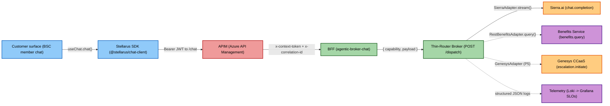
```mermaid
flowchart LR
    classDef client fill:#90caf9,stroke:#1565c0,stroke-width:2px,color:#000
    classDef edge fill:#ef9a9a,stroke:#b71c1c,stroke-width:2px,color:#000
    classDef backend fill:#a5d6a7,stroke:#1b5e20,stroke-width:2px,color:#000
    classDef sierra fill:#ffcc80,stroke:#e65100,stroke-width:2px,color:#000
    classDef store fill:#ce93d8,stroke:#4a148c,stroke-width:2px,color:#000

    surface["Customer surface (BSC member chat)"]:::client
    sdk["Stellarus SDK (@stellarus/chat-client)"]:::client
    apim["APIM (Azure API Management)"]:::edge
    bff["BFF (agentic-broker-chat)"]:::backend
    broker["Thin-Router Broker (POST /dispatch)"]:::backend
    sierra["Sierra.ai (chat.completion)"]:::sierra
    benefits["Benefits Service (benefits.query)"]:::store
    genesys["Genesys CCaaS (escalation.initiate)"]:::sierra
    telemetry["Telemetry (Loki -> Grafana SLOs)"]:::store

    surface -->|"useChat.chat()"| sdk
    sdk -->|"Bearer JWT to /chat"| apim
    apim -->|"x-context-token + x-correlation-id"| bff
    bff -->|"{ capability, payload }"| broker
    broker -->|"SierraAdapter.stream()"| sierra
    broker -.->|"RestBenefitsAdapter.query()"| benefits
    broker -.->|"GenesysAdapter (P5)"| genesys
    broker -.->|"structured JSON logs"| telemetry
```

The path maps directly onto the manifest sequence clauses: the SDK acquires the Auth0 Bearer JWT before any fetch (SDK-A1-SEQ-2); APIM validates it, calls CCS `POST /validate/token`, and injects `x-context-token` plus a fresh `x-correlation-id` (TENANT-D1-SEQ-1, SEQ-3, SEQ-4); the BFF translates surface semantics into a capability string and dispatches (BROKER-B1B2-SEQ-1); the broker checks the per-tenant rate limit before resolving (BROKER-B1B2-SEQ-2), resolves to the adapter (SEQ-3), and propagates `x-correlation-id` onward (SEQ-7). The full step-by-step lives in the per-project flow sections; this section asserts only the shape.

### 1.4 First customer, MVP gate, and platform horizon

| Milestone | Value | Meaning |
|---|---|---|
| First customer | BSC member chat | the first surface to ride the platform end to end |
| MVP gate | September 1, 2026 | Release Candidate go/no-go for BSC member chat (Jason signs the F1 launch gates) |
| Platform horizon | December 31, 2026 | the date by which the primitives are reusable beyond BSC |

### 1.5 The six-project platform map

Compass Platform decomposes into six Stellarus-owned projects. Each is an independently ownable primitive; together they compose the canonical runtime path.

| Project | Primitive | Lead | Target | Cross-team gate |
|---|---|---|---|---|
| **P1** | SDK / API (`@stellarus/chat-client`) | Julie Hughes | Aug 15 | SDK v2 (A5) blocked on E1 (escalation) |
| **P2** | Thin-Router Broker (`agentic-broker-api`) | Jason | Aug 15 | — |
| **P3** | Benefits Grounding (`RestBenefitsAdapter`, Benefits Service) | Jason | Aug 15 | **Jun 28** (C1/C2 Benefits LoB) |
| **P4** | Tenant Context / Auth Spine (CCS context-token contract) | Jason | Jul 15 | **Jun 28** (D1 token contract) — everything downstream blocks here |
| **P5** | Escalation / CCaaS (`GenesysAdapter`, PII/PHI Redactor) | Julie Hughes | Aug 15 | E1 mechanics BLOCKED on BSC/PTP |
| **P6** | Launch Telemetry (Loki -> Grafana SLOs, launch gates) | Jason | Aug 25 | F1 thresholds blocked on ACT-JASON |

The two **June 28 cross-team gates** are the spine of the schedule. **P4 (D1)** — the CCS context-token contract — gates everything downstream: the SDK cannot lock its surface, the broker cannot enforce `@RequireScopes('chat')`, and Benefits cannot perform production RS256 verification until the token contract and the `chat` scope (WI-D1-A, IRREVERSIBLE) are settled. **P3 (C1/C2)** — Benefits LoB coverage and fallback — gates the grounding answer quality the MVP is judged on. SDK v2 (A5), which carries the escalation event shape, is blocked on **E1** (Genesys API mechanics), which is itself BLOCKED on BSC/PTP.

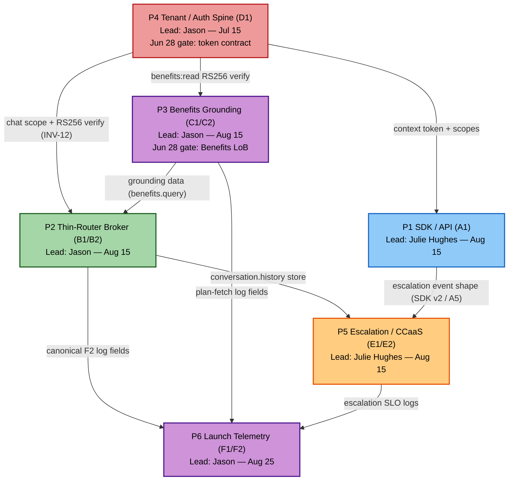
```mermaid
flowchart TB
    classDef client fill:#90caf9,stroke:#1565c0,stroke-width:2px,color:#000
    classDef backend fill:#a5d6a7,stroke:#1b5e20,stroke-width:2px,color:#000
    classDef edge fill:#ef9a9a,stroke:#b71c1c,stroke-width:2px,color:#000
    classDef store fill:#ce93d8,stroke:#4a148c,stroke-width:2px,color:#000
    classDef sierra fill:#ffcc80,stroke:#e65100,stroke-width:2px,color:#000

    p4["P4 Tenant / Auth Spine (D1)<br/>Lead: Jason — Jul 15<br/>Jun 28 gate: token contract"]:::edge
    p3["P3 Benefits Grounding (C1/C2)<br/>Lead: Jason — Aug 15<br/>Jun 28 gate: Benefits LoB"]:::store
    p1["P1 SDK / API (A1)<br/>Lead: Julie Hughes — Aug 15"]:::client
    p2["P2 Thin-Router Broker (B1/B2)<br/>Lead: Jason — Aug 15"]:::backend
    p5["P5 Escalation / CCaaS (E1/E2)<br/>Lead: Julie Hughes — Aug 15"]:::sierra
    p6["P6 Launch Telemetry (F1/F2)<br/>Lead: Jason — Aug 25"]:::store

    p4 -->|"chat scope + RS256 verify (INV-12)"| p2
    p4 -->|"context token + scopes"| p1
    p4 -->|"benefits:read RS256 verify"| p3
    p3 -->|"grounding data (benefits.query)"| p2
    p2 -->|"conversation.history store"| p5
    p1 -->|"escalation event shape (SDK v2 / A5)"| p5
    p2 -->|"canonical F2 log fields"| p6
    p3 -->|"plan-fetch log fields"| p6
    p5 -->|"escalation SLO logs"| p6
```

### 1.6 As-built reality (the starting line)

This spec is honest about where it begins. The platform is not greenfield, but it is also far from done, and the three tiers below are genuinely different states. Conflating them is the fastest path to mis-scoped work.

| Tier | State | What exists |
|---|---|---|
| **`main` (as-built today)** | merged, running | the `@stellarus/resolver` package — `(capability, customer_slug) -> DataSourceAdapter` via YAML with chokidar hot-reload — plus the `@stellarus/chat-client` core, `RestBenefitsAdapter`, and the BFF-side Plan Validation Gate (PVG) |
| **Unmerged feature branches** | written, not merged | the SDK surface (`StellarusProvider`/`useChat`/`fetchPlan`), the broker plan endpoint, JWKS rotation handling, and the whitelabel brand-slug resolver |
| **Compass Platform itself** | requirements only | the six requirements manifests — zero implementation code. This is the work this spec scopes. |

The load-bearing distinction: the **Resolver (`@stellarus/resolver`)** is on `main` and is the structural foundation the broker thin-router pattern depends on — it is distinct from the broker's `brand-slug.resolver.ts`. But the broker MVP gap (replacing `POST /v2/chat` with `POST /dispatch`, the `SierraAdapter`, the `PostgresConversationAdapter`, the `stream()` seam — WI-B1-A through WI-B1-F) is **to-be-built**. The SDK surface is written on a branch but the v1 surface lock is not merged. The Compass Platform primitives that this document specifies exist today only as the requirements manifests that source it.

### 1.7 Critical-path ordering and rework risk

The MVP gate (Sep 1, 2026) is reachable only in a fixed order, because each layer's contract is the next layer's precondition:

1. **CCS token contract + Tenant/Auth Spine (P4 / D1)** — the `chat` scope, the context-token claim set, the RS256 verification path. Everything downstream consumes the verified `customer_slug` and `scopes`.
2. **Benefits LoB coverage / fallback (P3 / C1/C2)** — the grounding the answer quality is judged on.
3. **SDK v1 surface (P1 / A1)** — the surface lock customers build against.
4. **Broker contract + alpha (P2 / B1/B2)** — `POST /dispatch`, the adapters, the conversation store.
5. **Escalation contract for SDK v2 (P5 / E1/E2)** — the typed escalation event shape and the Genesys handoff.
6. **Telemetry / launch gates (P6 / F1/F2)** — the SLOs and the go/no-go evidence chain.

**Rework risk is concentrated in two slips.** If **(1) the D1 token contract slips**, every downstream consumer — SDK scope expectations, broker `@RequireScopes('chat')`, Benefits RS256 verification — was built against a contract that then moved, forcing rework across P1, P2, and P3 simultaneously. If **(2) the C1/C2 Benefits LoB coverage slips**, the grounding data the SLO answer-quality gate measures is incomplete, and either the launch gate fails on real evidence (F1F2 INV-04 forbids "we believe") or the quality bar is silently lowered. Both are June 28 cross-team gates precisely because a late slip there is the most expensive failure the schedule can absorb.

### 1.8 Key Constraints & Rules

- **Ship through Stellarus primitives, never a vendor one-off.** BSC member chat reaches Sierra and Genesys only through Stellarus-owned adapters. A direct integration delivers one customer and zero platform.
- **The broker exposes exactly one endpoint.** `POST /dispatch` is capability-neutral; any named semantic HTTP endpoint on `agentic-broker-api` is a detectable contract violation (BROKER-B1B2 INV-01, INV-11). All semantic routing lives in BFF apps (INV-05).
- **Capabilities are opaque and YAML-registered.** The broker never references `chat`, `conversation`, or `benefits` by name in routing logic (INV-02); a new capability is a dropped YAML file in `RESOLVER_CONFIG_DIR`, never a broker code change (INV-03).
- **Sierra is runtime-only.** It is never a hardcoded broker dependency, and its native session storage is **not** the authoritative conversation record — `PostgresConversationAdapter` is (INV-06).
- **The Benefits Service is the governed source of truth** for plan/benefits data, reached via `RestBenefitsAdapter` under `benefits.query`.
- **Any Sierra-direct data fetch is temporary debt** requiring a named owner, explicit exit criteria, and a removal date. Debt missing any of the three is a thesis violation.
- **Tenant identity is resolved at the edge, never client-supplied.** `customer_slug` travels in the verified context token from APIM/CCS and drives all tenant scoping (TENANT-D1 INV-06, INV-07).
- **Distinguish as-built from to-be-built.** `main` = resolver + chat-client core + PVG; branches = SDK surface, broker plan endpoint, JWKS rotation, brand-slug; Compass Platform = requirements manifests only.

### 1.9 Decisions Still Open

| # | Question | Owner | Why it matters |
|---|---|---|---|
| 1 | `chat` scope persona grants (member + employee — exact grants TBD) | ACT-CCS / Ketema (WI-D1-A) | IRREVERSIBLE CCS migration `0003_chat_scopes.sql`; gates `@RequireScopes('chat')` on `/dispatch` |
| 2 | Benefits LoB coverage + fallback completeness (C1/C2) | Jason / Data + App team | Jun 28 cross-team gate; the grounding the answer-quality SLO is judged on |
| 3 | Genesys API mechanics, routing metadata, SLA, PII allow-list (E1-Z1..Z4) | Julie Hughes + BSC/PTP | BLOCKED; gates SDK v2 (A5) escalation event shape and `GenesysAdapter` |
| 4 | SLO threshold values + composite weights (F1-Z1, F2-Z4) | ACT-JASON | blocks all dashboard build and the F1 launch-gate evidence chain |

**The single biggest blocking decision is the D1 token contract (June 28).** It is the one input that, if it slips, forces simultaneous rework across the SDK, the broker, and Benefits Grounding — the rest of the schedule is built on the assumption that the `customer_slug`, `scopes`, and RS256 verification path are frozen by then.


## 2. Scope (In / Out for the September MVP)

The Compass Platform boundary is contested across six teams (SDK, Tenant/Auth, Broker,
Benefits, Escalation, Telemetry), so this spec leads with Scope before Architecture
Position. Everything below is framed against a single gate: the BSC member-chat Release
Candidate go/no-go on **September 1 2026**. The slice taxonomy that governs which items
get full elicitation versus a backlog note is stated at the end of this section — read it
to understand why some in-scope items carry a full contract and others carry only a thin
one.

A scope item here is a **slice**, not a feature: the smallest independently-testable,
independently-deployable vertical unit that produces a real-world observable effect. The
draft issue index decomposes the platform into **10 IRREVERSIBLE**, **~18 SLICE-LOCAL**,
and **6 DEFERRED** slices; the In/Out split below is the projection of that index onto the
September gate.

### In Scope (Sep 1 MVP)

- BSC member chat via SDK v1 — Auth0 PKCE, `StellarusProvider`, `useChat`, `fetchPlan` (A1, `@stellarus/chat-client` surface-lock, SDK-A1-SEQ-1 through SEQ-7)
- `StellarusProvider` PKCE entry point — owns token lifecycle, checks the `?code=` callback at mount (SDK-A1-SEQ-6; INV-11/12 keep Auth0 domain/audience/`useRefreshTokens` internal)
- `useChat` streaming state machine — `chat(opts)` + `abort()`, aborts in-flight SSE on unmount (SDK-A1-SEQ-7)
- `fetchPlan` three-state result — `PLAN_STATUS_NOT_FOUND` (404) / `PLAN_STATUS_OUTAGE` (503), never throws (SDK INV-06)
- broker `POST /dispatch` capability-neutral routing — the broker's only endpoint, `{ capability, payload }` plus `x-context-token` and `x-correlation-id` (B1B2 INV-01/02/11; replaces `POST /v2/chat`, WI-B1-F)
- the three live MVP capabilities — `chat.completion`, `benefits.query`, `conversation.history`, each resolved by YAML, never by broker code change (B1B2 INV-03)
- CCS context-token contract extension — the new **`chat` scope** (resource=chat, action=all), no send/receive split, gating `@RequireScopes('chat')` on `/dispatch` (WI-D1-A, IRREVERSIBLE; migration `0003_chat_scopes.sql`)
- `ContextTokenGuard` verification path — RS256 against CCS JWKS, `iss`/`aud`/`exp`, scope enforcement (TENANT-D1-SEQ-5/6/7; INV-06/07)
- `x-correlation-id` propagation — APIM-generated UUIDv4, stripped inbound, threaded BFF → broker → adapters → every log line (TENANT-D1-SEQ-3/4, BROKER-B1B2-SEQ-7, F1F2 INV-06)
- `PostgresConversationAdapter` per-tenant durable store — authoritative conversation history under `conversation.history`, `conversation-bsca.yaml` (new), per-tenant schema isolation (WI-B1-E; INV-06/07; Sierra native storage is NOT the source of truth)
- `SierraAdapter` wired via YAML — streaming adapter under `chat.completion`, `sierra-bsca.yaml`, absorbing token counting + Sierra circuit breaker (WI-B1-B/C; INV-09/10)
- `RestBenefitsAdapter` wired via YAML — `benefits.query`, `benefits-bsca.yaml` (exists), replacing the broker's `PlanHandlerService` direct-HTTP path (WI-B1-D)
- the `stream()` seam on `DataSourceAdapter` — optional `stream(): AsyncIterable<StreamEvent>` splitting query-shaped from streaming-shaped adapters (WI-B1-A, blocker)
- per-feature telemetry instrumentation — broker and benefits emit structured JSON with **exact** canonical F2 field names, no member-identifiable data (WI-F3-A/B; F1F2 INV-01a/01b/02a/02b)
- Grafana SLO panels — threshold-colored (green/yellow/red) per the F2 taxonomy via Loki LogQL, every alert annotated with `runbook_url` (WI-F3-C; F1F2 INV-03/07)
- F1 launch-gate evidence chain — documented go/no-go evidence across quality, security, privacy, support, rollback, signed off by Jason before the RC (TELEMETRY-F1F2-SEQ-6; INV-04)

### Out of Scope / Deferred

- **live Genesys escalation wiring** — the live leg defers (E1 BLOCKED on BSC/PTP: Genesys API shape E1-Z1, routing metadata E1-Z2, PII allow-list E1-Z3, SLA E1-Z4) — **but the contract-and-build-now perimeter does NOT defer:** the PII/PHI Redactor (`packages/redactor`, WI-E2-B), the SDK v2 escalation event shape (`escalation_initiated`/`_succeeded`/`_failed`/`_unavailable`, WI-E2-D), and the escalation BFF route on agentic-broker-chat (WI-E2-E) are all built and contracted this cycle; only the GenesysAdapter's live call to Genesys Cloud waits on the unblocked zones
- `csr` persona — a BSC CSR is NOT a Stellarus employee; DEFERRED to a separate persona (WI-D1-B; not in `VALID_PERSONAS`)
- ENG-286 per-consumer `aud` — referenced as a dependency only; today `aud` is the constant `stellarus-context-token`, Phase 2 per-consumer scoping is out of D1 scope (WI-D1-D)
- multi-agent routing — beyond single-capability dispatch (B6, DEFERRED)
- additional LoB adapters — beyond Sierra/REST-benefits/Postgres-conversation (C5, Q4 2026)
- analytics-app external multi-tenant GA — the BI surface stays internal; the cross-tenant cache/isolation refactor (CRIT-1/2/3, Auth0 `org_id`) is a refactor-not-rebuild backlog item, not a September deliverable
- npm / CDN distribution of the SDK — v1 ships internally; public package + CDN deferred (A6)
- legacy `POST /chat` deletion — kept for backward-compat until the BFF fully migrates to `/dispatch` (WI-B1-I, DEFERRED)
- `RateLimiterService` guard/interceptor refactor — the limiter stays as inline broker edge middleware for MVP; the NestJS guard refactor is cosmetic and deferred (WI-B1-H, DEFERRED)
- `SnowflakeBenefitsAdapter` — scaffolded-but-stub demo/future path (`benefits-bsca-snowflake.yaml`); v1 `benefits.query` is REST-only
- `system`-persona `mode` / API-key path — `live`/`test` keys are out of the human member-chat MVP surface

> **BLOCKED — C1/C2 Benefits LoB coverage & fallback.** No manifest exists for the
> Benefits Grounding coverage/fallback slice (EOC-PDF ingestion and the "what does the CRI
> agent answer from" data loop, C-Z1–C-Z4, GitHub #13). Because there is no requirements
> artifact, C1/C2 is **out of this spec's contract scope** — `RestBenefitsAdapter`
> transports `benefits.query`, but the governed completeness of the underlying benefits
> data is undefined. **Decision for v1:** ship the adapter transport, name the data-coverage
> gap explicitly. **Trigger for revisit:** Sneha's EOC-PDF ingestion ticket lands a
> manifest, OR a member-facing answer-quality miss traces to missing benefits data. This
> remains a named **critical-path risk** (MVP critical-path step 2: Benefits LoB
> coverage/fallback) even though it is not contracted here.

#### September MVP Scope Boundary

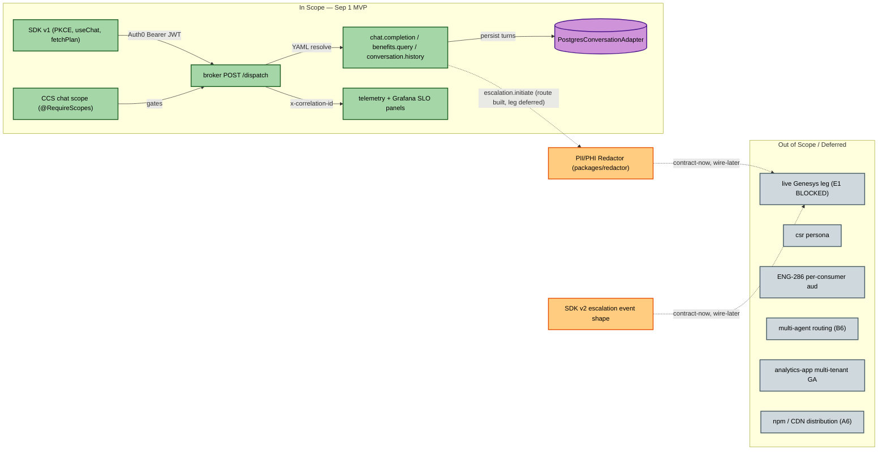
```mermaid
flowchart LR
    classDef backend fill:#a5d6a7,stroke:#1b5e20,stroke-width:2px,color:#000
    classDef store fill:#ce93d8,stroke:#4a148c,stroke-width:2px,color:#000
    classDef boundary fill:#cfd8dc,stroke:#455a64,stroke-width:2px,color:#000
    classDef straddle fill:#ffcc80,stroke:#e65100,stroke-width:2px,color:#000

    subgraph inscope["In Scope — Sep 1 MVP"]
        sdk["SDK v1 (PKCE, useChat, fetchPlan)"]:::backend
        dispatch["broker POST /dispatch"]:::backend
        caps["chat.completion / benefits.query / conversation.history"]:::backend
        scope["CCS chat scope (@RequireScopes)"]:::backend
        conv[("PostgresConversationAdapter")]:::store
        telem["telemetry + Grafana SLO panels"]:::backend
    end

    subgraph deferred["Out of Scope / Deferred"]
        genesys["live Genesys leg (E1 BLOCKED)"]:::boundary
        csr["csr persona"]:::boundary
        eng286["ENG-286 per-consumer aud"]:::boundary
        multi["multi-agent routing (B6)"]:::boundary
        analytics["analytics-app multi-tenant GA"]:::boundary
        npm["npm / CDN distribution (A6)"]:::boundary
    end

    redactor["PII/PHI Redactor (packages/redactor)"]:::straddle
    sdkv2["SDK v2 escalation event shape"]:::straddle

    sdk -->|"Auth0 Bearer JWT"| dispatch
    dispatch -->|"YAML resolve"| caps
    scope -->|"gates"| dispatch
    caps -->|"persist turns"| conv
    dispatch -->|"x-correlation-id"| telem

    redactor -.->|"contract-now, wire-later"| genesys
    sdkv2 -.->|"contract-now, wire-later"| genesys
    caps -.->|"escalation.initiate (route built, leg deferred)"| redactor
```

### Slice taxonomy (elicitation discipline)

Which slices above got a full requirements dialogue and which got a backlog note is
governed by the Pocock decomposition categories. Heavy `/req-elicit` fires **once per
IRREVERSIBLE slice**, never once per project — this is the discipline that kept the
manifest set bounded.

| Category | Meaning | Elicitation depth | Examples this cycle |
|---|---|---|---|
| **SEAM** | integration boundary already contracted | reference the existing contract, do not re-spec | Auth0 M2M APIM shim (`62f5cad5`), ENG-257 CCS JWKS, `@stellarus/resolver` |
| **IRREVERSIBLE** | lasting consequences | full `/req-elicit` before touching | `chat` scope (WI-D1-A), `POST /dispatch` contract, `PostgresConversationAdapter` store, SDK v1 surface-lock |
| **SLICE-LOCAL** | implementation detail | thin contract, no discovery dialogue | `InternalContextClaims`/`ContextTokenPayload` alignment (WI-D1-E), correlation-id threading |
| **DEFERRED** | valid but not this cycle | explicit backlog note, no contract | legacy `/chat` delete (WI-B1-I), RateLimiter refactor (WI-B1-H), `csr` persona (WI-D1-B), npm distribution (A6) |

The rule is load-bearing: a DEFERRED or SLICE-LOCAL slice does **not** trigger a full
elicitation, so the absence of a heavy contract for those items is intentional, not an
omission — the per-slice contract index lives in the Key Constraints & Rules section near
the end of this spec.


## 3. Architecture Position

The Compass Platform is a request pipeline with exactly one network trust
boundary and one internal trust authority. Every customer request enters
through **APIM** (the edge), is decorated with a CCS-signed **context token**,
flows to a per-surface **BFF**, and is dispatched to the **Thin-Router Broker**,
which resolves an opaque **capability** string to a **DataSourceAdapter** and
nothing more. The broker never names a semantic route; the BFF never validates
an external credential; CCS never authenticates a human. Each component owns one
job, and the trust a request carries is established once — at the APIM/CCS
boundary — and verified again, cryptographically, at every internal hop.

This section establishes each component's identity and trust role, documents the
two-token reality (CCS RS256 context tokens for tenant/identity claims, Auth0
access JWTs for human authentication, verified in different places), and surfaces
the platform's single largest structural divergence: **agentic-broker-api today
reimplements context-token validation locally and keeps conversation state in
memory, consuming neither `@stellarus/auth` nor `@stellarus/db`.** It is the one
component that does not yet sit on the shared spine. The target state converges
it onto `ContextTokenGuard` and `PostgresConversationAdapter`; that convergence
is the main duplication this platform exists to retire.

Deep dives live in the per-component sections: the broker contract in §4, the
BFF surface rule in §5, the auth/tenant spine in §6, the SDK surface in §7, and
the adapters and their downstreams in §8.

### Platform Architecture Position

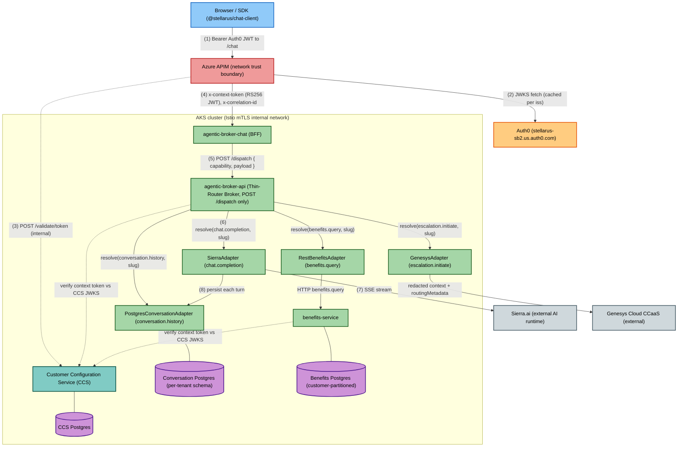
```mermaid
flowchart TB
    classDef client fill:#90caf9,stroke:#1565c0,stroke-width:2px,color:#000
    classDef identity fill:#ffcc80,stroke:#e65100,stroke-width:2px,color:#000
    classDef edge fill:#ef9a9a,stroke:#b71c1c,stroke-width:2px,color:#000
    classDef backend fill:#a5d6a7,stroke:#1b5e20,stroke-width:2px,color:#000
    classDef ccs fill:#80cbc4,stroke:#004d40,stroke-width:2px,color:#000
    classDef store fill:#ce93d8,stroke:#4a148c,stroke-width:2px,color:#000
    classDef external fill:#cfd8dc,stroke:#455a64,stroke-width:2px,color:#000

    client["Browser / SDK (@stellarus/chat-client)"]:::client
    auth0["Auth0 (stellarus-sb2.us.auth0.com)"]:::identity
    apim["Azure APIM (network trust boundary)"]:::edge

    subgraph aks["AKS cluster (Istio mTLS internal network)"]
        direction LR
        bff["agentic-broker-chat (BFF)"]:::backend
        broker["agentic-broker-api (Thin-Router Broker, POST /dispatch only)"]:::backend
        ccs["Customer Configuration Service (CCS)"]:::ccs
        sierraAd["SierraAdapter (chat.completion)"]:::backend
        benefitsAd["RestBenefitsAdapter (benefits.query)"]:::backend
        convAd["PostgresConversationAdapter (conversation.history)"]:::backend
        genesysAd["GenesysAdapter (escalation.initiate)"]:::backend
        benefitsSvc["benefits-service"]:::backend
        convDb[("Conversation Postgres (per-tenant schema)")]:::store
        benefitsDb[("Benefits Postgres (customer-partitioned)")]:::store
        ccsDb[("CCS Postgres")]:::store
    end

    sierra["Sierra.ai (external AI runtime)"]:::external
    genesys["Genesys Cloud CCaaS (external)"]:::external

    client -->|"(1) Bearer Auth0 JWT to /chat"| apim
    apim -->|"(2) JWKS fetch (cached per iss)"| auth0
    apim -.->|"(3) POST /validate/token (internal)"| ccs
    apim -->|"(4) x-context-token (RS256 JWT), x-correlation-id"| bff
    bff -->|"(5) POST /dispatch { capability, payload }"| broker
    broker -->|"(6) resolve(chat.completion, slug)"| sierraAd
    broker -->|"resolve(benefits.query, slug)"| benefitsAd
    broker -->|"resolve(conversation.history, slug)"| convAd
    broker -->|"resolve(escalation.initiate, slug)"| genesysAd
    sierraAd -->|"(7) SSE stream"| sierra
    sierraAd -->|"(8) persist each turn"| convAd
    convAd --- convDb
    benefitsAd -->|"HTTP benefits.query"| benefitsSvc
    benefitsSvc --- benefitsDb
    genesysAd -->|"redacted context + routingMetadata"| genesys
    ccs --- ccsDb
    broker -.->|"verify context token vs CCS JWKS"| ccs
    benefitsSvc -.->|"verify context token vs CCS JWKS"| ccs
```

The numbered edges trace **Flow A** (customer chat) and **Flow B** (auth/tenant
resolution): the client presents an Auth0 Bearer JWT (Flow B SEQ-2), APIM
validates it against Auth0 JWKS, calls CCS `POST /validate/token`
(TENANT-D1-SEQ-1), and injects `x-context-token` plus a fresh `x-correlation-id`
(TENANT-D1-SEQ-3/4) before routing to the BFF. The BFF translates surface
semantics into the `chat.completion` capability and dispatches to the broker
(BROKER-B1B2-SEQ-1); the broker rate-limits, resolves, and calls the adapter
(BROKER-B1B2-SEQ-2/3/4); `SierraAdapter` streams from Sierra and persists each
turn to `PostgresConversationAdapter` (BROKER-B1B2-SEQ-5). Dotted edges are
internal-only calls a customer never touches.

### Component Identity & Trust Roles

| Component | Diagram class | Trust role |
|---|---|---|
| Browser / SDK (`@stellarus/chat-client`) | client (blue) | Untrusted. Holds an Auth0 access JWT only; never sees a context token, broker URL, or internal service name (SDK INV-01/09). |
| Auth0 (`stellarus-sb2.us.auth0.com`) | identity (orange) | Authenticates humans via PKCE; issues access JWTs carrying the `https://stellarus.com/persona` custom claim. |
| Azure APIM | edge (red) | The network trust boundary. The only ingress; validates external credentials, injects trusted headers, strips untrusted ones. |
| agentic-broker-chat (BFF) | backend (green) | Owns all semantic routes for the chat surface; acquires the context token via APIM; dispatches capabilities. |
| agentic-broker-api (broker) | backend (green) | Capability-neutral router. One endpoint, `POST /dispatch`; resolves `(capability, customer_slug)` to an adapter; owns rate limiting. |
| SierraAdapter / RestBenefitsAdapter / PostgresConversationAdapter / GenesysAdapter | backend (green) | Each owns one downstream and its circuit breaker; registered by YAML, instantiated by the resolver. |
| CCS (`customer-configuration-service`) | ccs / internal-trust (teal) | The authoritative issuer/signer/validator of context tokens; owns the scope + persona registry. |
| Postgres stores (conversation, benefits, CCS) | store (purple) | Per-tenant / customer-partitioned durable state. |
| Sierra.ai, Genesys Cloud CCaaS | external (grey) | External runtimes, reachable only through their dedicated adapter. |

### owns / does NOT own

Trust roles are precise. Each load-bearing component has an explicit boundary;
the platform's correctness depends on these boundaries not blurring.

**APIM owns:**
- validating external caller credentials (Auth0 JWT signature, issuer, expiry)
- calling CCS `POST /validate/token` and injecting the resulting `x-context-token`
- generating one UUIDv4 `x-correlation-id` per request and stripping any inbound one (TENANT-D1-INV-04)

APIM does **not** own:
- customer-resolution rules themselves — those live in CCS
- context-token signing — CCS signs, APIM only carries
- any semantic routing decision — that is the BFF's

**The broker owns:**
- resolving `(capability, customer_slug)` to a `DataSourceAdapter` via the resolver
- per-tenant rate limiting as cross-cutting edge middleware, on `customer_slug` from the verified token (BROKER-B1B2-INV-08)
- propagating `x-correlation-id` to the adapter (BROKER-B1B2-SEQ-7)

The broker does **not** own:
- semantic routing — it never references `chat`, `conversation`, or `benefits` by name (BROKER-B1B2-INV-02)
- any HTTP endpoint other than `POST /dispatch` (BROKER-B1B2-INV-01, INV-11 drift guard)
- provider-specific logic — no `SierraClientService` import, no token counting, no circuit breaker (BROKER-B1B2-INV-04/09/10)

**CCS owns:**
- issuing and signing RS256 context tokens (`TokenService.sign()`)
- the scope registry (14 scopes + the new `chat` scope) and persona registry (`member`, `employee`, `provider`, plus `system`)
- exposing `POST /validate/token` and (ENG-257) `/.well-known/jwks.json`

CCS does **not** own:
- authenticating humans — Auth0 does; CCS validates an already-authenticated persona
- embedding `correlation_id` in the signed token (TENANT-D1-INV-02) — that is header-only, APIM-generated

**Each adapter owns** its downstream's failure state machine: Sierra's circuit
breaker lives in `SierraAdapter`, Genesys's in `GenesysAdapter`
(BROKER-B1B2-INV-09). No adapter owns another's downstream, and `GenesysAdapter`
is the **only** component permitted to call the Genesys API (E1E2-INV-05).

### The Two-Token Reality

Two distinct signed tokens move through the platform, verified in different
places against different keys. Conflating them is a security error.

| Token | Issuer | Signature | Carries | Travels as | Verified by / where |
|---|---|---|---|---|---|
| Auth0 access JWT | Auth0 (`stellarus-sb2.us.auth0.com`) | Auth0 JWKS (per-issuer) | human identity + `https://stellarus.com/persona` | `Authorization: Bearer <jwt>` | APIM, at the edge — against Auth0 JWKS |
| Context token | CCS (`TokenService.sign()`) | RS256, CCS JWKS | `iss`, `aud`, `exp`, `iat`, `sub`, `customer_id`, `customer_slug`, `principal_id`, `persona`, `scopes[]`, optional `mode` | `x-context-token` header | `ContextTokenGuard` in each internal service — against CCS JWKS |

The Auth0 JWT is the external credential and never crosses the edge inward — APIM
strips it from the trust surface and replaces it with the context token. The
context token is the **internal** credential: it is what every AKS service trusts,
and `ContextTokenGuard` re-verifies its RS256 signature, `iss`, `aud`, and `exp`
on every hop (TENANT-D1-INV-06) before enforcing `@RequireScopes()`
(TENANT-D1-INV-07). The `correlation_id` is in neither token — it is an
observability-only HTTP header (TENANT-D1-INV-05), and `mode`
appears only in `system`-persona API-key tokens (TENANT-D1-INV-09).

The shared verification path is `ContextTokenGuard` from
`@stellarus/auth/internal/nest`. It is the platform's single intended way to
verify a context token — and the source of the central divergence below.

### Central Divergence — Broker Auth & Session Convergence

The knowledge graph surfaces one finding that dominates the platform's cleanup
backlog. Every internal service is supposed to consume the shared spine:
`ContextTokenGuard` from `@stellarus/auth/internal` for verification, and
`PostgresConversationAdapter` (backed by `@stellarus/db`) for durable state.
**benefits-service already does. The broker does not.**

As built today, `agentic-broker-api` reimplements context-token validation
**locally** — its own `src/auth/*.guard.ts` calling `jose` directly — and keeps
conversation state in an **in-memory session store**. It consumes neither
`packages/auth` nor `packages/db`. This makes it the platform outlier: the one
service whose trust verification is a private copy rather than the shared guard,
and the one service whose conversation history evaporates on restart — which is
disqualifying, because durable history is the prerequisite for the escalation
handoff (Flow D, E1E2-INV-09).

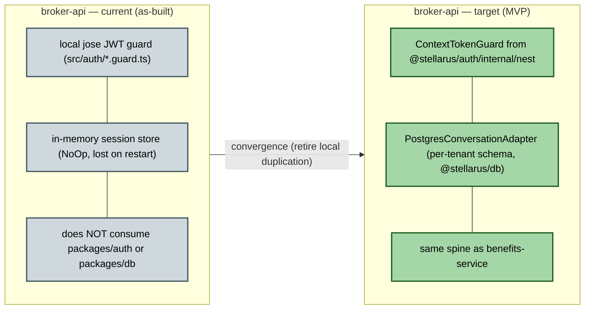
```mermaid
flowchart LR
    classDef backend fill:#a5d6a7,stroke:#1b5e20,stroke-width:2px,color:#000
    classDef store fill:#ce93d8,stroke:#4a148c,stroke-width:2px,color:#000
    classDef boundary fill:#cfd8dc,stroke:#455a64,stroke-width:2px,color:#000

    subgraph current["broker-api — current (as-built)"]
        direction TB
        curGuard["local jose JWT guard (src/auth/*.guard.ts)"]:::boundary
        curStore["in-memory session store (NoOp, lost on restart)"]:::boundary
        curNote["does NOT consume packages/auth or packages/db"]:::boundary
        curGuard --- curStore --- curNote
    end

    subgraph target["broker-api — target (MVP)"]
        direction TB
        tgtGuard["ContextTokenGuard from @stellarus/auth/internal/nest"]:::backend
        tgtStore["PostgresConversationAdapter (per-tenant schema, @stellarus/db)"]:::backend
        tgtNote["same spine as benefits-service"]:::backend
        tgtGuard --- tgtStore --- tgtNote
    end

    current -->|"convergence (retire local duplication)"| target
```

The convergence is two coordinated moves: replace the local `jose` guard with
the shared `ContextTokenGuard` (verifying against CCS JWKS per TENANT-D1-INV-06,
falling back to a static PEM only on transport failure until ENG-257 lands, then
never — INV-12a), and replace the in-memory store with
`PostgresConversationAdapter` registered via `conversation-bsca.yaml`
(BROKER-B1B2-INV-06/07, work item WI-B1-E). Retiring this duplication is the
single most consequential structural change between the current platform and the
MVP target.

### Trust Boundaries

Three layers, two crossings. A request is untrusted until APIM establishes its
trust, and that trust is re-verified — never merely assumed — on the internal
network.

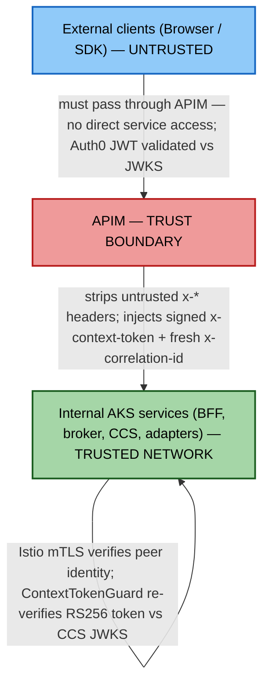
```mermaid
flowchart TB
    classDef client fill:#90caf9,stroke:#1565c0,stroke-width:2px,color:#000
    classDef edge fill:#ef9a9a,stroke:#b71c1c,stroke-width:2px,color:#000
    classDef backend fill:#a5d6a7,stroke:#1b5e20,stroke-width:2px,color:#000

    ext["External clients (Browser / SDK) — UNTRUSTED"]:::client
    apim["APIM — TRUST BOUNDARY"]:::edge
    internal["Internal AKS services (BFF, broker, CCS, adapters) — TRUSTED NETWORK"]:::backend

    ext -->|"must pass through APIM — no direct service access; Auth0 JWT validated vs JWKS"| apim
    apim -->|"strips untrusted x-* headers; injects signed x-context-token + fresh x-correlation-id"| internal
    internal -->|"Istio mTLS verifies peer identity; ContextTokenGuard re-verifies RS256 token vs CCS JWKS"| internal
```

| Layer | Trust level | Verification |
|---|---|---|
| External clients (Browser / SDK) | Untrusted | Must pass through APIM — no direct service access. Auth0 JWT validated against Auth0 JWKS. |
| APIM | Trust boundary | Validates external credentials; strips untrusted inbound `x-*` headers (notably any forged `x-correlation-id`, TENANT-D1-INV-04); injects the signed `x-context-token`. |
| Internal AKS services | Trusted network | Istio mTLS verifies peer service identity; `ContextTokenGuard` independently re-verifies the context token's RS256 signature, `iss`, `aud`, `exp` on every request (TENANT-D1-INV-06). |

The two verification layers on the internal network are complementary, not
redundant: **Istio mTLS** answers "is this peer a legitimate cluster service?";
**`ContextTokenGuard`** answers "does this request carry a valid, unexpired,
correctly-audienced tenant context with the required scopes?". Network identity
and request authorization are separate questions, verified separately. Today the
broker answers the second question with a local copy of the guard — see the
convergence above.

### As-Built Today vs To-Be-Built for MVP

| Concern | As-built today | To-be-built for MVP |
|---|---|---|
| Broker endpoint | semantic `POST /v2/chat`, `POST /chat` | capability-neutral `POST /dispatch` only (WI-B1-F) |
| Broker token verification | local `jose` guard in `src/auth/*.guard.ts` | shared `ContextTokenGuard` from `@stellarus/auth/internal` |
| Conversation store | in-memory NoOp (lost on restart) | `PostgresConversationAdapter`, per-tenant schema (WI-B1-E) |
| Sierra | hardcoded `SierraClientService` dependency | `SierraAdapter` (streaming) via `sierra-bsca.yaml` (WI-B1-B) |
| Benefits | broker `PlanHandlerService` direct HTTP | `RestBenefitsAdapter` via `benefits-bsca.yaml` (merged on main, WI-B1-D) |
| Circuit breaker / token counting | `CircuitBreakerService` + `TokenCounterService` in broker | moved into `SierraAdapter` (WI-B1-C) |
| `chat` scope gate | none | `@RequireScopes('chat')` on `/dispatch` (CCS migration `0003_chat_scopes.sql`, WI-D1-A) |
| CCS JWKS | broker falls back to static `CONTEXT_TOKEN_PUBLIC_KEY` | `/.well-known/jwks.json` (ENG-257); static fallback forbidden in prod (INV-12a/b) |
| Escalation / GenesysAdapter | none | `escalation.initiate` via `genesys-bsca.yaml` (P5/E2 scope) |

The resolver (`@stellarus/resolver`) and `RestBenefitsAdapter` are already merged
to main; the rest of the right column is the broker convergence work. None of it
adds a named broker endpoint — every new capability arrives as a YAML file in
`RESOLVER_CONFIG_DIR` (BROKER-B1B2-INV-03), which is exactly why the thin-router
contract is the structural guard against the drift this section documents.


## 4. The Thin-Router Broker

### 4.1 Overview

The Thin-Router Broker (`agentic-broker-api`) is a capability-neutral router. It exposes exactly **one** HTTP endpoint — `POST /dispatch` — accepts a body of `{ capability: string, payload: unknown }` plus the headers `x-context-token` and `x-correlation-id`, and resolves the pair `(capability, customer_slug)` to a `DataSourceAdapter` through YAML configuration. It has no business logic. All semantic routing — "this is a chat request", "this is a benefits lookup", "this is an escalation" — lives in BFF apps, never in the broker.

The single load-bearing assertion of this section is stated verbatim: **the broker never knows semantic names.** It does not reference "chat", "conversation", or "benefits" in any routing code path. A `capability` is an opaque `{domain}.{action}` string. The broker hands that string and the verified `customer_slug` to `@stellarus/resolver`, which reads YAML from `RESOLVER_CONFIG_DIR` (watched by `chokidar` for hot-reload), maps the class name through `ADAPTER_CLASS_REGISTRY`, and returns an adapter instance. Registering a new capability is a YAML drop with zero broker source change.

The broker owns three things and only three: terminating the `POST /dispatch` request, enforcing the per-tenant rate budget at the edge (`RateLimiterService`), and delegating to the resolved adapter. It does **not** own Sierra streaming, LLM token counting, conversation persistence, or any provider circuit breaker — each of those lives in the adapter that owns the downstream (§4.6, §4.9).

This section documents the broker in two registers: the **target thin router** (the contract the platform is converging on, the bulk of this document) and the **as-built broker** (a drifted second pipeline that §4.8 enumerates and §4.9 dismantles). Where the two diverge, the target is normative and the as-built is debt with a named owner and an exit work item.

### 4.2 Scope

#### In Scope

- the single `POST /dispatch` endpoint and its request/response contract
- `(capability, customer_slug)` -> adapter resolution via `@stellarus/resolver` YAML
- per-tenant rate limiting at the edge on the verified `customer_slug`
- the `stream()` seam on `DataSourceAdapter` and the split into streaming vs query adapters
- `x-correlation-id` propagation from broker into every adapter call
- the drift-guard rule (INV-11) that keeps the broker capability-neutral
- the gap between the as-built broker and the target router, plus the work items that close it

#### Out of Scope

- semantic routing, surface vocabulary, and conversation-retrieval endpoints — owned by BFF apps (§4.5; A1/BFF spec)
- the CCS context-token contract, scope registry, and `ContextTokenGuard` internals — owned by the Tenant/Auth Spine (D1 spec)
- adapter-internal mechanics of Sierra streaming, Genesys handoff, and benefits HTTP — owned by each adapter contract (§4.6)
- the PII/PHI Redactor and escalation flow — owned by the Escalation spec (E1/E2)
- SLO taxonomy and Grafana panels — owned by the Telemetry spec (F1/F2); the broker only emits canonical log fields

### 4.3 Architecture Position

The broker sits behind APIM and behind every BFF. APIM is the network trust boundary: it validates the external Auth0 JWT, calls CCS to mint the `x-context-token`, injects a fresh `x-correlation-id`, and routes to the per-surface BFF. The BFF translates surface semantics into a capability string and is the only caller of `POST /dispatch`. The broker resolves, rate-limits, and dispatches. Adapters own their downstreams; the conversation store is authoritative Postgres, not Sierra native session storage (INV-06).

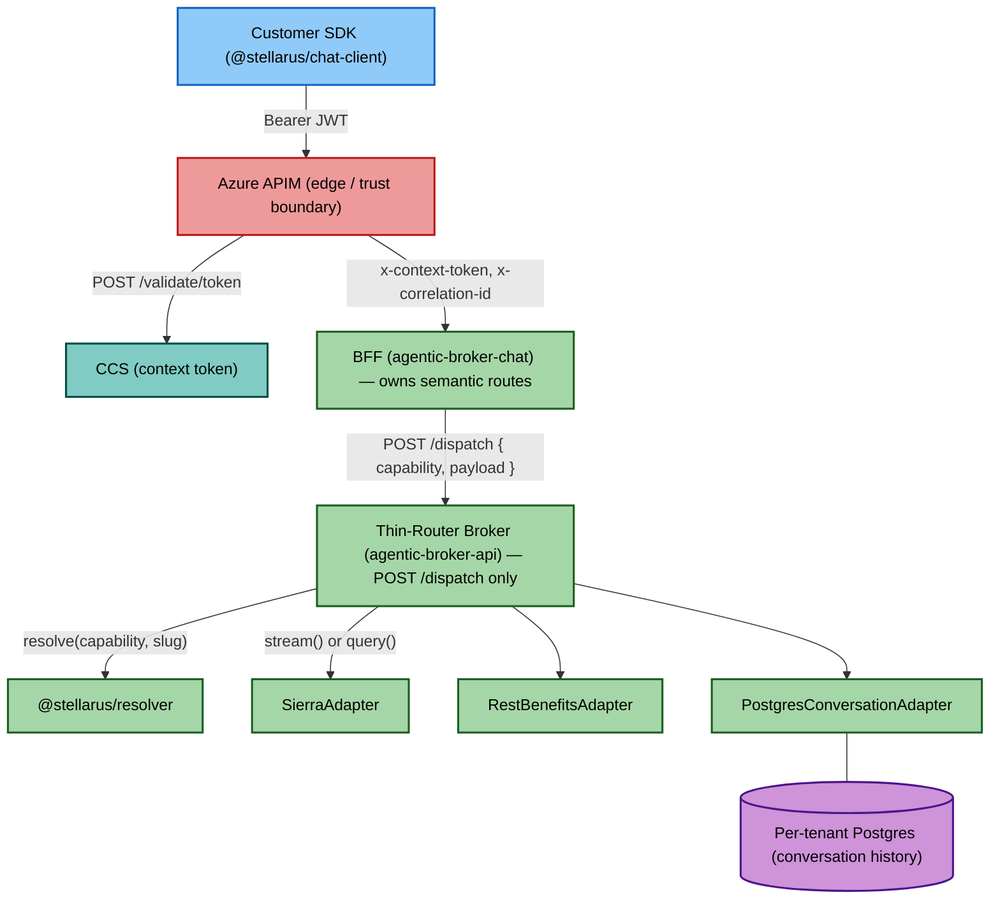
```mermaid
flowchart TB
    classDef client fill:#90caf9,stroke:#1565c0,stroke-width:2px,color:#000
    classDef edge fill:#ef9a9a,stroke:#b71c1c,stroke-width:2px,color:#000
    classDef backend fill:#a5d6a7,stroke:#1b5e20,stroke-width:2px,color:#000
    classDef ccs fill:#80cbc4,stroke:#004d40,stroke-width:2px,color:#000
    classDef store fill:#ce93d8,stroke:#4a148c,stroke-width:2px,color:#000
    classDef boundary fill:#cfd8dc,stroke:#455a64,stroke-width:2px,color:#000

    sdk["Customer SDK (@stellarus/chat-client)"]:::client
    apim["Azure APIM (edge / trust boundary)"]:::edge
    ccs["CCS (context token)"]:::ccs
    bff["BFF (agentic-broker-chat) — owns semantic routes"]:::backend
    broker["Thin-Router Broker (agentic-broker-api) — POST /dispatch only"]:::backend
    resolver["@stellarus/resolver"]:::backend
    sierra["SierraAdapter"]:::backend
    benefits["RestBenefitsAdapter"]:::backend
    conv["PostgresConversationAdapter"]:::backend
    db[("Per-tenant Postgres (conversation history)")]:::store

    sdk -->|"Bearer JWT"| apim
    apim -->|"POST /validate/token"| ccs
    apim -->|"x-context-token, x-correlation-id"| bff
    bff -->|"POST /dispatch { capability, payload }"| broker
    broker -->|"resolve(capability, slug)"| resolver
    broker -->|"stream() or query()"| sierra
    broker --> benefits
    broker --> conv
    conv --- db
```

### 4.4 The `POST /dispatch` Contract

`POST /dispatch` is the broker's only endpoint. There is structurally nowhere to add a named semantic route; any named HTTP endpoint on the broker is a detectable contract violation (INV-11, §4.10).

| Element | Value |
|---|---|
| Method + path | `POST /dispatch` |
| Body | `{ capability: string, payload: unknown }` |
| Required headers | `x-context-token` (signed JWT, carries `customer_slug`), `x-correlation-id` (UUIDv4 from APIM) |
| Scope gate | `@RequireScopes('chat')` via `ContextTokenGuard` (D1 WI-D1-A) |
| Streaming response | `AsyncIterable<StreamEvent>` (when the resolved adapter implements `stream()`) |
| Query response | `ResolverResponse` (when the resolved adapter implements only `query()`) |
| Contract authority | `apps/agentic-broker-api/contracts/dispatch.contract.ts` (new) |

The request body fields:

| Field | Type | Required | Description |
|---|---|---|---|
| `capability` | `string` | yes | opaque `{domain}.{action}` — resolved via YAML, never branched on by name (INV-02) |
| `payload` | `unknown` | yes | adapter-specific body; the broker forwards it verbatim without inspection |

The dispatch pipeline runs three steps in a fixed order — **rate-limit before resolve before adapter** (§4.9 edge ordering). The side YAML registry feeds the resolver out of band.

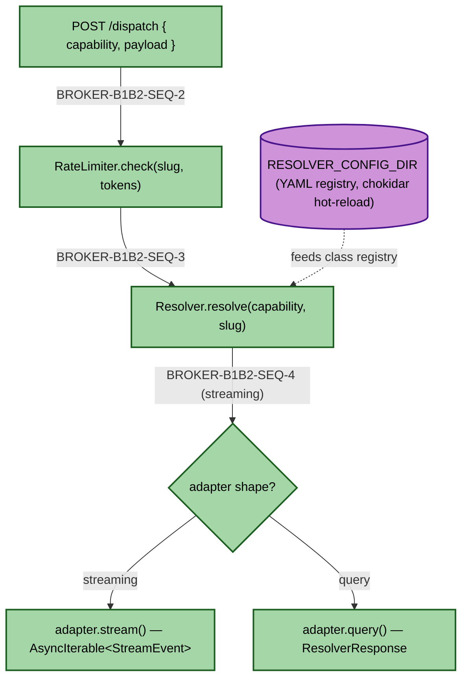
```mermaid
flowchart TB
    classDef backend fill:#a5d6a7,stroke:#1b5e20,stroke-width:2px,color:#000
    classDef store fill:#ce93d8,stroke:#4a148c,stroke-width:2px,color:#000
    classDef boundary fill:#cfd8dc,stroke:#455a64,stroke-width:2px,color:#000

    dispatch["POST /dispatch { capability, payload }"]:::backend
    rl["RateLimiter.check(slug, tokens)"]:::backend
    resolve["Resolver.resolve(capability, slug)"]:::backend
    decide{"adapter shape?"}:::backend
    stream["adapter.stream() — AsyncIterable&lt;StreamEvent&gt;"]:::backend
    query["adapter.query() — ResolverResponse"]:::backend
    yaml[("RESOLVER_CONFIG_DIR (YAML registry, chokidar hot-reload)")]:::store

    dispatch -->|"BROKER-B1B2-SEQ-2"| rl
    rl -->|"BROKER-B1B2-SEQ-3"| resolve
    resolve -->|"BROKER-B1B2-SEQ-4 (streaming)"| decide
    decide -->|"streaming"| stream
    decide -->|"query"| query
    yaml -.->|"feeds class registry"| resolve
```

Per-endpoint failure modes (also centralized in §4.11):

| Status | Condition |
|---|---|
| `401` | missing/invalid `x-context-token`, or RS256 verification fails (INV-06, D1) |
| `403` | verified token lacks the `chat` scope (`@RequireScopes('chat')`, D1 SEQ-7) |
| `404` | no YAML registration for `(capability, customer_slug)` |
| `429` | `RateLimiter.check` rejects the per-tenant token budget (INV-08) |
| `502/503` | resolved adapter's downstream failed; the adapter's circuit breaker governs (INV-09) |

### 4.5 The BFF Surface Rule (load-bearing)

All semantic routes live in BFF apps. The rule is: **same user surface = same BFF; different surface = new BFF.** The broker's `POST /dispatch` takes `{ capability, payload }` — there is nowhere to put a `POST /chat` route on the broker because it does not exist. Any named semantic endpoint on the broker is a detectable violation answered with "why are you adding a named endpoint to the broker? Put it in the BFF."

| Scenario | BFF assignment |
|---|---|
| BSC member chat | `agentic-broker-chat` (the v1 BFF) |
| Genesys escalation **from** the chat UI | `agentic-broker-chat` (same surface) -> `{ capability: "escalation.initiate", payload: { conversationId, reason } }` |
| Standalone IVR / phone routing | new BFF: `agentic-broker-ivr` / `agentic-broker-call` |
| Future CSR assist tool | new BFF: `agentic-broker-csr` |
| Customer-embedded widget (non-BSC) | new BFF per customer surface |

### 4.6 Capability Registry and Adapters

A `capability` is resolved to a `DataSourceAdapter` purely by YAML. The broker treats every capability string as opaque (INV-02). The MVP set:

| Capability | Adapter class | YAML file | Shape | Status |
|---|---|---|---|---|
| `chat.completion` | `SierraAdapter` | `sierra-bsca.yaml` | streaming (`stream()`) | to-be-built (WI-B1-B), replaces hardcoded `SierraClientService` |
| `benefits.query` | `RestBenefitsAdapter` | `benefits-bsca.yaml` (exists) | query (`query()`) | on `main`; replaces `PlanHandlerService` (WI-B1-D) |
| `conversation.history` | `PostgresConversationAdapter` | `conversation-bsca.yaml` (new) | query (`query()`) | to-be-built (WI-B1-E); replaces in-memory `SessionStore` |
| `escalation.initiate` | `GenesysAdapter` | `genesys-bsca.yaml` | query (`query()`) | P5/E2 scope — NOT in broker MVP (owned by E1/E2) |
| `benefits.query` (Snowflake) | `SnowflakeBenefitsAdapter` | `benefits-bsca-snowflake.yaml` | query (`query()`) | scaffolded stub; demo/future only, REST-only for v1 |

Resolution is opaque-string lookup across three columns — capability strings on the left, adapter classes in the middle, YAML files on the right. The broker never reads across the columns; the resolver does.

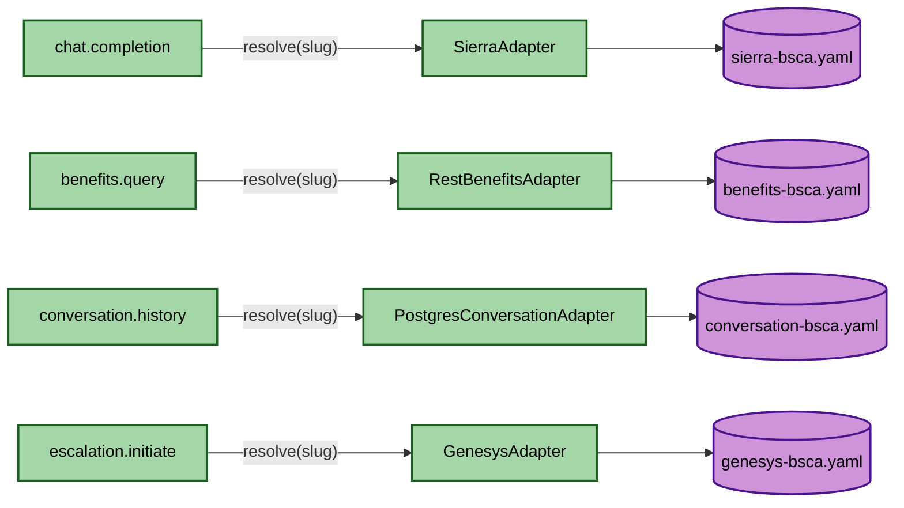
```mermaid
flowchart LR
    classDef backend fill:#a5d6a7,stroke:#1b5e20,stroke-width:2px,color:#000
    classDef store fill:#ce93d8,stroke:#4a148c,stroke-width:2px,color:#000

    cap1["chat.completion"]:::backend
    cap2["benefits.query"]:::backend
    cap3["conversation.history"]:::backend
    cap4["escalation.initiate"]:::backend

    ad1["SierraAdapter"]:::backend
    ad2["RestBenefitsAdapter"]:::backend
    ad3["PostgresConversationAdapter"]:::backend
    ad4["GenesysAdapter"]:::backend

    y1[("sierra-bsca.yaml")]:::store
    y2[("benefits-bsca.yaml")]:::store
    y3[("conversation-bsca.yaml")]:::store
    y4[("genesys-bsca.yaml")]:::store

    cap1 -->|"resolve(slug)"| ad1 --> y1
    cap2 -->|"resolve(slug)"| ad2 --> y2
    cap3 -->|"resolve(slug)"| ad3 --> y3
    cap4 -->|"resolve(slug)"| ad4 --> y4
```

#### The `stream()` seam

`DataSourceAdapter` today exposes only `query()`. WI-B1-A (a blocker) adds an optional `stream(): AsyncIterable<StreamEvent>`, splitting adapters into query-shaped (`DataSourceAdapter`) and streaming-shaped (`StreamingDataSourceAdapter`). This is the seam that lets `SierraAdapter` stream SSE without the broker owning streaming logic. The broker chooses `stream()` vs `query()` on the shape the resolver returns (BROKER-B1B2-SEQ-4) — it does not branch on the capability name.

### 4.7 Dispatch Sequence — `chat.completion`

The canonical streaming flow (manifest Flow A). The BFF dispatches; the broker rate-limits, resolves to `SierraAdapter`, and streams; `SierraAdapter` persists each turn to `PostgresConversationAdapter` (the authoritative store, INV-06) and yields `StreamEvents` back. The broker self-call marks `x-correlation-id` propagation into the adapter (BROKER-B1B2-SEQ-7).

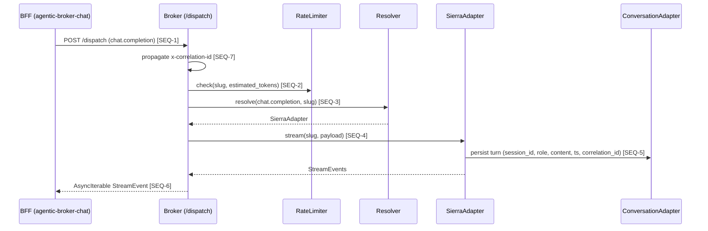
```mermaid
sequenceDiagram
    participant BFF as BFF (agentic-broker-chat)
    participant BR as Broker (/dispatch)
    participant RL as RateLimiter
    participant RES as Resolver
    participant SA as SierraAdapter
    participant CA as ConversationAdapter

    BFF->>BR: POST /dispatch (chat.completion) [SEQ-1]
    BR->>BR: propagate x-correlation-id [SEQ-7]
    BR->>RL: check(slug, estimated_tokens) [SEQ-2]
    BR->>RES: resolve(chat.completion, slug) [SEQ-3]
    RES-->>BR: SierraAdapter
    BR->>SA: stream(slug, payload) [SEQ-4]
    SA->>CA: persist turn (session_id, role, content, ts, correlation_id) [SEQ-5]
    SA-->>BR: StreamEvents
    BR-->>BFF: AsyncIterable StreamEvent [SEQ-6]
```

### 4.8 Why the Broker Keeps Drifting — and the Second Pipeline to Dismantle

The broker keeps accreting business logic because **it is the first HTTP service developers touch.** When a new capability is needed, the path of least resistance is to add a service and a route to the broker. Over time that produces a full second pipeline parallel to the thin router.

The capability-neutral contract is the **structural cure**, not a guideline. If the broker exposes no semantic endpoints, there is nowhere for business logic to accumulate — a developer who wants to add behavior has no named route to hang it on and is structurally redirected into a BFF or an adapter. INV-01 (only `/dispatch`) and INV-11 (drift guard) are the enforcement.

The accreted second pipeline to dismantle, named explicitly:

- `SierraClientService` — provider-specific Sierra client wired directly into the broker
- `RateLimiter` — stays (it is genuinely edge), but moves from inline to guard (WI-B1-H)
- `CircuitBreaker` — per-provider failure state living in the broker
- `TokenCounter` — LLM token counting (tiktoken) in the broker
- `SessionStore` — in-memory NoOp conversation store
- `SSEWriter` — broker-owned SSE serialization
- `PlanHandler` — direct-HTTP benefits path in the broker (`PlanHandlerService`)

Every one of these moves out: most relocate into the adapter that owns the downstream, one stays at the edge, and the named endpoints collapse to `/dispatch`.

### 4.9 B1 Gap Table — As-Built vs Target

This is the authoritative gap between the drifted broker (as-built today) and the target thin router (to-be-built for MVP).

| Concern | Current (as-built) | Required (target) | Priority |
|---|---|---|---|
| Endpoint | `POST /v2/chat`, `POST /chat` (semantic) | `POST /dispatch` only (capability-neutral) | Core (WI-B1-F) |
| Sierra | `SierraClientService` hardcoded | `SierraAdapter` via `sierra-bsca.yaml` as `chat.completion` | Core (WI-B1-B) |
| Adapter shape | only `query()` | add `stream(): AsyncIterable<StreamEvent>` | Blocker (WI-B1-A) |
| Benefits | `PlanHandlerService` direct HTTP | `RestBenefitsAdapter` via `benefits-bsca.yaml` (`benefits.query`) | Core (WI-B1-D) |
| Session/conversation | in-memory `SessionStore` (NoOp) | `PostgresConversationAdapter` via `conversation-bsca.yaml` (`conversation.history`) | Core (WI-B1-E) |
| Circuit breaker | `CircuitBreakerService` in broker | moves into `SierraAdapter` (each adapter owns its downstream) | Refactor (WI-B1-C) |
| Token counter | `TokenCounterService` in broker | moves into `SierraAdapter` (Sierra-specific) | Refactor (WI-B1-C) |
| Rate limiter | inline in `ChatHandlerService` | **stays in the broker** as edge middleware; refactor inline -> NestJS guard | Deferred (WI-B1-H) |
| Conversation retrieval | none | `GET /api/conversations/{sessionId}` on the **BFF**, dispatching `conversation.history` | P5 (WI-B1-G) |
| `chat` scope gate | none | `@RequireScopes('chat')` on `/dispatch` (D1 WI-D1-A) | D1 dep |
| `correlation_id` | not threaded through SSE error events | broker propagates `x-correlation-id` to adapters (SEQ-7) | D1 alignment |
| Legacy `/chat` | backward-compat route | deleted after BFF migrates | Deferred (WI-B1-I) |

The decisive split: **the circuit breaker and token counter move into `SierraAdapter`; the rate limiter STAYS in the broker.** Token-budget semantics require tenant context that only exists at the edge, on the verified `customer_slug` from the context token — the limiter is genuinely cross-cutting, not provider-specific.

#### Edge ordering (normative)

`RateLimiter.check` runs **BEFORE** `Resolver.resolve` runs **BEFORE** adapter dispatch:

```text
RateLimiter.check(slug, tokens)            # BROKER-B1B2-SEQ-2
  -> Resolver.resolve(capability, slug)     # BROKER-B1B2-SEQ-3
    -> adapter.stream() | adapter.query()    # BROKER-B1B2-SEQ-4
```

Resolving before checking the budget would let an over-budget tenant consume adapter work; the rate check is therefore unconditionally first (INV-08).

The relocation, drawn as gap-to-target:

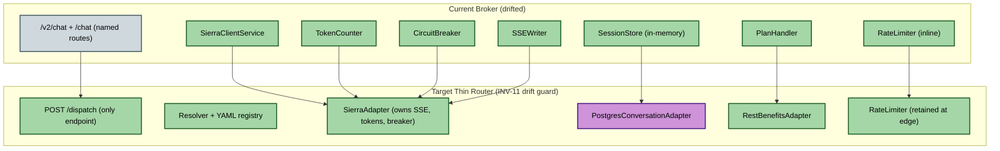
```mermaid
flowchart TB
    classDef backend fill:#a5d6a7,stroke:#1b5e20,stroke-width:2px,color:#000
    classDef store fill:#ce93d8,stroke:#4a148c,stroke-width:2px,color:#000
    classDef boundary fill:#cfd8dc,stroke:#455a64,stroke-width:2px,color:#000

    subgraph CUR["Current Broker (drifted)"]
        direction TB
        scs["SierraClientService"]:::backend
        ss["SessionStore (in-memory)"]:::backend
        ph["PlanHandler"]:::backend
        tc["TokenCounter"]:::backend
        cb["CircuitBreaker"]:::backend
        sse["SSEWriter"]:::backend
        rl0["RateLimiter (inline)"]:::backend
        ep["/v2/chat + /chat (named routes)"]:::boundary
    end

    subgraph TGT["Target Thin Router (INV-11 drift guard)"]
        direction TB
        disp["POST /dispatch (only endpoint)"]:::backend
        res["Resolver + YAML registry"]:::backend
        sa["SierraAdapter (owns SSE, tokens, breaker)"]:::backend
        ca["PostgresConversationAdapter"]:::store
        ba["RestBenefitsAdapter"]:::backend
        rl1["RateLimiter (retained at edge)"]:::backend
    end

    scs --> sa
    tc --> sa
    cb --> sa
    sse --> sa
    ss --> ca
    ph --> ba
    rl0 --> rl1
    ep --> disp
```

### 4.10 Hard Invariants (MUST / MUST-NOT)

These are the broker's non-negotiable obligations (manifest B1B2). Each is a review gate.

| ID | Obligation |
|---|---|
| INV-01 | The broker MUST NOT expose any HTTP endpoint other than `POST /dispatch`; all semantic routes live in BFF apps. |
| INV-02 | The broker MUST NOT reference "chat", "conversation", "benefits", or any capability name in routing logic; capabilities are opaque strings resolved via YAML. |
| INV-03 | A new capability MUST be registered by dropping YAML in `RESOLVER_CONFIG_DIR` — never by modifying broker source. |
| INV-04 | The broker MUST NOT import `SierraClientService`, `SierraClientModule`, or any AI-provider-specific code. |
| INV-06 | `PostgresConversationAdapter` MUST be the authoritative conversation-history store; Sierra native session storage MUST NOT be the source of truth. |
| INV-07 | `PostgresConversationAdapter` MUST use per-tenant Postgres schema isolation; it MUST NOT allow cross-tenant conversation reads. |
| INV-08 | `RateLimiter` MUST operate on `customer_slug` from the verified context token; it MUST NOT operate on IP addresses or API keys alone. |
| INV-09 | The broker MUST NOT own the Sierra circuit breaker; `SierraAdapter` owns its own, and every future adapter owns its downstream's. |
| INV-10 | The broker MUST NOT count LLM tokens; token counting is Sierra-specific and lives in `SierraAdapter`. |
| INV-11 | **Drift guard.** Any PR adding a named HTTP endpoint (other than `/dispatch`) to `agentic-broker-api` MUST be rejected at review as an architectural violation of INV-01. |

### 4.11 Failure Handling

#### Dispatch request failures

| Condition | Response |
|---|---|
| Missing/invalid `x-context-token` | `401` |
| RS256 verification fails against CCS JWKS | `401` (INV-06, D1) |
| Verified token lacks `chat` scope | `403` (D1 SEQ-7) |
| No YAML registration for `(capability, customer_slug)` | `404` |
| Per-tenant token budget exhausted | `429` (INV-08) |

#### Adapter / downstream failures

After resolution, the resolved adapter owns its downstream's failure handling. The Sierra circuit breaker lives in `SierraAdapter` (INV-09); the broker does not re-interpret adapter failures, it surfaces them. A tripped breaker presents as `503` from the adapter; the broker propagates the `x-correlation-id` (SEQ-7) so the failure is traceable end to end.

### 4.12 Observability

The broker MUST emit a structured JSON log on every chat request, error, and circuit-breaker event, using **exact** canonical F2 field names (no invented names — Telemetry INV-01a) and no member-identifiable data (Telemetry INV-02a):

`{ event, customer_slug, latency_ms, status, capability, correlation_id }`

The broker MUST include `correlation_id` (from `x-correlation-id`) in every log event (Telemetry INV-06). Token cost is emitted by `SierraAdapter` via the `token_cost` field (feeding the Cost-per-Answer SLO), never by the broker (INV-10). Threshold-colored SLO panels and the canonical taxonomy are owned by the Telemetry spec (F1/F2); the broker's obligation ends at emitting the fields.

### 4.13 Work Items

| WI | Description | Priority |
|---|---|---|
| WI-B1-A | add `stream(): AsyncIterable<StreamEvent>` to `DataSourceAdapter` (the streaming seam) | Blocker |
| WI-B1-B | implement `SierraAdapter` wrapping `SierraClientService`; register `sierra-bsca.yaml` | Core |
| WI-B1-C | move `TokenCounterService` + `CircuitBreakerService` into `SierraAdapter` | Core |
| WI-B1-D | implement `RestBenefitsAdapter` replacing `PlanHandlerService`; `benefits-bsca.yaml` | Core |
| WI-B1-E | implement `PostgresConversationAdapter` (per-tenant schema); `conversation-bsca.yaml` | Core (escalation dep) |
| WI-B1-F | replace `POST /v2/chat` with `POST /dispatch`; update BFF to call `/dispatch` | Core |
| WI-B1-G | add `GET /api/conversations/{sessionId}` to the **BFF**, dispatching `conversation.history` | P5 |
| WI-B1-H | refactor `RateLimiterService` inline -> NestJS guard/interceptor (stays at edge) | Deferred |
| WI-B1-I | delete legacy `POST /chat` after BFF migration | Deferred |

### 4.14 Decisions Still Open

**WI-B1-H — RateLimiter placement.**
**Decision for v1: keep `RateLimiterService` inline in the dispatch path.** It already works, and the token-budget semantics it enforces require the tenant context that is present at the edge.
**Trigger for revisit:** the edge surface grows (a second cross-cutting edge concern appears, or the limiter needs to be shared across more than the dispatch handler) — at that point refactor it to a NestJS guard/interceptor. It stays *in the broker* either way; only its wiring shape changes.

**WI-B1-I — legacy `/chat` deletion.**
**Decision for v1: leave `POST /chat` in place as a backward-compat route, deferred for deletion.** Deleting it before consumers migrate would break the live surface.
**Trigger for revisit:** the BFF (`agentic-broker-chat`) has fully migrated to dispatching through `/dispatch` and no caller hits `/chat`. Until then the route is tolerated debt, explicitly tracked, and exempt from INV-11 only as a named pre-existing exception — no *new* named endpoint qualifies.

### 4.15 New Contracts

| Contract | Location |
|---|---|
| streaming adapter seam | `packages/resolver/src/contracts/streaming-adapter.contract.ts` |
| dispatch endpoint | `apps/agentic-broker-api/contracts/dispatch.contract.ts` |
| Sierra adapter | `apps/agentic-broker-api/adapters/sierra-adapter.contract.ts` |
| conversation adapter | `apps/agentic-broker-api/adapters/conversation-adapter.contract.ts` |

### 4.16 Key Constraints & Rules

- **One endpoint, forever.** The broker exposes `POST /dispatch` and nothing else (INV-01). The drift guard (INV-11) makes a named route a review-blocking architectural violation.
- **Capabilities are opaque.** The broker never branches on a semantic name; YAML resolves `(capability, customer_slug)` to an adapter (INV-02/03).
- **Adapters own their downstreams.** Circuit breaker and token counter live in the adapter, not the broker (INV-09/10).
- **The rate limiter stays at the edge.** Token-budget semantics require tenant context; the limiter operates on the verified `customer_slug`, never IP or API key (INV-08).
- **Postgres is the authoritative conversation record.** Sierra native session storage is never the source of truth (INV-06); per-tenant schema isolation forbids cross-tenant reads (INV-07).
- **The cure for drift is structural, not procedural.** With no semantic endpoints, there is nowhere for business logic to accumulate — that is why the contract, not a code-review reminder, is the enforcement.


## 5. The BFF Layer & Surface Rule

A **BFF (Backend-for-Frontend)** is a per-surface backend that owns all semantic
routes for exactly one user surface, translates that surface's semantics into
capability strings, acquires the CCS context token, and dispatches to the
[Thin-Router Broker](04-thin-router-broker.md) (§4). The first BFF is
`agentic-broker-chat`, the backend for BSC member chat. It is the only component
in the platform permitted to know that a user is "chatting," "escalating," or
"querying a plan" — the broker never does (§4, INV-02).

This section establishes the **load-bearing surface rule** that governs when a new
BFF is created versus when an existing one is reused, fixes the route inventory
`agentic-broker-chat` owns, and shows why the broker's capability-neutral
`POST /dispatch` contract is the *structural* enforcement that keeps semantic
logic out of the broker and inside BFFs.

### The Surface Rule

> **Same user surface = same BFF. Different surface = new BFF.**

A "user surface" is a distinct point of human contact with the conversational AI
runtime: the BSC member chat UI is one surface; a standalone IVR/phone line is a
second; a CSR assist tool is a third; a customer-embedded widget on a non-BSC
site is a fourth. Each surface gets its own BFF. All BFFs converge on the single
shared, capability-neutral broker. The rule is not a style preference — it is the
mechanism that keeps each surface's semantics (its routes, its translation logic,
its session shape) isolated from every other surface while the broker stays a
pure router (§4, INV-01).

A capability dispatched from *within* an existing surface — Genesys escalation
triggered from the chat UI — is the **same** surface and therefore the **same**
BFF (`agentic-broker-chat`). It is added as a new capability dispatch
(`escalation.initiate`), **not** a new BFF. A genuinely new surface — IVR, CSR,
per-customer widget — is a **new** BFF.

`agentic-broker-chat` owns:

- all semantic HTTP routes for the chat surface (`/api/chat`, `/api/plan`, `/api/conversations/{sessionId}`)
- translating chat-surface semantics into capability strings (`chat.completion`, `benefits.query`, `conversation.history`, `escalation.initiate`)
- acquiring the CCS context token via `acquireCcsContextToken` (OAuth client-credentials)
- propagating `x-correlation-id` to all downstream calls (D1 SEQ-8, B1B2 SEQ-7)

`agentic-broker-chat` does **not** own:

- capability→adapter resolution (the [Resolver](04-thin-router-broker.md) owns it via YAML)
- rate limiting (stays in the broker as edge middleware — B1B2 INV-08)
- any direct call to Sierra, Benefits Service, Postgres, or Genesys (adapters own those — §4)

### BFF Surface Topology

Every surface points to its own dedicated BFF; every BFF converges on the one
shared broker `POST /dispatch`. One BFF per surface, one capability-neutral
broker for all of them.

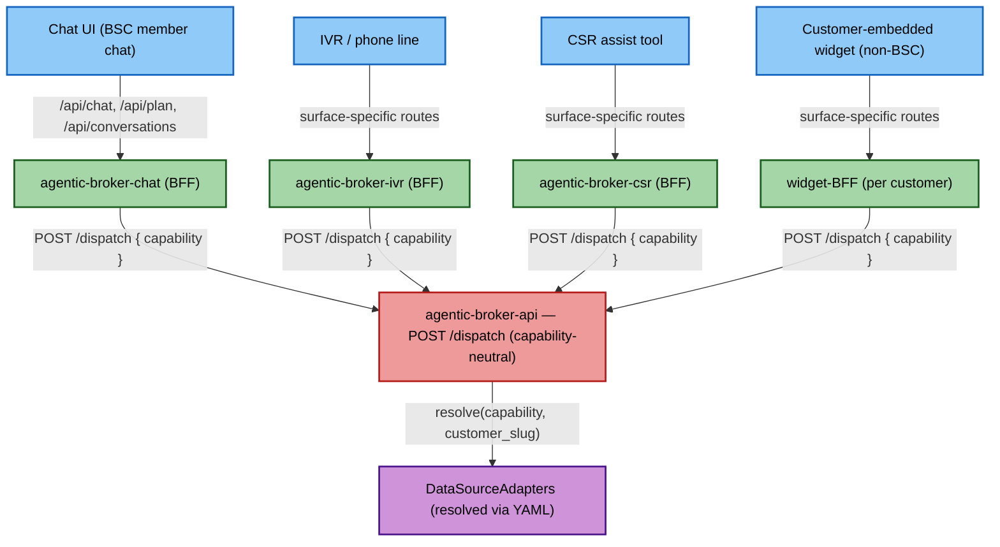
```mermaid
flowchart TB
    classDef client fill:#90caf9,stroke:#1565c0,stroke-width:2px,color:#000
    classDef backend fill:#a5d6a7,stroke:#1b5e20,stroke-width:2px,color:#000
    classDef edge fill:#ef9a9a,stroke:#b71c1c,stroke-width:2px,color:#000
    classDef store fill:#ce93d8,stroke:#4a148c,stroke-width:2px,color:#000

    chatui["Chat UI (BSC member chat)"]:::client
    ivr["IVR / phone line"]:::client
    csr["CSR assist tool"]:::client
    widget["Customer-embedded widget (non-BSC)"]:::client

    bffchat["agentic-broker-chat (BFF)"]:::backend
    bffivr["agentic-broker-ivr (BFF)"]:::backend
    bffcsr["agentic-broker-csr (BFF)"]:::backend
    bffwidget["widget-BFF (per customer)"]:::backend

    broker["agentic-broker-api — POST /dispatch (capability-neutral)"]:::edge
    adapters["DataSourceAdapters (resolved via YAML)"]:::store

    chatui -->|"/api/chat, /api/plan, /api/conversations"| bffchat
    ivr -->|"surface-specific routes"| bffivr
    csr -->|"surface-specific routes"| bffcsr
    widget -->|"surface-specific routes"| bffwidget

    bffchat -->|"POST /dispatch { capability }"| broker
    bffivr -->|"POST /dispatch { capability }"| broker
    bffcsr -->|"POST /dispatch { capability }"| broker
    bffwidget -->|"POST /dispatch { capability }"| broker

    broker -->|"resolve(capability, customer_slug)"| adapters
```

### 5.1 Surface → BFF Assignment Table

This table is load-bearing and is reproduced verbatim from the architecture
decision of record. It is the authoritative answer to "does this need a new BFF?"

| Scenario | BFF |
|---|---|
| Genesys escalation FROM chat UI | `agentic-broker-chat` (same surface) → `{ capability: "escalation.initiate", payload: { conversationId, reason } }` |
| Standalone IVR / phone routing | New BFF: `agentic-broker-ivr` / `agentic-broker-call` |
| Future CSR assist tool | New BFF: `agentic-broker-csr` |
| Customer-embedded widget (non-BSC) | New BFF per customer surface |

Escalation-from-chat is the worked example of "same surface." The member never
leaves the chat UI; the escalation is one more capability the chat surface can
dispatch. IVR is the worked example of "different surface": a phone caller is a
distinct point of human contact with a distinct session model, so it gets
`agentic-broker-ivr`. The CSR assist tool and per-customer widgets follow the
same reasoning.

### Surface → BFF Assignment Rule (decision flow)

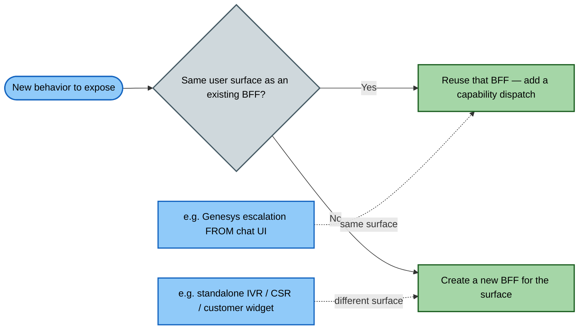
```mermaid
flowchart LR
    classDef client fill:#90caf9,stroke:#1565c0,stroke-width:2px,color:#000
    classDef backend fill:#a5d6a7,stroke:#1b5e20,stroke-width:2px,color:#000
    classDef boundary fill:#cfd8dc,stroke:#455a64,stroke-width:2px,color:#000

    start(["New behavior to expose"]):::client
    q{"Same user surface as an existing BFF?"}:::boundary
    reuse["Reuse that BFF — add a capability dispatch"]:::backend
    create["Create a new BFF for the surface"]:::backend

    esc["e.g. Genesys escalation FROM chat UI"]:::client
    newsurf["e.g. standalone IVR / CSR / customer widget"]:::client

    start --> q
    q -->|"Yes"| reuse
    q -->|"No"| create
    esc -.->|"same surface"| reuse
    newsurf -.->|"different surface"| create
```

### 5.2 Route Inventory — `agentic-broker-chat`

The chat BFF owns three semantic routes. Two are **as-built on `main` today**;
one is **to-be-built for the MVP** (WI-B1-G). Every route translates a surface
verb into a capability string and dispatches to the broker — none of these route
names exists, or could exist, on the broker (see §5.3).

| Route | Capability dispatched | Status | Purpose |
|---|---|---|---|
| `POST /api/chat` | `chat.completion` | as-built (`main`) | Streaming chat turn; translates the chat-send verb, acquires the context token, dispatches to the broker, streams SSE back (Flow A) |
| `GET /api/plan` | `benefits.query` (via [PVG](#the-plan-validation-gate-pvg)) | as-built (`main`) | Plan Validation Gate: fetches plan data from CCS via the context token, gates users from querying plans they have not attested to |
| `GET /api/conversations/{sessionId}` | `conversation.history` | **to-be-built (MVP, WI-B1-G)** | Conversation retrieval; the escalation context-retrieval entry point (§10) |

#### The Plan Validation Gate (PVG)

The **Plan Validation Gate** is a BFF feature, on `main` today, that gates users
from querying plans they have not attested to. The BFF `/api/plan` route fetches
plan data from CCS via the context token and refuses plans outside the verified
attestation. This is distinct from the broker-side NestJS `GET /api/plan`
endpoint that exists only on a branch — that branch endpoint is a contract
violation against B1B2 INV-01 (the broker exposes no named route but `/dispatch`)
and is slated for removal as part of the `POST /dispatch` migration (WI-B1-F).
The **load-bearing PVG lives in the BFF**; the broker-side variant does not.

The PVG's SDK-facing read path is `fetchPlan`, which returns a three-state
`PlanResult` and **never throws** for 404/503: `PLAN_STATUS_NOT_FOUND` (404) or
`PLAN_STATUS_OUTAGE` (503), per A1 INV-06.

#### `GET /api/conversations/{sessionId}` — conversation retrieval (WI-B1-G)

The new conversation-retrieval route is the entry point escalation uses to pull
the full conversation before redaction (§10, Flow D). It dispatches
`conversation.history`, which the broker resolves to the
`PostgresConversationAdapter` — the durable, authoritative conversation store
(B1B2 INV-06). Sierra's native session storage is **not** the source of truth
(E1E2 INV-09).

**Decision for MVP (B-NEW-Z2): conversation retrieval lives in the BFF, not as a
broker endpoint.** Retrieval is a chat-surface semantic ("give me *this
conversation's* history"), so it belongs to the chat BFF as a named route. The
broker stays unaware of "conversation" as a concept — it only sees the opaque
capability `conversation.history` (§4, INV-02). Putting a
`GET /conversations/...` route on the broker would name a semantic on the router
and violate B1B2 INV-01/INV-11.

**Trigger for revisit:** a second surface needs conversation retrieval. At that
point the route is duplicated into that surface's BFF (each owns its own), never
hoisted onto the broker.

### 5.3 Structural Enforcement — Why The Broker Cannot Hold A Named Route

The surface rule is enforced by the *shape of the broker's only endpoint*, not by
review vigilance alone. `POST /dispatch` accepts exactly:

```text
POST /dispatch
body:    { capability: string, payload: unknown }
headers: x-context-token, x-correlation-id
```

There is **nowhere to put a named semantic route** on the broker. The body has no
field that names an endpoint; the path is fixed at `/dispatch`. A developer who
wants to add `POST /chat`, `GET /conversations`, or `POST /escalate` to the
broker has to add a *new HTTP endpoint* — and that is a **detectable contract
violation** tied directly to B1B2 INV-11 (the drift guard: any PR adding a named
HTTP endpoint other than `/dispatch` to `agentic-broker-api` is rejected at
review as an architectural violation of INV-01).

The question the violation answers itself is: "why are you adding a named
endpoint to the broker? Put it in the BFF." Because the broker has no semantic
endpoints, there is nowhere for business logic to accumulate — which is precisely
why the broker kept drifting before this contract existed: developers add code to
the broker because it is the first HTTP service they touch. The capability-neutral
dispatch contract is the structural backstop.

| Mechanism | Enforces | Clause |
|---|---|---|
| `POST /dispatch` is the broker's only endpoint | No named semantic route can be added without a visible new endpoint | B1B2 INV-01 |
| Body is `{ capability, payload }` only | Nowhere to encode an endpoint name in the request | §4 contract |
| Capabilities are opaque strings resolved via YAML | Broker never references chat/conversation/benefits by name | B1B2 INV-02 |
| PR review drift guard | Any new named endpoint on the broker is rejected | B1B2 INV-11 |
| BFF owns all semantic routes for its surface | Semantic logic has a home that is *not* the broker | B1B2 INV-05 |

### 5.4 Request Translation — Semantic To Capability

The BFF is the **semantic-to-capability translator**. The SDK speaks surface
semantics (a chat message with a Bearer JWT); the broker speaks capabilities. The
BFF sits between them: it validates the caller's context token, self-calls
`acquireCcsContextToken` (OAuth client-credentials) to obtain the CCS context
token, translates the surface verb into a capability string, and dispatches
`POST /dispatch` with `{ capability }` plus `x-context-token` and
`x-correlation-id`. The broker streams the adapter response back, and the BFF
re-emits it to the SDK as SSE.

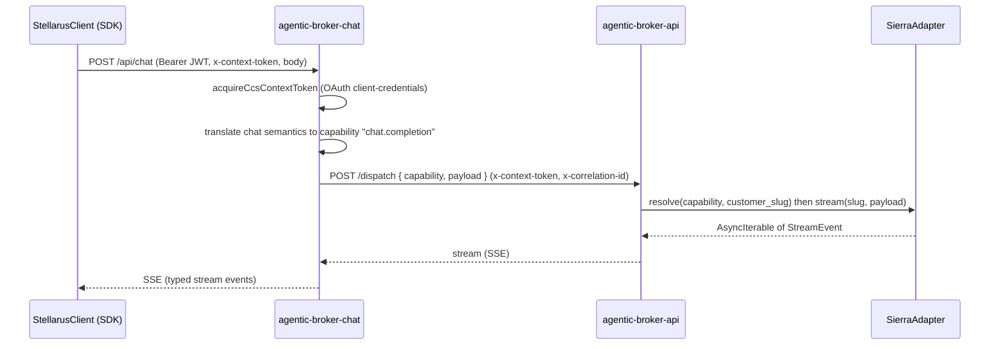
```mermaid
sequenceDiagram
    participant SDK as StellarusClient (SDK)
    participant BFF as agentic-broker-chat
    participant Broker as agentic-broker-api
    participant Adapter as SierraAdapter

    SDK->>BFF: POST /api/chat (Bearer JWT, x-context-token, body)
    BFF->>BFF: acquireCcsContextToken (OAuth client-credentials)
    BFF->>BFF: translate chat semantics to capability "chat.completion"
    BFF->>Broker: POST /dispatch { capability, payload } (x-context-token, x-correlation-id)
    Broker->>Adapter: resolve(capability, customer_slug) then stream(slug, payload)
    Adapter-->>Broker: AsyncIterable of StreamEvent
    Broker-->>BFF: stream (SSE)
    BFF-->>SDK: SSE (typed stream events)
```

The BFF propagates `x-correlation-id` to every downstream call (D1 SEQ-8); the
broker propagates it onward to the adapter (B1B2 SEQ-7), so a single correlation
id threads the whole request and lands in every structured log event
(F1F2 INV-06). The correlation id is observability-only and carries no security
meaning (D1 INV-05).

### 5.5 Failure Handling

Failures fall into two classes: those the BFF originates (translation, token
acquisition, attestation) and those it passes through from the broker/adapters.

| Condition | Response |
|---|---|
| Missing/invalid Bearer JWT at APIM edge | `401` (rejected before reaching BFF) |
| Context token acquisition (`acquireCcsContextToken`) fails | `5xx` — BFF cannot dispatch without a context token |
| `@RequireScopes('chat')` not satisfied on `/dispatch` | `403` (enforced by `ContextTokenGuard`, D1 INV-07) |
| Per-tenant rate limit exceeded | `429` (broker edge middleware, B1B2 INV-08) — SDK surfaces `RateLimitError` |
| Plan not attested / not found (PVG `/api/plan`) | `404` → `fetchPlan` returns `PLAN_STATUS_NOT_FOUND` (never throws, A1 INV-06) |
| Benefits Service outage | `503` → `fetchPlan` returns `PLAN_STATUS_OUTAGE` (A1 INV-06) |
| Conversation not found (`/api/conversations/{sessionId}`) | `404` — escalation handoff aborts before redaction (§10) |
| Adapter/broker stream error | passes through as a typed SSE error event; BFF does not re-interpret business failures |

### 5.6 Key Constraints & Rules

- **One BFF per surface.** Same user surface = same BFF; different surface = new BFF. This is the load-bearing rule (B1B2 INV-05).
- **The BFF owns ALL semantic routes for its surface.** `/api/chat`, `/api/plan`, `/api/conversations/{sessionId}` live in `agentic-broker-chat`, never on the broker (B1B2 INV-01/INV-05).
- **The broker has nowhere to hold a named route.** `POST /dispatch` takes `{ capability, payload }` only; any named semantic endpoint on the broker is a detectable contract violation (B1B2 INV-11).
- **The BFF is the semantic-to-capability translator.** It acquires the CCS context token (`acquireCcsContextToken`, OAuth client-credentials) and maps surface verbs to capability strings.
- **The BFF propagates `x-correlation-id` to all downstream calls.** Unbroken trace chain SDK→BFF→broker→adapter (D1 SEQ-8, B1B2 SEQ-7, F1F2 INV-06).
- **Conversation retrieval lives in the BFF (B-NEW-Z2), not as a broker endpoint.** `GET /api/conversations/{sessionId}` dispatches `conversation.history`; it is the escalation context-retrieval entry point consumed by §10.
- **The Plan Validation Gate lives in the BFF.** `/api/plan` fetches plan data from CCS via the context token and gates un-attested plan queries; the branch-only broker-side `GET /api/plan` is a violation to be removed (WI-B1-F).

### Cross-References

- **§4 (Thin-Router Broker)** — the capability-neutral `POST /dispatch` contract this section's enforcement depends on; capability registry and Resolver.
- **§10 (Escalation)** — consumes `GET /api/conversations/{sessionId}` (Flow D) for handoff context; `escalation.initiate` is dispatched from the chat BFF as the same-surface example of the rule.


## 6. Tenant Context & Auth Spine

The Tenant Context & Auth Spine is the layer that turns an authenticated human or
system caller into a verifiable, tenant-scoped, least-privilege identity that every
downstream service can trust without re-authenticating. Its authoritative source of
truth is the **CCS (Customer Configuration Service)** — `apps/customer-configuration-service`
— which issues, signs, and validates the **context token**: an RS256-signed JWT
carrying tenant and identity claims. CCS owns the **scope registry** and the **persona
registry**; it does **not** authenticate humans (Auth0 does that) and it does **not**
route business traffic (the Thin-Router Broker does that).

The Spine has three trust segments in series: **Auth0** authenticates the human and
stamps a persona claim; **APIM (Azure API Management)** is the network trust boundary
that validates the external Auth0 JWT, calls CCS to mint the context token, and injects
trusted headers while stripping forged ones; and the shared **ContextTokenGuard**
(`@stellarus/auth/internal/nest`) inside each service verifies the context token against
CCS JWKS and enforces declared scopes. The context token is the single artifact that
crosses from the edge into the mesh; the Auth0 access JWT never travels past APIM.

This section is contract-extension work, not greenfield. The existing SEAM —
`apps/agentic-broker-api/contracts/tenant-context.contract.ts` (36 clauses) plus
`packages/auth/src/internal/types.ts` (`InternalContextClaims`) — is the authority for
this slice. **We extend those 36 clauses; we do not replace them.** The new behavior in
scope for MVP is narrow: a single `chat` scope, a per-request correlation id discipline,
and the alignment of three drifting token-claim interfaces. Everything else here documents
the as-built contract so consumers can converge on it.

### Architecture Position

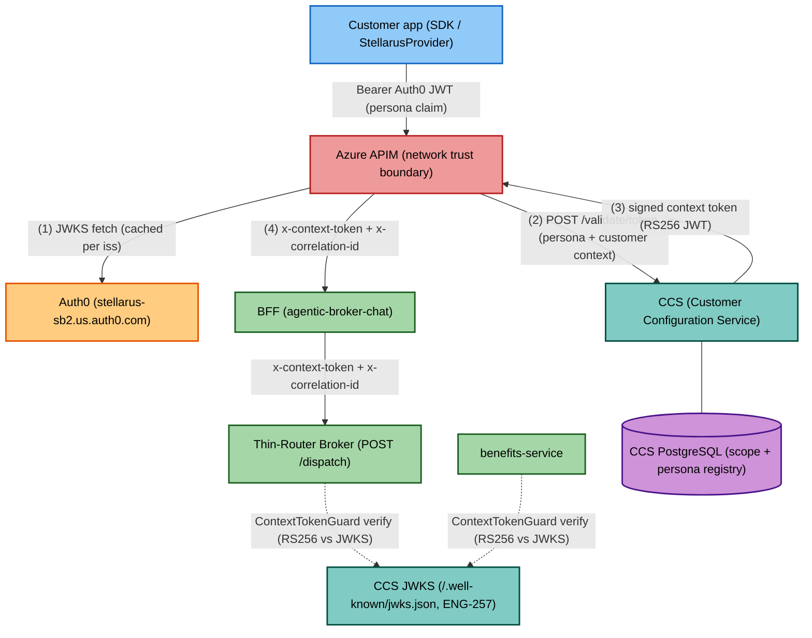
```mermaid
flowchart TB
    classDef client fill:#90caf9,stroke:#1565c0,stroke-width:2px,color:#000
    classDef identity fill:#ffcc80,stroke:#e65100,stroke-width:2px,color:#000
    classDef edge fill:#ef9a9a,stroke:#b71c1c,stroke-width:2px,color:#000
    classDef backend fill:#a5d6a7,stroke:#1b5e20,stroke-width:2px,color:#000
    classDef ccs fill:#80cbc4,stroke:#004d40,stroke-width:2px,color:#000
    classDef store fill:#ce93d8,stroke:#4a148c,stroke-width:2px,color:#000

    client["Customer app (SDK / StellarusProvider)"]:::client
    auth0["Auth0 (stellarus-sb2.us.auth0.com)"]:::identity
    apim["Azure APIM (network trust boundary)"]:::edge
    ccs["CCS (Customer Configuration Service)"]:::ccs
    jwks["CCS JWKS (/.well-known/jwks.json, ENG-257)"]:::ccs
    bff["BFF (agentic-broker-chat)"]:::backend
    broker["Thin-Router Broker (POST /dispatch)"]:::backend
    benefits["benefits-service"]:::backend
    db[("CCS PostgreSQL (scope + persona registry)")]:::store

    client -->|"Bearer Auth0 JWT (persona claim)"| apim
    apim -->|"(1) JWKS fetch (cached per iss)"| auth0
    apim -->|"(2) POST /validate/token (persona + customer context)"| ccs
    ccs --- db
    ccs -->|"(3) signed context token (RS256 JWT)"| apim
    apim -->|"(4) x-context-token + x-correlation-id"| bff
    bff -->|"x-context-token + x-correlation-id"| broker
    broker -.->|"ContextTokenGuard verify (RS256 vs JWKS)"| jwks
    benefits -.->|"ContextTokenGuard verify (RS256 vs JWKS)"| jwks
```

CCS owns:

- issuing and RS256-signing context tokens via `TokenService.sign()` (jose)
- the scope registry (14 scopes today + the new `chat` scope) and persona registry
- `POST /validate/token` and (ENG-257) `GET /.well-known/jwks.json`

CCS does **not** own:

- authenticating humans — Auth0 validates credentials and issues access tokens
- the network trust boundary — APIM validates external JWTs and injects trusted headers
- scope **enforcement** at the call site — ContextTokenGuard does that inside each service

APIM owns:

- validating external Auth0 JWTs (JWKS cached per issuer)
- calling CCS `POST /validate/token` and injecting `x-context-token`
- generating one UUIDv4 `x-correlation-id` per request and stripping inbound `x-*` headers

### 6.1 The Context Token

The context token is an RS256-signed JWT minted by CCS and verified by every consumer
against CCS JWKS. It is distinct from the Auth0 access JWT — the Auth0 token authenticates
the human at the edge and is consumed by APIM; the context token authorizes the request
inside the mesh and is consumed by services. It travels as the `x-context-token` header.

| Claim | Type | Description |
|---|---|---|
| `iss` | `text` | Token issuer — CCS. Validated by ContextTokenGuard (INV-06). |
| `aud` | `text` | Audience — platform-wide `stellarus-context-token` constant for v1 (see ENG-286). MUST be present and non-empty (INV-03). |
| `exp` | `number` | Expiry (epoch seconds). Validated before claims attach (TENANT-D1-SEQ-6). |
| `iat` | `number` | Issued-at (epoch seconds). |
| `sub` | `uuid` | Subject — the resolved principal. |
| `customer_id` | `uuid` | Tenant primary key. |
| `customer_slug` | `text` | Immutable tenant identifier (e.g. `bsca`) — drives ALL tenant scoping downstream. |
| `principal_id` | `text` | Identity of the calling principal within the tenant. |
| `persona` | `text` | Identity class — one of `member`, `employee`, `provider` for human flows. |
| `scopes` | `text[]` | Granted permission strings in `{resource}:{action}` format. |
| `mode` | `text` (optional) | `live` \| `test` — present ONLY in `system`-persona (API-key) tokens (INV-09). |

`correlation_id` is **not** in this list and never will be — `TokenService.sign()` takes
`Omit<ContextTokenClaims, 'correlation_id'>` by design (INV-02). See §6.5.

The signing path is fixed by `TENANT-D1-SEQ-2`: `TokenService.sign()` MUST emit `iss`,
`aud`, `exp`, `iat`, `sub`, `customer_id`, `customer_slug`, `principal_id`, `persona`, and
`scopes` before returning the token to APIM. A token missing `aud` is a malformed token
that the downstream guard rejects (INV-03, the ENG-251 fix, referenced as applied).

### 6.2 Claims, Scope, and Persona Registry (Data Model)

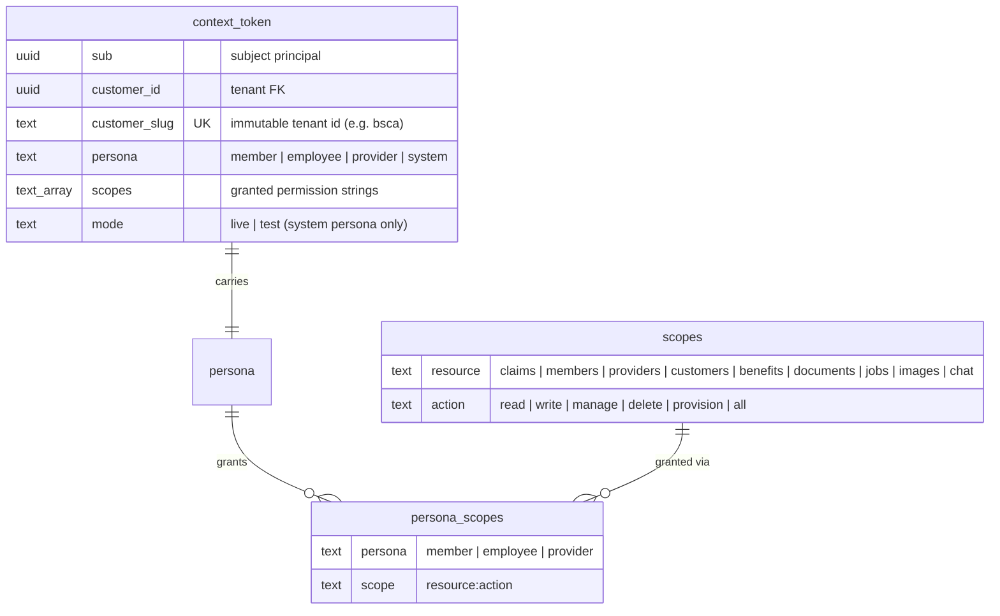
```mermaid
erDiagram
    context_token ||--|| persona : "carries"
    persona ||--o{ persona_scopes : "grants"
    scopes ||--o{ persona_scopes : "granted via"

    context_token {
        uuid sub "subject principal"
        uuid customer_id "tenant FK"
        text customer_slug UK "immutable tenant id (e.g. bsca)"
        text persona "member | employee | provider | system"
        text_array scopes "granted permission strings"
        text mode "live | test (system persona only)"
    }
    scopes {
        text resource "claims | members | providers | customers | benefits | documents | jobs | images | chat"
        text action "read | write | manage | delete | provision | all"
    }
    persona_scopes {
        text persona "member | employee | provider"
        text scope "resource:action"
    }
```

#### context_token

| Column | Type | Constraints |
|---|---|---|
| `sub` | `uuid` | NOT NULL — resolved principal, mirrors `principal_id` context |
| `customer_id` | `uuid` | NOT NULL — tenant FK to CCS customers |
| `customer_slug` | `text` | NOT NULL, UNIQUE per tenant — immutable; drives PostgresConversationAdapter schema, benefits-service partition, RateLimiter budget, analytics cache key. Resolved at the APIM/CCS boundary, never client-supplied. |
| `persona` | `text` | NOT NULL — for human flows validated against `VALID_PERSONAS` (INV-01) |
| `scopes` | `text[]` | NOT NULL — enforced by ContextTokenGuard via `@RequireScopes()` (INV-07) |
| `mode` | `text` | NULLABLE — `live` \| `test`; present only in `system`-persona tokens (INV-09); verifier throws `InvalidContextTokenError` if present but not `live`\|`test` |

#### scopes

| Column | Type | Constraints |
|---|---|---|
| `resource` | `text` | NOT NULL — left side of `{resource}:{action}` |
| `action` | `text` | NOT NULL — right side of `{resource}:{action}` |

Scope strings are convention-enforced as `{resource}:{action}` — there is no compile-time
constraint, so `ACT-MAINTAINER` SHALL NOT register a scope that deviates from this format
(INV-11). The `chat` scope is the documented exception in shape (`resource=chat`,
`action=all`).

#### persona_scopes

| Column | Type | Constraints |
|---|---|---|
| `persona` | `text` | NOT NULL, CHECK `persona IN ('member','employee','provider')` |
| `scope` | `text` | NOT NULL — references a registered scope; default grants per persona |

#### Scope Registry (as-built: 14 scopes, migrations 0000 + 0002)

| Scope | Resource | Action | Default persona grants |
|---|---|---|---|
| `claims:read` | claims | read | member, employee, provider |
| `claims:write` | claims | write | employee |
| `members:read` | members | read | member, employee, provider |
| `providers:manage` | providers | manage | employee, provider |
| `customers:manage` | customers | manage | employee (requires `customer_slug='stellarus'`, INV-10) |
| `benefits:read` | benefits | read | employee |
| `benefits:write` | benefits | write | employee |
| `documents:read` | documents | read | employee, member |
| `documents:write` | documents | write | employee |
| `documents:delete` | documents | delete | employee |
| `jobs:read` | jobs | read | employee |
| `jobs:write` | jobs | write | employee |
| `images:read` | images | read | employee |
| `customers:provision` | customers | provision | none — operator-only (INV-08) |

`customers:provision` is the one scope `ACT-MAINTAINER` SHALL NOT grant to any default
persona — it is operator-only (INV-08). `customers:manage` is granted to `employee` but
gated by tenant: CCS SHALL NOT grant CCS admin access unless `persona === 'employee'`
**and** `customer_slug === 'stellarus'` (INV-10).

#### New scope for MVP (to-be-built): `chat`

| Scope | Resource | Action | Default persona grants |
|---|---|---|---|
| `chat` | chat | all | member TBD, employee TBD, provider —, system per-key |

The `chat` scope is a **single** scope — no `send`/`receive` split — added for the broker
`POST /dispatch` handler, which gates on `@RequireScopes('chat')`. It requires CCS migration
`0003_chat_scopes.sql` plus persona grants (likely `member` + `employee`, **exact grants
TBD**). This is the **WI-D1-A** work item.

**Decision for v1: single `chat` scope, no action delineation.** A `chat:send` /
`chat:receive` split adds two registry rows and two guard checks for a boundary the
product does not yet draw.

**Trigger for revisit:** a surface needs to grant read-only transcript access without
the ability to send turns, OR a compliance requirement separates authoring from reading.

**This migration is IRREVERSIBLE** (per the Slice taxonomy) — once `0003_chat_scopes.sql`
lands and tokens are minted with `chat`, the grant matrix is in production identity tokens
and cannot be silently rescinded without breaking live callers. The persona grant decision
(member-only vs member+employee) MUST be settled before the migration is written.

### 6.3 Persona Model

Persona is the identity class carried in the context token and is constrained at the
database level: `CHECK (persona IN ('member','employee','provider'))`. Persona enters the
chain as an Auth0 custom claim (`https://stellarus.com/persona`) and is validated by CCS
against `VALID_PERSONAS = {member, employee, provider}` for every human flow before a
token is issued (INV-01).

| Persona | Source | In `VALID_PERSONAS`? | Notes |
|---|---|---|---|
| `member` | Auth0-federated human | yes | default scopes: `claims:read`, `members:read`, `documents:read` |
| `employee` | Auth0-federated human (Stellarus staff) | yes | broadest grants; `customers:manage` only when `customer_slug='stellarus'` (INV-10) |
| `provider` | Auth0-federated human | yes | scopes: `claims:read`, `members:read`, `providers:manage` |
| `system` | API-key path only (`validate.service.ts`) | **no** | NOT JWT-validated; the ONLY persona that carries `mode` |
| `csr` | (BSC contact-center role) | **DEFERRED** | a BSC CSR is NOT a Stellarus employee — separate persona needed (WI-D1-B) |

`system` is real and in production, but it lives on the API-key path and is deliberately
**not** in `VALID_PERSONAS` — it is never produced by the human Auth0 flow, so the
human-flow validator must not accept it. It is the only persona that carries `mode`.

`csr` is the open persona question. A BSC CSR is not a Stellarus employee, so reusing
`employee` would over-grant a third party. **Deferred to post-D1 (WI-D1-B).** This is an
IRREVERSIBLE slice (a new persona is a lasting identity-model commitment) and requires a
cross-team discussion before any DB CHECK constraint change.

**Trigger for revisit:** a CSR-assist surface (e.g. a future `agentic-broker-csr` BFF)
reaches design — at that point the `csr` persona is on the critical path and the CHECK
constraint must be widened in a migration before tokens can carry it.

### 6.4 Issuance & Verification Path

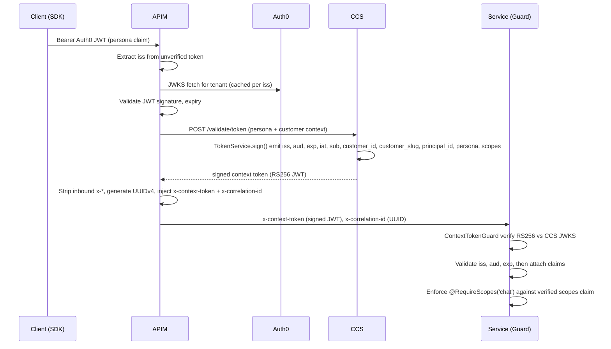
```mermaid
sequenceDiagram
    participant C as Client (SDK)
    participant APIM
    participant Auth0
    participant CCS
    participant Service as Service (Guard)

    C->>APIM: Bearer Auth0 JWT (persona claim)
    APIM->>APIM: Extract iss from unverified token
    APIM->>Auth0: JWKS fetch for tenant (cached per iss)
    APIM->>APIM: Validate JWT signature, expiry
    APIM->>CCS: POST /validate/token (persona + customer context)
    CCS->>CCS: TokenService.sign() emit iss, aud, exp, iat, sub, customer_id, customer_slug, principal_id, persona, scopes
    CCS-->>APIM: signed context token (RS256 JWT)
    APIM->>APIM: Strip inbound x-*, generate UUIDv4, inject x-context-token + x-correlation-id
    APIM->>Service: x-context-token (signed JWT), x-correlation-id (UUID)
    Service->>Service: ContextTokenGuard verify RS256 vs CCS JWKS
    Service->>Service: Validate iss, aud, exp, then attach claims
    Service->>Service: Enforce @RequireScopes('chat') against verified scopes claim
```

The path, step by step, with clause traceability:

1. The customer SDK (`useChat.chat()`) acquires an Auth0 Bearer JWT via
   `getAccessTokenSilently()` before any fetch (SDK-A1-SEQ-2) and sends it to APIM.
2. APIM validates the Auth0 JWT (JWKS cached per `iss`), then POSTs CCS `/validate/token`
   with the Auth0 persona + customer context (+ `target_audience` for ENG-286) **before**
   injecting `x-context-token` (TENANT-D1-SEQ-1). Without this, services receive an
   unvalidated request.
3. CCS `TokenService.sign()` emits the full claim set **before** returning the signed token
   (TENANT-D1-SEQ-2). `aud` MUST be present (INV-03); `correlation_id` is never embedded
   (INV-02).
4. APIM generates a fresh UUIDv4 and sets `x-correlation-id` **before** forwarding
   (TENANT-D1-SEQ-3), and strips any inbound `x-correlation-id` from external callers
   **before** injecting its own (TENANT-D1-SEQ-4, INV-04) — otherwise external callers
   could forge correlation ids.
5. Inside the service, **ContextTokenGuard** verifies the RS256 signature against CCS JWKS
   **before** extracting claims (TENANT-D1-SEQ-5, INV-06) — unverified claims must never
   pass through.
6. The guard validates `iss`, `aud`, `exp` **after** signature verification and **before**
   attaching claims (TENANT-D1-SEQ-6) — otherwise expired or misrouted tokens are accepted.
7. The guard enforces required scopes from `@RequireScopes('chat')` metadata **after** claim
   attachment — ALL declared scopes must be present in the verified `scopes` claim
   (TENANT-D1-SEQ-7, INV-07) — otherwise unpermissioned personas reach protected routes.
8. The BFF propagates `x-correlation-id` to all downstream service calls during request
   processing (TENANT-D1-SEQ-8) so the distributed trace chain stays intact.

**ContextTokenGuard** (`@stellarus/auth/internal/nest`) is the platform's single intended
verification path. The guard verifies the RS256 signature against CCS JWKS, validates
`iss`/`aud`/`exp`, attaches the verified `ContextTokenPayload` to the request
(`req.contextToken`, IP-4), and enforces `@RequireScopes()`. As-built today, `agentic-broker-api`
reimplements this guard locally — a divergence to converge onto the shared guard, not a
second implementation to maintain.

#### Scope Enforcement Decision

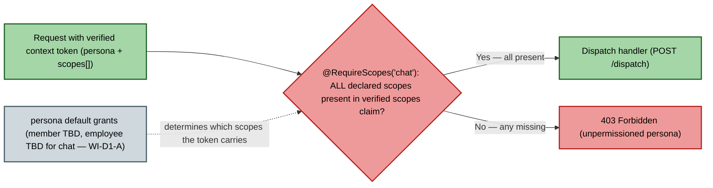
```mermaid
flowchart LR
    classDef edge fill:#ef9a9a,stroke:#b71c1c,stroke-width:2px,color:#000
    classDef backend fill:#a5d6a7,stroke:#1b5e20,stroke-width:2px,color:#000
    classDef boundary fill:#cfd8dc,stroke:#455a64,stroke-width:2px,color:#000

    req["Request with verified context token (persona + scopes[])"]:::backend
    gate{"@RequireScopes('chat'): ALL declared scopes present in verified scopes claim?"}:::edge
    persona["persona default grants (member TBD, employee TBD for chat — WI-D1-A)"]:::boundary
    handler["Dispatch handler (POST /dispatch)"]:::backend
    deny["403 Forbidden (unpermissioned persona)"]:::edge

    req --> gate
    persona -.->|"determines which scopes the token carries"| gate
    gate -->|"Yes — all present"| handler
    gate -->|"No — any missing"| deny
```

Enforcement is all-or-nothing: a request reaches the handler only if **every** scope
declared by `@RequireScopes()` is present in the verified `scopes[]` claim (INV-07). A
partial match is a denial. The scopes a token carries are determined upstream by the
persona's default grants at issuance — which is why the `chat` persona-grant decision
(WI-D1-A) is load-bearing: if `member` is not granted `chat`, member chat is dead on
arrival at the guard regardless of any code change in the broker or BFF.

### 6.5 correlation_id (Definitive)

`correlation_id` is observability metadata, not a security claim. The facts are fixed:

- **NOT in the JWT.** `TokenService.sign()` takes `Omit<ContextTokenClaims, 'correlation_id'>`
  by design (INV-02). The signed token cannot carry it.
- **APIM-generated.** APIM generates a fresh UUIDv4 per request (INV-04).
- **Inbound stripped.** APIM strips any inbound `x-correlation-id` from external callers
  before injecting its own (TENANT-D1-SEQ-4, INV-04) — forged correlation ids are impossible.
- **Header-only.** It travels as the `x-correlation-id` HTTP header, is propagated
  server-side by the BFF and broker to adapters, and appears in every structured log event.
- **Not a security claim.** Consumers SHALL NOT treat `x-correlation-id` as a security
  claim — it is observability metadata only (INV-05).

The `correlation_id?` field that appears in the broker's `ContextTokenPayload` interface is
vestigial passthrough — it is never populated from the signed token and must not be relied
on as an authenticated value.

### 6.6 mode (Definitive)

`mode` is an API-key attribute, not a human-flow claim:

- value is `live` | `test`
- present ONLY in `system`-persona tokens (the API-key path); omitted from
  `member`/`employee`/`provider` tokens (INV-09)
- the key-prefix convention is `sk_live_` / `sk_test_`
- the verifier throws `InvalidContextTokenError` if `mode` is present but is not `live`
  or `test`

The invariant is one-directional and absolute: **CCS SHALL NOT embed `mode` in any
human-flow token (INV-09).** A `mode` claim appearing on a `member`/`employee`/`provider`
token is a malformed token, not a feature.

### 6.7 Three-Interface Alignment (WI-D1-E)

Three definitions of the context-token claims exist today, and they disagree on
`correlation_id`. This is the cleanup target.

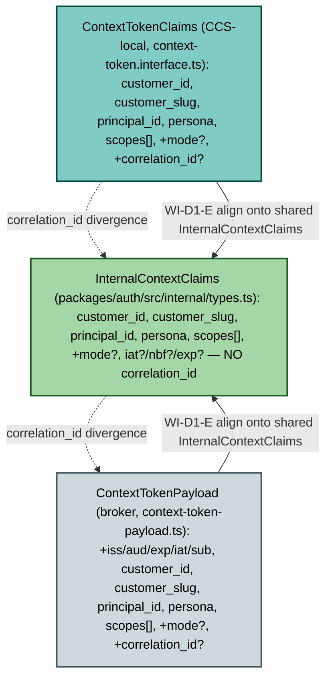
```mermaid
flowchart TB
    classDef ccs fill:#80cbc4,stroke:#004d40,stroke-width:2px,color:#000
    classDef backend fill:#a5d6a7,stroke:#1b5e20,stroke-width:2px,color:#000
    classDef boundary fill:#cfd8dc,stroke:#455a64,stroke-width:2px,color:#000

    ccsLocal["ContextTokenClaims (CCS-local, context-token.interface.ts): customer_id, customer_slug, principal_id, persona, scopes[], +mode?, +correlation_id?"]:::ccs
    internal["InternalContextClaims (packages/auth/src/internal/types.ts): customer_id, customer_slug, principal_id, persona, scopes[], +mode?, iat?/nbf?/exp? — NO correlation_id"]:::backend
    broker["ContextTokenPayload (broker, context-token-payload.ts): +iss/aud/exp/iat/sub, customer_id, customer_slug, principal_id, persona, scopes[], +mode?, +correlation_id?"]:::boundary

    ccsLocal -. "correlation_id divergence" .-> internal
    internal -. "correlation_id divergence" .-> broker
    ccsLocal -->|"WI-D1-E align onto shared InternalContextClaims"| internal
    broker -->|"WI-D1-E align onto shared InternalContextClaims"| internal
```

| Interface | Location | Has `correlation_id`? | Has `iss`/`aud`/`exp`? |
|---|---|---|---|
| `ContextTokenClaims` | `apps/customer-configuration-service` (`context-token.interface.ts`) | yes (optional) | no |
| `InternalContextClaims` | `packages/auth/src/internal/types.ts` | **no** | partial (`iat?`/`nbf?`/`exp?`) |
| `ContextTokenPayload` | `apps/agentic-broker-api` (`context-token-payload.ts`) | yes (optional) | yes |

The shared package (`InternalContextClaims`) has it right: `correlation_id` is **not** a
claim (it is a header, per §6.5), so the alignment target is to converge the CCS-local and
broker interfaces onto the shared package's shape, dropping `correlation_id` from the claim
type. This is **WI-D1-E**, a SLICE-LOCAL cleanup — no migration, no contract change to the
36 SEAM clauses, just type convergence so all three consumers describe the same token.

### 6.8 Auth0 Facts

- **Tenant:** `stellarus-sb2.us.auth0.com`.
- **Flow:** Authorization Code + PKCE (Auth0 PKCE), handled inside the SDK via
  `@auth0/auth0-react`. The removed `apiKey` config was a security hole; `StellarusProvider`
  is now the exclusive PKCE entry point (INV-03 of the SDK slice).
- **Persona custom claim:** `https://stellarus.com/persona` — Auth0 injects the persona
  into the access JWT (SDK-A1-SEQ flow, step 2 of Flow B) before APIM forwards it to CCS
  `/validate/token`.
- **Session lifetime — INVESTIGATION_MARKER SDK-INV-14.** `ACT-STELLARUS` SHALL NOT
  configure the Auth0 tenant session lifetime beyond the healthcare compliance ceiling, and
  SHALL verify the policy before GA. **Do not lock the session lifetime until the
  compliance ceiling is verified** — locking it first risks shipping a non-compliant
  default that is then load-bearing for live members.

### 6.9 Failure Handling

#### Context Token Verification Failures

| Condition | Response |
|---|---|
| Missing `x-context-token` header | `401` |
| RS256 signature does not verify against CCS JWKS | `401` |
| `iss` mismatch | `401` |
| `aud` missing, empty, or mismatched | `401` (INV-03) |
| `exp` in the past | `401` |
| `@RequireScopes()` scope not present in verified `scopes[]` | `403` (INV-07) |
| `mode` present but not `live`\|`test` | `InvalidContextTokenError` (rejected, INV-09) |

#### Token Issuance Failures (CCS `/validate/token`)

| Condition | Response |
|---|---|
| `persona` not in `VALID_PERSONAS` for a human flow | issuance refused (INV-01) |
| `aud` cannot be resolved | issuance refused — no token without `aud` (INV-03) |
| Auth0 JWT invalid at APIM | `401` at edge — CCS never called |

### 6.10 Security Model

#### Trust Boundaries

| Layer | Trust level | Verification |
|---|---|---|
| External clients | Untrusted | Must pass through APIM — no direct service access |
| Auth0 | Identity provider | Authenticates humans; issues access JWT with persona claim |
| APIM | Trust boundary | Validates Auth0 JWT via JWKS; strips inbound `x-*`; injects `x-context-token` + `x-correlation-id` |
| CCS | Authoritative issuer | RS256-signs context tokens; owns scope + persona registry |
| Internal services | Trusted network | ContextTokenGuard verifies context token RS256 vs CCS JWKS |

#### Header Security

APIM is the only component permitted to set `x-context-token` and `x-correlation-id` on
the trusted side. Any inbound `x-*` header from an external caller is stripped before
APIM injects its own (INV-04). Services treat these headers as trusted **only because**
they arrive from inside the APIM boundary and the context token's signature verifies.

#### Scope Enforcement

Scope enforcement is the responsibility of the ContextTokenGuard at the call site, not of
CCS. CCS decides which scopes a persona is granted at issuance; the guard decides whether
the verified token satisfies a route's `@RequireScopes()` declaration (INV-07). The two
must not be conflated — over-granting at issuance is contained at the route only if both
sides are correct.

#### Key Material (JWKS)

Production RS256 verification depends on the **CCS JWKS endpoint** at
`/.well-known/jwks.json` (**ENG-257**, owner Jordan Ramos, draft PR open). Consumers verify
context-token signatures against the published key set, prefer reachable JWKS keys, and
refresh on a rotated `kid`. A static `CONTEXT_TOKEN_PUBLIC_KEY` PEM is permitted only as a
transport-failure fallback today.

**Decision for v1: static-key fallback stays only until ENG-257 lands.** Once ENG-257 is
complete, neither the broker nor benefits-service SHALL fall back to a static
`CONTEXT_TOKEN_PUBLIC_KEY` in production (INV-12a, INV-12b).

**Trigger for revisit:** ENG-257 merges — at that point the static-key path is removed
from production config for both `agentic-broker-api` and `benefits-service`.

### 6.11 Decisions Still Open

| # | Question | Owner | Why it matters |
|---|---|---|---|
| 1 | `chat` persona grants — member-only vs member+employee (WI-D1-A) | Ketema / D1 | IRREVERSIBLE migration `0003_chat_scopes.sql`; wrong grant matrix is in live identity tokens |
| 2 | `csr` persona definition (WI-D1-B) | cross-team (BSC + Stellarus) | a BSC CSR is not a Stellarus employee; reusing `employee` over-grants a third party |
| 3 | CCS JWKS endpoint completion (ENG-257) | Jordan Ramos | blocks production RS256 verification (INV-12a/b); removes static-key fallback |
| 4 | Per-consumer `aud` scoping (ENG-286) | Bharath | today `aud` is one constant for all tokens, cross-service replay risk |
| 5 | Auth0 session lifetime vs healthcare ceiling (SDK-INV-14) | ACT-STELLARUS | must verify compliance ceiling before GA; do not lock lifetime first |

**ENG-286 — per-consumer `aud`.** Today `aud` is the same `stellarus-context-token` for all
tokens, which means a token minted for one service is structurally accepted by another —
cross-service replay. **Decision for v1: accept the platform-wide `aud` constant**, enforced
as present and non-empty (Phase 1). **Trigger for revisit:** cross-service replay risk
materializes — a token issued for one consumer is observed being accepted by another, OR a
security review flags the shared audience — at which point Phase 2 introduces per-consumer
`aud` scoping.

**The single biggest blocking decision** is ENG-257 (JWKS): until it lands, every consumer
is on the static-key fallback and INV-12 cannot be satisfied in production, which gates the
broker and benefits-service from trusting CCS-signed tokens the way the contract requires.

### 6.12 Key Constraints & Rules

- **CCS is the authoritative source of truth for context tokens.** It issues, signs, and
  validates them and owns the scope + persona registry. No other service mints a context token.
- **The context token is RS256-signed and verified against CCS JWKS.** Never accept claims
  from an unverified token (INV-06).
- **`correlation_id` is never in the JWT.** It is an APIM-generated, header-only,
  observability-only value (INV-02, INV-04, INV-05).
- **`mode` appears only in `system`-persona tokens.** Never in a human-flow token (INV-09).
- **`customer_slug` is resolved at the APIM/CCS boundary, never client-supplied.** It drives
  all tenant scoping downstream.
- **Scope strings are `{resource}:{action}`, convention-enforced.** Do not register a scope
  that deviates from the format (INV-11); `chat` (`chat:all`) is the documented exception.
- **`customers:provision` is operator-only.** Never granted to a default persona (INV-08).
- **Extend the 36-clause SEAM contract, never replace it.** `tenant-context.contract.ts`
  plus `InternalContextClaims` is the authority for this slice; the only additive behavior
  for MVP is the `chat` scope, the correlation-id discipline, and the WI-D1-E interface
  alignment.


## 7. The SDK (@stellarus/chat-client)

The SDK is the only Compass Platform component a customer developer ever touches. Everything
else in this spec — the Thin-Router Broker, the Tenant/Auth Spine, Benefits grounding,
Escalation, Telemetry — sits behind Azure APIM and is invisible to the customer. `@stellarus/chat-client`
is the published npm package through which any customer surface reaches the conversational AI
runtime: a customer installs it, wraps their React tree in one provider, and calls one hook.

This section locks the **v1 public surface** and the **auth-model change** that gates it. The
surface lock is a contract, not a description: once published, no public export may be removed,
renamed, or re-signed without a MAJOR version bump (INV-13). The auth-model change is a security
fix — the previously-designed `apiKey` config is **removed** (it was a credential-in-the-browser
hole) and replaced by Auth0 PKCE handled inside the SDK. The customer supplies only a `clientId`;
the SDK owns the entire PKCE + silent-refresh lifecycle via `@auth0/auth0-react`.

Contract authority for this section is `packages/chat-client/src/contracts/stellarus_client_contract.ts`
and `packages/chat-client/src/contracts/use_chat_contract.ts`. These two files are the new,
authoritative v1 contracts. Manifest: `REQ-2026-SDK-A1-SURFACE-LOCK` (Ambiguity 1/10).

### Build state — as-built vs to-be-built

The distinction matters because PR review is in flight against an older design.

| Artifact | State | Notes |
|---|---|---|
| `stellarus-client.ts`, `use-chat.ts`, `react/index.ts` | on branch `feat/stellarus-chat-sdk` only — **NOT merged** | 155/155 tests passing on the branch |
| `stellarus_client_contract.ts` + `use_chat_contract.ts` | **new, authoritative** | the v1 surface lock; the source of truth |
| PR #421 | open, **predates this v1 contract** | MUST be validated against the contract below, not treated as source of truth |
| `apiKey` config field | **removed** (security fix) | replaced by Auth0 PKCE via `StellarusProvider` |

**Decision for v1: the contract files are authoritative; PR #421 is a candidate implementation.**
Any divergence between #421 and the two contract files is a defect in #421, not a contract
amendment. **Trigger for revisit:** none — the contract wins by construction (INV-13 forbids
silent surface change).

### 7.1 What the SDK is, and is not

The SDK owns:

- the customer-facing PKCE login + token lifecycle (`StellarusProvider`)
- the streaming chat state machine and per-send abort (`useChat`)
- the APIM call mechanics, SSE-parse delegation, and `sessionId` capture (`StellarusClient`, internal)
- the three-state plan lookup that never throws (`fetchPlan`)
- a small, versioned set of typed error classes

The SDK does **not** own and SHALL NOT expose:

- any internal service name — `broker`, `sierra`, `agentic`, `ccs`, `benefits` — in any public
  type, method, error class, or thrown string (INV-01)
- any internal routing URL — broker URL, BFF URL — in config, error, or docs (INV-09)
- any direct call to CCS from a customer-facing code path (INV-02)
- any raw API key surface; Auth0 PKCE is the only authentication path (INV-03)
- BSC/benefits vocabulary (`planQuery`, `planData`, `planValidationStatus`) in any public type (INV-10)
- the Auth0 `domain`, `audience`, or `useRefreshTokens` toggle as customer-configurable knobs (INV-11, INV-12)

The generic vocabulary that replaces all BSC-specific terms is **`contextQuery` / `contextStatus`
/ `contextData`** (INV-10). The SDK forwards `contextData` to APIM **verbatim, never mutated** (INV-07).

### 7.2 Public Surface & Internal Boundary

The load-bearing architectural line is the boundary between what a customer imports and what runs
underneath. The public surface is generic, identity-only, and outage-tolerant. The internal
mechanics know about APIM, SSE, and `sessionId` — and none of those names cross the line.

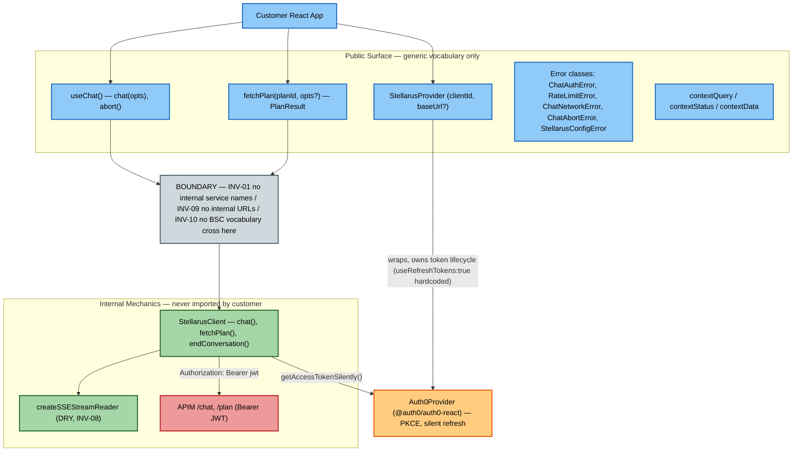
```mermaid
flowchart TB
    classDef client fill:#90caf9,stroke:#1565c0,stroke-width:2px,color:#000
    classDef identity fill:#ffcc80,stroke:#e65100,stroke-width:2px,color:#000
    classDef edge fill:#ef9a9a,stroke:#b71c1c,stroke-width:2px,color:#000
    classDef backend fill:#a5d6a7,stroke:#1b5e20,stroke-width:2px,color:#000
    classDef boundary fill:#cfd8dc,stroke:#455a64,stroke-width:2px,color:#000

    customer["Customer React App"]:::client

    subgraph public["Public Surface — generic vocabulary only"]
        provider["StellarusProvider (clientId, baseUrl?)"]:::client
        hook["useChat() — chat(opts), abort()"]:::client
        plan["fetchPlan(planId, opts?) — PlanResult"]:::client
        errs["Error classes: ChatAuthError, RateLimitError, ChatNetworkError, ChatAbortError, StellarusConfigError"]:::client
        vocab["contextQuery / contextStatus / contextData"]:::client
    end

    bnd["BOUNDARY — INV-01 no internal service names / INV-09 no internal URLs / INV-10 no BSC vocabulary cross here"]:::boundary

    subgraph internal["Internal Mechanics — never imported by customer"]
        sclient["StellarusClient — chat(), fetchPlan(), endConversation()"]:::backend
        sse["createSSEStreamReader (DRY, INV-08)"]:::backend
        apim["APIM /chat, /plan (Bearer JWT)"]:::edge
    end

    auth0["Auth0Provider (@auth0/auth0-react) — PKCE, silent refresh"]:::identity

    customer --> provider
    provider -->|"wraps, owns token lifecycle (useRefreshTokens:true hardcoded)"| auth0
    customer --> hook
    customer --> plan
    hook --> bnd
    plan --> bnd
    bnd --> sclient
    sclient -->|"getAccessTokenSilently()"| auth0
    sclient --> sse
    sclient -->|"Authorization: Bearer jwt"| apim
```

`StellarusProvider` wraps `Auth0Provider` (the orange identity node) and is the exclusive PKCE
entry point. The customer never sees Auth0 directly. `StellarusClient` is the only component below
the boundary that talks to APIM, and it delegates *all* SSE parsing to `createSSEStreamReader`
rather than re-implementing it (INV-08, DRY).

### 7.3 Config shape

```text
StellarusProvider config:
{
  clientId: string,        // REQUIRED — the customer's Auth0 application client id
  baseUrl?: string,        // OPTIONAL — APIM base; defaults to the Stellarus platform edge
  onRedirectCallback?: (appState?) => void   // OPTIONAL escape hatch for post-login routing
}
```

| Field | Type | Required | Description |
|---|---|---|---|
| `clientId` | `string` | yes | the customer's Auth0 application client id — the *only* credential-adjacent value the customer supplies |
| `baseUrl` | `string` | no | APIM edge base URL; never a broker or BFF URL (INV-09) |
| `onRedirectCallback` | `function` | no | escape hatch invoked after PKCE code exchange so the customer app controls post-login navigation |

What is **not** in the config is the contract:

- no `apiKey` — removed; it was a security hole (INV-03)
- no Auth0 `domain` / `audience` — internal Stellarus constants, maintained by the platform team (INV-12)
- no `useRefreshTokens` — hardcoded `true` inside `StellarusProvider`, never customer-configurable (INV-11)
- no broker URL, BFF URL, or any internal routing URL (INV-09)

### 7.4 Auth-model change — apiKey removed, Auth0 PKCE only

This is the single most important change in the v1 surface, and it is a **security fix**.

**As-designed previously:** the customer passed an `apiKey` into SDK config. That places a
long-lived credential in browser-delivered JavaScript — readable by anyone with devtools, leakable
to any third-party script on the page, and impossible to scope per-user. It is the credential hole
CL16 exists to prevent.

**As-built for v1:** the customer supplies only `clientId`. `StellarusProvider` wraps
`Auth0Provider` and runs the **Authorization Code + PKCE** flow inside the SDK via
`@auth0/auth0-react`. On mount the provider checks the URL for the `?code=` callback param and
exchanges the auth code (SDK-A1-SEQ-6); if absent, the user loops back to login. The provider owns
the token lifecycle and hardcodes `useRefreshTokens: true` so silent refresh is on and not a
customer concern (INV-11). The Auth0 tenant is `stellarus-sb2.us.auth0.com`; the persona rides in
the custom claim `https://stellarus.com/persona`. Neither the tenant domain nor the audience is
customer-configurable (INV-12).

**Decision for v1: PKCE-in-the-SDK, zero customer credential handling.** The customer's only
secret-shaped input is a public Auth0 client id, which is not a secret. **Trigger for revisit:**
SDK-INV-14 (below) — Auth0 tenant session lifetime must be verified against the healthcare
compliance ceiling before GA.

### 7.5 Public methods

| Symbol | Kind | Signature | Behavior |
|---|---|---|---|
| `StellarusProvider` | React component | `({ clientId, baseUrl?, onRedirectCallback? })` | wraps `Auth0Provider`; owns token lifecycle; PKCE entry point (SDK-A1-SEQ-1, SEQ-6) |
| `useChat` | React hook | `() => { chat, abort, status, ... }` | streaming state machine + per-send `AbortController`; aborts on unmount (SDK-A1-SEQ-7); throws if no provider mounted |
| `useChat.chat` | method | `chat(opts) => AsyncIterable<StreamEvent>` | acquires Bearer JWT via `getAccessTokenSilently()` before any fetch (SDK-A1-SEQ-2) |
| `useChat.abort` | method | `abort() => void` | aborts the in-flight SSE stream for the current send |
| `getAccessTokenSilently` | re-export | `() => Promise<string>` | Auth0 silent token acquisition (IP-1) |
| `StellarusClient.fetchPlan` | method (internal class) | `fetchPlan(planId, opts?) => Promise<PlanResult>` | three-state result; never throws for 404/503 (INV-06) |
| `StellarusClient.endConversation` | method (internal class) | `endConversation() => void` | ends the current conversation; clears captured `sessionId` |

`StellarusClient` is **internal** — it is the engine `useChat` and `fetchPlan` drive, not a customer
import. It owns the APIM calls, the SSE-parse delegation to `createSSEStreamReader`, and the
`sessionId` capture. It never calls CCS directly (INV-02) and never generates a `conversationId`
client-side (INV-05).

#### `fetchPlan(planId, opts?)` — the three-state, no-throw contract

`fetchPlan` calls APIM `/plan` with the Bearer JWT and a `planId` query param (IP-7), and returns a
`PlanResult` that **never throws** for the two expected non-200 outcomes (INV-06, SDK-PLAN-PRE-1):

| Upstream status | `PlanResult` state | Meaning |
|---|---|---|
| `200` | data state — `contextData` payload | plan found |
| `404` | `PLAN_STATUS_NOT_FOUND` | plan does not exist for this member; not an error |
| `503` | `PLAN_STATUS_OUTAGE` | benefits path temporarily unavailable; retry later |

A consuming UI branches on the state constant rather than wrapping the call in `try/catch`. This is
deliberate: a missing plan and a transient outage are normal product states, not exceptions. (Other
statuses — `401`, network failure — still surface as the error classes in §7.7.)

### 7.6 useChat streaming lifecycle

`chat()` drives a fixed sequence: acquire token, POST to APIM, parse the SSE stream, capture the
`sessionId` from the broker's `session` event, and thread that `sessionId` on every subsequent turn.
On unmount, the hook aborts the in-flight stream to prevent a memory leak.

```mermaid
sequenceDiagram
    participant H as useChat
    participant SC as StellarusClient
    participant A0 as Auth0
    participant AP as APIM

    H->>SC: chat(opts)
    SC->>A0: getAccessTokenSilently()
    A0-->>SC: Bearer JWT
    SC->>AP: POST /chat (Authorization Bearer, body message + optional sessionId/contextQuery/contextStatus/contextData)
    AP-->>SC: 200 SSE stream
    SC->>SC: createSSEStreamReader.parse() (INV-08)
    SC->>SC: capture sessionId from session SSE event, store to private field (INV-05)
    Note over SC: turns greater than 1 thread the non-null sessionId
    SC->>AP: POST /chat (thread sessionId in body)
    AP-->>SC: 200 SSE stream
    H->>H: on unmount abortController.abort()
```

Clause mapping:

- `H->>SC: chat(opts)` then token acquisition — **SDK-A1-SEQ-2**, IP-1 (`getAccessTokenSilently()` before any fetch; APIM rejects `401` otherwise)
- `SC->>SC: createSSEStreamReader.parse()` — **SDK-A1-SEQ-3**, IP-5 (parse only after the 200; no typed events otherwise)
- capture `sessionId` from `session` event — **SDK-A1-SEQ-4**, INV-05 (multi-turn continuity broken otherwise)
- thread `sessionId` on turns > 1 — **SDK-A1-SEQ-5** (new conversation created each turn otherwise)
- `abortController.abort()` on unmount — **SDK-A1-SEQ-7** (in-flight SSE stream leaks otherwise)

`sessionId` is captured **only** from a `session` SSE event emitted by the broker (INV-05). The SDK
never invents a conversation identifier. On turns > 1 the non-null `sessionId` is threaded into the
request body to preserve continuity; omit it and every turn starts a fresh conversation.

### 7.7 Error classes

The SDK surfaces a small, versioned set of typed errors. None of them carries a credential, a
token, or an internal service name (INV-01, INV-04a/b).

| Class | When | Carries |
|---|---|---|
| `ChatAuthError` | APIM rejects the Bearer JWT (`401`), or token acquisition fails | no token, no credential (INV-04a/b) |
| `RateLimitError` | per-tenant rate limit exceeded (`429`) | `retryAfter` (seconds) |
| `ChatNetworkError` | transport failure reaching APIM, or non-handled `5xx` | no internal URL (INV-09) |
| `ChatAbortError` | the send was aborted via `abort()` or unmount | — (suppressed at the hook level, see SDK-UXV-1) |
| `StellarusConfigError` | invalid/missing config (e.g. no `clientId`, provider not mounted) | no credential |

**Credential redaction is a hard invariant.** Neither `StellarusClient` (INV-04a) nor `useChat`
(INV-04b) may place an Auth0 access token, refresh token, or any credential into an error message,
a `console` log, or a thrown string. Error messages name the *condition*, never the *secret*.

### 7.8 useChat status state machine

`useChat` exposes an observable `status`. It is a deliberately small machine: a send moves `idle`
to `streaming`; the stream resolves to `done`, faults to `error`, or is cut short to `aborted`.

```mermaid
stateDiagram-v2
    [*] --> idle
    idle --> streaming: chat()
    streaming --> done: stream complete
    streaming --> error: ChatAuthError / ChatNetworkError / RateLimitError
    streaming --> aborted: abort() or unmount (ChatAbortError suppressed)
    done --> streaming: chat() next turn
    error --> streaming: chat() retry
    aborted --> streaming: chat() new send
    done --> [*]
```

The `aborted` transition is where SDK-UXV-1 lives. When a send is aborted — explicitly via `abort()`
or implicitly on unmount (SDK-A1-SEQ-7) — the underlying `ChatAbortError` is **suppressed at the
hook level** so a normal user navigation does not surface as an error toast. The observable status
moves to `aborted`, not `error`.

### 7.9 Integration points

| # | Source -> Target | Handoff | Clause |
|---|---|---|---|
| IP-1 | `useChat` -> `getAccessTokenSilently()` | Auth0 Bearer JWT string | SDK-CHAT-PRE-1 |
| IP-2 | `StellarusClient.chat()` -> APIM `/chat` | `Authorization: Bearer <jwt>`, body `message` + optional `sessionId`/`contextQuery`/`contextStatus`/`contextData` | SDK-CHAT-PRE-1, SDK-CHAT-SEQ-1 |
| IP-3 | APIM -> CCS (internal) | shared secret -> context token | internal; customer never touches (INV-02) |
| IP-4 | APIM -> broker (internal) | context token in forwarded headers | internal; customer never touches |
| IP-5 | broker SSE -> APIM -> `StellarusClient` -> `createSSEStreamReader` | raw SSE text stream | SDK-CHAT-POST-1 |
| IP-6 | `StellarusClient` -> `useChat` | `AsyncIterable<StellarusStreamEvent>` | SDK-CHAT-POST-1 -> POST-4 |
| IP-7 | `StellarusClient.fetchPlan()` -> APIM `/plan` | `Authorization: Bearer <jwt>`, `planId` query param | SDK-PLAN-PRE-1 |

IP-3 and IP-4 are listed for completeness only — they are entirely internal. The customer's request
crosses exactly one boundary (APIM via IP-2/IP-7); everything past it is platform-owned and never
named in the SDK.

### 7.10 Failure Handling

#### Chat request failures
| Condition | Surfaced as |
|---|---|
| Bearer JWT rejected / token acquisition failed | `ChatAuthError` |
| Rate limit exceeded (`429`) | `RateLimitError` with `retryAfter` |
| Transport failure / unhandled `5xx` | `ChatNetworkError` |
| Send aborted (`abort()` or unmount) | `ChatAbortError` — suppressed at hook level, `status = aborted` |
| Missing/invalid config (no `clientId`, no provider) | `StellarusConfigError` |

#### Plan lookup outcomes (do NOT throw)
| Upstream status | Returned `PlanResult` |
|---|---|
| `404` | `PLAN_STATUS_NOT_FOUND` |
| `503` | `PLAN_STATUS_OUTAGE` |

The split is the contract: chat failures are *thrown* typed errors; plan 404/503 are *returned*
states (INV-06). A consumer must not wrap `fetchPlan` in `try/catch` expecting 404/503 — those are
normal results.

### 7.11 Observability — what the SDK must NOT record

The SDK touches credentials (Auth0 tokens), so the redaction list is mandatory. The SDK SHALL NOT
record, in any error, `console` output, or thrown string:

- the Auth0 access token or refresh token (INV-04a/b)
- any raw API key (there is none in v1, but the prohibition stands — INV-03)
- the signed context token (the SDK never sees it; it is injected at APIM)
- internal service names or routing URLs (INV-01, INV-09)

The SDK has no `correlation_id` of its own; observability correlation is generated at APIM and lives
server-side (see the Telemetry section). The SDK's contribution to the trace is the request itself.

### 7.12 Key Constraints & Rules

The hard invariants below ARE the surface-lock contract. Each is a SHALL-NOT that a reviewer can
check mechanically against PR #421 and any future change.

- **No internal service names anywhere public.** `broker`, `sierra`, `agentic`, `ccs`, `benefits`
  appear in no public type, method, error class, or string (INV-01).
- **No direct CCS call.** No customer-facing code path calls CCS; the SDK reaches CCS only
  transitively through APIM (INV-02).
- **No raw API key — Auth0 PKCE only.** `apiKey` config is removed; the customer authenticates
  exclusively through Auth0 PKCE via `StellarusProvider` (INV-03).
- **No credentials in errors/logs/throws.** Neither `StellarusClient` (INV-04a) nor `useChat`
  (INV-04b) emits a token or credential.
- **No client-side conversationId.** `sessionId` is captured ONLY from a `session` SSE event; the
  SDK never generates one (INV-05).
- **fetchPlan never throws for 404/503.** It returns `PLAN_STATUS_NOT_FOUND` / `PLAN_STATUS_OUTAGE`
  (INV-06).
- **contextData forwarded verbatim.** `StellarusClient` never mutates `contextData` before
  forwarding to APIM (INV-07).
- **All SSE parsing delegated.** Parsing goes through `createSSEStreamReader`, never re-implemented
  (INV-08, DRY).
- **No internal routing URLs exposed.** No broker/BFF/internal URL in config, error, or docs (INV-09).
- **No BSC/benefits vocabulary public.** `planQuery`/`planData`/`planValidationStatus` never appear
  in public types; the generic `contextQuery`/`contextStatus`/`contextData` are used instead (INV-10).
- **useRefreshTokens not customer-configurable.** Hardcoded `true` in `StellarusProvider` (INV-11).
- **Auth0 domain/audience are internal constants.** Not customer-configurable; maintained by the
  platform team (INV-12).
- **No public export removed/renamed/re-signed without a MAJOR bump.** The surface is frozen at v1
  semver granularity (INV-13).

### 7.13 Decisions Still Open

Two markers remain open and are framed with explicit v1 decisions and revisit triggers.

| # | Marker | Decision for v1 | Trigger to revisit |
|---|---|---|---|
| 1 | **SDK-INV-14** — Auth0 tenant session lifetime vs healthcare compliance ceiling | do NOT lock the session lifetime in the contract until the policy is verified; treat it as platform-owned config | **verify the tenant session-lifetime policy against the healthcare compliance ceiling before GA** — `ACT-STELLARUS` SHALL NOT configure a lifetime beyond the ceiling (INV-14) |
| 2 | **SDK-UXV-1** — stream abort/unmount UX | suppress `ChatAbortError` at the hook level; surface `status = aborted` rather than an error state | **real-world UX validation required before ship** — confirm with human testing that suppressing the abort error is the right member experience; do not ship on assumption alone |

Neither marker blocks the surface lock. INV-14 constrains a platform-side Auth0 setting, not a
public type; SDK-UXV-1 constrains observable hook behavior already encoded in the 7.8 state
machine. Both are GA gates, not contract gaps.

**The single biggest open item is SDK-INV-14** — the session-lifetime ceiling is the one
unresolved input that could force an Auth0 tenant configuration change before the Sep 1 2026 MVP
gate, and it depends on a compliance-policy answer the SDK team does not own.


## 8. Data Source Adapters

The `DataSourceAdapter` is the unit of pluggability in the Thin-Router Broker. Every downstream the broker can reach — Sierra, the Benefits Service, the conversation store, Genesys — is reached through exactly one adapter, and the broker never names any of them. The broker resolves an opaque `(capability, customer_slug)` pair to a `DataSourceAdapter` via the **Resolver (@stellarus/resolver)** and calls one of two methods on the result: `query()` or `stream()`. It knows nothing else about what sits behind the seam.

This section defines the adapter interface, the `stream()` seam that splits adapters into two shapes, the platform principle that **each adapter owns its own downstream's concerns** (circuit breaker, token counting, SSE parsing — never the broker), and the four MVP adapters with their capability, YAML file, and responsibilities. It also specifies the conversation-persist obligation that wires `SierraAdapter` to `PostgresConversationAdapter`, and the YAML-only registration model that lets a new adapter be added with zero broker code change.

This section owns the adapter contracts and the seam; §6 (Thin-Router Broker) owns `POST /dispatch` and the resolve/rate-limit ordering, §7 (Resolver) owns the YAML config loader internals, and §10 (Escalation) co-owns `GenesysAdapter` and the redaction gate that precedes it.

### Architecture Position

The adapter sits below the broker and above the downstream. The broker is the only caller; the downstream (Sierra, Benefits Service, Postgres, Genesys) is the only callee. The adapter is the single place where provider-specific concern lives — the broker stays capability-neutral (INV-02) and provider-agnostic (INV-04) precisely because everything provider-shaped is pushed down into the adapter.

```mermaid
flowchart TB
    classDef client fill:#90caf9,stroke:#1565c0,stroke-width:2px,color:#000
    classDef edge fill:#ef9a9a,stroke:#b71c1c,stroke-width:2px,color:#000
    classDef backend fill:#a5d6a7,stroke:#1b5e20,stroke-width:2px,color:#000
    classDef ccs fill:#80cbc4,stroke:#004d40,stroke-width:2px,color:#000
    classDef store fill:#ce93d8,stroke:#4a148c,stroke-width:2px,color:#000
    classDef boundary fill:#cfd8dc,stroke:#455a64,stroke-width:2px,color:#000

    bff["BFF (agentic-broker-chat)"]:::client
    broker["Thin-Router Broker (POST /dispatch)"]:::edge
    resolver["Resolver (@stellarus/resolver)"]:::ccs

    subgraph adapters["DataSourceAdapter layer (owns provider concerns)"]
        direction LR
        sierra["SierraAdapter (stream)"]:::backend
        rest["RestBenefitsAdapter (query)"]:::backend
        conv["PostgresConversationAdapter (query)"]:::backend
        genesys["GenesysAdapter (query)"]:::backend
    end

    sierraDown["Sierra.ai (SSE)"]:::boundary
    benefitsDown["Benefits Service"]:::boundary
    pg[("Per-tenant Postgres")]:::store
    genesysDown["Genesys Cloud CCaaS"]:::boundary

    bff -->|"{ capability, payload } + x-context-token + x-correlation-id"| broker
    broker -->|"resolve(capability, customer_slug)"| resolver
    resolver -->|"adapter instance"| broker
    broker -->|"stream() or query()"| adapters
    sierra -->|"SSE open + token count + circuit breaker"| sierraDown
    sierra -->|"persist turn"| conv
    rest -->|"HTTP benefits.query"| benefitsDown
    conv --- pg
    genesys -->|"escalation handoff + circuit breaker"| genesysDown
```

### The Adapter Interface and the stream() Seam

The interface as built today exposes a single method, `query()`. The MVP work adds the optional `stream(): AsyncIterable<StreamEvent>` method (**WI-B1-A**, 🔴 blocker), which splits the type into two shapes:

- **`DataSourceAdapter`** — exposes `query(slug, payload)`, returns a single `ResolverResponse`. The query-shaped adapter.
- **`StreamingDataSourceAdapter`** — extends `DataSourceAdapter` and adds `stream(slug, payload): AsyncIterable<StreamEvent>`. The streaming-shaped adapter.

The broker selects the method from the resolved adapter's shape: streaming capabilities call `stream()`, query capabilities call `query()` (BROKER-B1B2-SEQ-4). The seam exists so that `SierraAdapter` can stream Sierra's SSE response without the broker owning any streaming logic — the broker just pipes the `AsyncIterable<StreamEvent>` back to the BFF (IP-6).

```mermaid
classDiagram
    class DataSourceAdapter {
        <<interface>>
        +query(slug, payload) ResolverResponse
    }
    class StreamingDataSourceAdapter {
        <<interface>>
        +stream(slug, payload) AsyncIterable~StreamEvent~
    }
    class SierraAdapter {
        +stream(slug, payload) AsyncIterable~StreamEvent~
        -tokenCounter
        -circuitBreaker_OWNS
        -parseSSE()
        -persistTurn()
    }
    class RestBenefitsAdapter {
        +query(slug, payload) ResolverResponse
    }
    class PostgresConversationAdapter {
        +query(slug, payload) ResolverResponse
        +getAll(conversationId)
        +persist(turn)
    }
    class GenesysAdapter {
        +query(slug, payload) ResolverResponse
        -circuitBreaker_OWNS_startsCLOSED
    }
    class SnowflakeBenefitsAdapter {
        +query(slug, payload) ResolverResponse
    }

    DataSourceAdapter <|-- StreamingDataSourceAdapter : extends
    StreamingDataSourceAdapter <|.. SierraAdapter : implements
    DataSourceAdapter <|.. RestBenefitsAdapter : implements
    DataSourceAdapter <|.. PostgresConversationAdapter : implements
    DataSourceAdapter <|.. GenesysAdapter : implements
    DataSourceAdapter <|.. SnowflakeBenefitsAdapter : implements
```

Only `SierraAdapter` and `GenesysAdapter` own a circuit breaker, because only they own a fallible external network downstream (INV-09). `PostgresConversationAdapter` reaches a first-party datastore and is the authoritative conversation record (INV-06); `RestBenefitsAdapter` reaches the governed Benefits Service. `SnowflakeBenefitsAdapter` is a stub and owns nothing live.

### The Platform Principle: Each Adapter Owns Its Downstream's Concerns

This is the load-bearing rule that keeps the broker thin. Anything specific to one provider lives in that provider's adapter, never in the broker:

- **Circuit breaker** moves OUT of the broker and INTO the adapter that owns the downstream (INV-09). Sierra's circuit breaker lives in `SierraAdapter`; Genesys's lives in `GenesysAdapter`. A future adapter brings its own.
- **Token counter** (tiktoken / LLM token counting) is Sierra-specific and lives in `SierraAdapter`, never in the broker (INV-10). It feeds the cost-per-answer SLO via the `token_cost` log field (§11).
- **SSE parsing** for the Sierra stream lives in `SierraAdapter`. The broker pipes the resulting `AsyncIterable<StreamEvent>` without interpreting it.
- **Secret retrieval** is per-adapter. `GenesysAdapter` resolves credentials from Azure Key Vault via Managed Identity, never env vars (INV-07).

The broker is forbidden from importing `SierraClientService`, `SierraClientModule`, or any AI-provider-specific code (INV-04). When the broker has no provider-specific code and no semantic endpoints, there is structurally nowhere for business logic to accumulate — which is the whole point of the thin-router pattern.

### The Four MVP Adapters

| Capability | Adapter | Shape | YAML file | Status | Owns |
|---|---|---|---|---|---|
| `chat.completion` | `SierraAdapter` | `stream()` | `sierra-bsca.yaml` | to-be-built (WI-B1-B/C) | token counter, Sierra circuit breaker, SSE parsing |
| `benefits.query` | `RestBenefitsAdapter` | `query()` | `benefits-bsca.yaml` (exists) | on `main` (WI-B1-D) | HTTP call to Benefits Service |
| `conversation.history` | `PostgresConversationAdapter` | `query()` | `conversation-bsca.yaml` (new) | to-be-built (WI-B1-E) | per-tenant Postgres schema, authoritative store |
| `escalation.initiate` | `GenesysAdapter` | `query()` | `genesys-bsca.yaml` | to-be-built (P5/E2, §10) | Genesys circuit breaker, Key Vault creds |
| `benefits.query` (Snowflake) | `SnowflakeBenefitsAdapter` | `query()` | `benefits-bsca-snowflake.yaml` | stub — scaffolded, not live | nothing live (demo/future) |

#### SierraAdapter — `chat.completion`, streaming

`SierraAdapter` is the `StreamingDataSourceAdapter` for **Sierra (Sierra.ai)**, registered via `sierra-bsca.yaml`. It wraps the existing `SierraClientService` and absorbs the two services that currently live in the broker: `TokenCounterService` and `CircuitBreakerService` move INTO the adapter (WI-B1-B implements the adapter, WI-B1-C moves the services). It owns SSE parsing against Sierra's stream and yields `StreamEvent`s back through `stream()`.

`SierraAdapter` replaces the hardcoded broker `SierraClientService` dependency. Sierra is runtime-only — never a hardcoded broker dependency — and its native session storage is NOT the authoritative conversation record (INV-06); see the persist obligation below.

**Owns:** Sierra circuit breaker (INV-09), token counter (INV-10), SSE parsing, per-turn conversation persist (BROKER-B1B2-SEQ-5).

#### RestBenefitsAdapter — `benefits.query`, query

`RestBenefitsAdapter` is the `DataSourceAdapter` for the **Benefits Service** over HTTP, registered via `benefits-bsca.yaml` (already exists). It replaces the broker's `PlanHandlerService` direct-HTTP path (WI-B1-D) — the direct-HTTP-in-broker pattern is a README violation the adapter removes. It is **implemented on `main`** today: this is the one MVP adapter that is as-built, not to-be-built.

The `query()` path makes an HTTP call to the Benefits Service, which retrieves plan data from its customer-partitioned Postgres. The SDK-facing `fetchPlan` variant maps `404` → `PLAN_STATUS_NOT_FOUND` and `503` → `PLAN_STATUS_OUTAGE` rather than throwing (SDK INV-06); the broker-side `query()` returns the `ResolverResponse` unchanged (Flow C, BROKER-B1B2-SEQ-4).

#### PostgresConversationAdapter — `conversation.history`, query (authoritative store)

`PostgresConversationAdapter` is the durable, authoritative conversation-history store, registered via `conversation-bsca.yaml` (new, WI-B1-E). It replaces the in-memory `SessionStore` NoOp. The design directive is explicit: *"like the benefit service — Postgres, per-tenant schema, compress, index it."*

- **Per-tenant Postgres schema isolation** — same pattern as `benefits-service`; cross-tenant conversation reads are forbidden (INV-07). Scoping is driven by `customer_slug` from the verified context token, never client-supplied.
- **Authoritative store** — Sierra native session storage is NOT the source of truth (INV-06). The Postgres record is.
- **Compressed and indexed**, **durable across broker restarts** — the in-memory store lost history on restart and broke escalation handoff; the Postgres store does not.
- **The escalation prerequisite** — §10 escalation sources its full conversation context exclusively from this adapter (Flow D, SEQ-2; E1E2 INV-09). Without it, the redactor receives nothing to scrub.

#### GenesysAdapter — `escalation.initiate`, query (P5/E2)

`GenesysAdapter` is the `DataSourceAdapter` calling **Genesys Cloud CCaaS**, registered via `genesys-bsca.yaml`. It is P5/E2 scope — declared here, owned and specified in §10. Its circuit breaker starts **CLOSED**; credentials come from Azure Key Vault via Managed Identity, never env vars (INV-07). It is the ONLY component permitted to call the Genesys API (INV-05). E1 integration mechanics (API shape, routing metadata fields, SLA) are BLOCKED on BSC/PTP — see §10.

#### SnowflakeBenefitsAdapter — stub

`SnowflakeBenefitsAdapter` is a scaffolded-but-stub `DataSourceAdapter` for a future Snowflake-backed `benefits.query` path, registered via `benefits-bsca-snowflake.yaml`. It exists in the registry but is not live.

**Decision for v1: REST-only for benefits.** `RestBenefitsAdapter` is the live `benefits.query` path; `SnowflakeBenefitsAdapter` stays a stub.
**Trigger for revisit:** the demo / Snowflake path is needed — at which point the stub is filled in and the YAML for the target `customer_slug` is pointed at the Snowflake class. No broker code change is required to make the switch (INV-03).

### The Conversation-Persist Obligation

`SierraAdapter` does not only stream — it persists. After each Sierra response chunk, `SierraAdapter` persists the turn to `PostgresConversationAdapter` (BROKER-B1B2-SEQ-5, IP-5). The persisted turn carries exactly: `session_id`, `role`, `content` (text), `timestamp`, `correlation_id`. This persist happens AFTER each chunk so that the authoritative store (INV-06) is built incrementally as the stream flows — if it were skipped, conversation history would be lost and the escalation handoff would break (the escalation context comes from this store, not from Sierra).

```mermaid
sequenceDiagram
    participant B as Broker
    participant SA as SierraAdapter
    participant S as Sierra
    participant CA as PostgresConversationAdapter

    B->>SA: stream(slug, payload)
    SA->>SA: circuit breaker check (Sierra)
    SA->>S: open SSE stream
    loop per Sierra chunk
        S-->>SA: chunk (SSE)
        SA->>SA: parse SSE + count tokens
        SA->>CA: persist turn (session_id, role, content, timestamp, correlation_id)
        CA-->>SA: ack
        SA-->>B: StreamEvent
    end
    S-->>SA: stream end
    SA-->>B: stream complete
```

This maps to BROKER-B1B2-SEQ-4 (broker calls `stream()`) and BROKER-B1B2-SEQ-5 (adapter persists each turn). The token-count and circuit-breaker self-calls are internal to `SierraAdapter` (INV-09, INV-10) — the broker never sees them.

### Registration is YAML-Only (Zero Broker Code Change)

An adapter is added or reconfigured by dropping a YAML file in `RESOLVER_CONFIG_DIR` — never by modifying broker source (INV-03). The `ADAPTER_CLASS_REGISTRY` maps adapter class names to implementations; the resolver's config loader hot-reloads via **chokidar** when a YAML file appears or changes, instantiating the adapter and binding it to `(capability, customer_slug)`.

```mermaid
flowchart TB
    classDef store fill:#ce93d8,stroke:#4a148c,stroke-width:2px,color:#000
    classDef ccs fill:#80cbc4,stroke:#004d40,stroke-width:2px,color:#000
    classDef backend fill:#a5d6a7,stroke:#1b5e20,stroke-width:2px,color:#000
    classDef boundary fill:#cfd8dc,stroke:#455a64,stroke-width:2px,color:#000

    subgraph cfg["RESOLVER_CONFIG_DIR"]
        y1["sierra-bsca.yaml"]:::store
        y2["benefits-bsca.yaml"]:::store
        y3["conversation-bsca.yaml"]:::store
        y4["genesys-bsca.yaml"]:::store
    end

    loader["config-loader (chokidar watch)"]:::ccs
    registry["ADAPTER_CLASS_REGISTRY (class name to impl)"]:::ccs

    subgraph inst["instantiated adapters bound to (capability, customer_slug)"]
        a1["SierraAdapter to (chat.completion, bsca)"]:::backend
        a2["RestBenefitsAdapter to (benefits.query, bsca)"]:::backend
        a3["PostgresConversationAdapter to (conversation.history, bsca)"]:::backend
        a4["GenesysAdapter to (escalation.initiate, bsca)"]:::backend
    end

    nocode["zero broker code change (INV-03)"]:::boundary

    cfg -->|"file add/change event"| loader
    loader -->|"resolve class name"| registry
    registry -->|"instantiate"| inst
    nocode -.->|"adding a YAML is the ONLY step"| cfg
```

The resolver (`@stellarus/resolver`) is already implemented and merged to `main`; it is distinct from the broker's `brand-slug.resolver.ts`. The config env var is `RESOLVER_CONFIG_DIR`.

### As-Built Today vs To-Be-Built for MVP

| Item | As-built today | To-be-built for MVP | Work item |
|---|---|---|---|
| Adapter interface | `query()` only | add optional `stream(): AsyncIterable<StreamEvent>` | WI-B1-A 🔴 |
| Sierra access | `SierraClientService` hardcoded in broker | `SierraAdapter` via `sierra-bsca.yaml` | WI-B1-B 🔴 |
| Token counter + circuit breaker | `TokenCounterService` + `CircuitBreakerService` in broker | moved INTO `SierraAdapter` | WI-B1-C 🔴 |
| Benefits access | `RestBenefitsAdapter` (replaces `PlanHandlerService`) | already on `main` | WI-B1-D ✅ |
| Conversation store | in-memory `SessionStore` NoOp | `PostgresConversationAdapter`, per-tenant, `conversation-bsca.yaml` | WI-B1-E 🔴 |
| Escalation adapter | none | `GenesysAdapter`, `genesys-bsca.yaml` (P5/E2) | §10 / WI-E2-C 🔴 |
| Snowflake benefits | scaffolded stub | stays stub until demo path needed | — |
| Resolver | implemented, merged to `main` | — | ✅ |

### Failure Handling

| Condition | Response |
|---|---|
| Resolver finds no adapter for `(capability, customer_slug)` | broker returns `404` capability-not-found (no adapter dispatch) |
| Sierra circuit breaker OPEN | `SierraAdapter` short-circuits without calling Sierra; emits `circuit_breaker_open` log (§11); broker surfaces error StreamEvent |
| `PostgresConversationAdapter` persist fails mid-stream | persist failure is logged with `correlation_id`; stream continues (history gap is observable, not silent) |
| `RestBenefitsAdapter` Benefits Service `404`/`503` | `query()` returns the `ResolverResponse`; SDK `fetchPlan` maps to `PLAN_STATUS_NOT_FOUND` / `PLAN_STATUS_OUTAGE`, never throws (SDK INV-06) |
| `GenesysAdapter` circuit breaker OPEN / Genesys unreachable | handoff result `unavailable`; SDK surfaces `escalation_unavailable` (§10, E2-Z2) |
| Malformed / unknown adapter class name in YAML | config-loader rejects the file; existing bindings unchanged (hot-reload is additive-safe) |

### New Contracts

| Contract file | Defines | Shared with |
|---|---|---|
| `packages/resolver/src/contracts/streaming-adapter.contract.ts` | `stream(): AsyncIterable<StreamEvent>` seam, `StreamEvent` shape | §6, §7 |
| `apps/agentic-broker-api/adapters/sierra-adapter.contract.ts` | `SierraAdapter` stream + persist + token-count + circuit-breaker obligations | §6 |
| `apps/agentic-broker-api/adapters/conversation-adapter.contract.ts` | `PostgresConversationAdapter` per-tenant isolation, authoritative-store, `getAll()` | §6, §10 |
| `apps/agentic-broker-api/adapters/genesys-adapter.contract.ts` | `GenesysAdapter` handoff, Key Vault creds, circuit breaker | §10 |

### Key Constraints & Rules

- **The broker never names a downstream.** Every provider is reached through one adapter; the broker calls only `query()` or `stream()` on an opaque resolved object (INV-02, INV-04).
- **Each adapter owns its downstream's concerns.** Circuit breaker (INV-09), token counting (INV-10), SSE parsing, and secret retrieval (INV-07) live in the adapter, never the broker.
- **Postgres is the authoritative conversation record.** Sierra native session storage is NOT the source of truth (INV-06); `PostgresConversationAdapter` is, with per-tenant schema isolation (INV-07).
- **`SierraAdapter` persists every turn.** `session_id, role, content, timestamp, correlation_id` after each Sierra chunk (BROKER-B1B2-SEQ-5) — the escalation handoff depends on it.
- **Registration is YAML-only.** Adding or reconfiguring an adapter is dropping a YAML file in `RESOLVER_CONFIG_DIR`; the resolver hot-reloads via chokidar against `ADAPTER_CLASS_REGISTRY` (INV-03). No broker code change, ever.
- **`GenesysAdapter` is the only Genesys caller.** INV-05; credentials from Azure Key Vault via Managed Identity only (INV-07).

### Decisions Still Open

| # | Question | Owner | Why it matters |
|---|---|---|---|
| 1 | Genesys API shape (REST / SDK / Widget) for `GenesysAdapter` | Julie Hughes + BSC/PTP | Blocks `GenesysAdapter` implementation (E1-Z1) |
| 2 | Routing-metadata fields in `escalation.initiate` payload | Julie Hughes + BSC | Blocks adapter payload contract (E1-Z2) |
| 3 | Conversation compression/index scheme for `PostgresConversationAdapter` | Ketema (platform) | Storage cost + retrieval latency under multi-turn load |
| 4 | When the Snowflake `benefits.query` demo path activates | Platform + demo stakeholders | Trigger to fill the `SnowflakeBenefitsAdapter` stub |

The single biggest blocking decision is **#1 (Genesys API shape)** — it gates the entire escalation adapter and, transitively, the escalation-success SLO in §11.


## 9. End-to-End Data Flows

This section renders the five canonical Compass Platform flows as house-style
sequence diagrams. Each flow is deliberately linear — participant aliases, `->>`
for requests, `-->>` for responses, self-calls (`X->>X`) for internal steps, and
no `alt`/`loop`/`note` blocks — so the diagram reads as a single trace from edge
to datastore. Every message is annotated with the SEQ clause IDs from its source
manifest, so each step is traceable back to the requirement that mandates it
(`SDK-A1-SEQ-*`, `TENANT-D1-SEQ-*`, `BROKER-B1B2-SEQ-*`, `ESCALATION-E1E2-SEQ-*`,
`TELEMETRY-F1F2-SEQ-*`). Each diagram is followed by the hard invariants it
enforces.

The deep-dive obligations each flow exercises live in the per-component sections:
SDK in §4, Broker and adapters in §5, Tenant/Auth Spine and CCS in §6, Escalation
in §7, Telemetry in §8, with data models in §10 and operational runbooks in §11.

**Build status legend.** A flow step is *as-built today* when the named component
already exists on `main`; it is *to-be-built for MVP* when it depends on an open
work item (`WI-*`) or a blocked Linear issue (`ENG-257`, `ENG-286`). Per-step
status is called out in the prose after each diagram rather than in the diagram
itself.

### 9.1 Flow participants

The five flows share one participant vocabulary. Names match the canonical
glossary exactly.

| Alias | Component | Glossary role |
|---|---|---|
| `Customer` | Customer app (`StellarusProvider`-wrapped) | host application embedding the SDK |
| `Member` | BSC member (end user) | human initiating escalation handoff |
| `useChat` | `useChat` hook | streaming state machine, abort-on-unmount |
| `Client` | `StellarusClient` | APIM calls, SSE-parse delegation, sessionId capture |
| `Provider` | `StellarusProvider` | PKCE entry point, token-lifecycle owner |
| `Auth0` | Auth0 (`stellarus-sb2.us.auth0.com`) | human authentication, persona claim |
| `APIM` | Azure APIM | edge trust boundary, header injection/strip |
| `CCS` | Customer Configuration Service | context-token issuer/signer |
| `Guard` | `ContextTokenGuard` | RS256 verify, scope enforcement |
| `BFF` | `agentic-broker-chat` | semantic routes, capability translation |
| `Broker` | `agentic-broker-api` | capability-neutral `POST /dispatch` router |
| `RateLimiter` | `RateLimiterService` | per-tenant token-bucket edge middleware |
| `Resolver` | `@stellarus/resolver` | `(capability, customer_slug)` → adapter |
| `SierraAdapter` | `SierraAdapter` | streaming adapter for Sierra AI |
| `Sierra` | Sierra.ai | external conversational AI runtime |
| `ConvStore` | `PostgresConversationAdapter` | authoritative per-tenant conversation store |
| `BenefitsAdapter` | `RestBenefitsAdapter` | HTTP adapter for Benefits Service |
| `Benefits` | Benefits Service | governed plan/benefits source of truth |
| `Redactor` | PII/PHI Redactor (`packages/redactor`) | mandatory fail-closed scrub gate |
| `GenesysAdapter` | `GenesysAdapter` | sole caller of Genesys Cloud |
| `Genesys` | Genesys Cloud CCaaS | external contact-center handoff target |
| `Loki` | Grafana Loki | log aggregation, LogQL metric derivation |
| `Grafana` | Grafana | threshold-colored SLO panels |
| `QA` | QA reviewer | weekly answer-quality sampling |
| `Jason` | Jason Jackson (P6 Lead) | F2 taxonomy approval, F1 gate sign-off |

---

### 9.2 Flow A — Customer Chat Request

A member sends a chat turn. The request travels SDK → APIM → BFF → broker
`/dispatch` → `SierraAdapter` → Sierra, streams back as SSE, and each turn is
persisted to the authoritative Postgres store. This is the platform's primary
hot path.

```mermaid
sequenceDiagram
    participant Customer
    participant useChat
    participant Client as StellarusClient
    participant Auth0
    participant APIM
    participant BFF
    participant Broker
    participant RateLimiter
    participant Resolver
    participant SierraAdapter
    participant Sierra
    participant ConvStore as PostgresConversationAdapter

    Customer->>useChat: chat(message)
    useChat->>Auth0: getAccessTokenSilently() [SDK-A1-SEQ-2]
    Auth0-->>useChat: Bearer JWT
    useChat->>Client: chat({ message, sessionId? })
    Client->>APIM: POST /chat (Bearer, contextData verbatim) [SDK-A1-SEQ-1, INV-07]
    APIM->>APIM: validate JWT, resolve tenant, inject x-context-token + x-correlation-id
    APIM->>BFF: route /api/chat (x-context-token, x-correlation-id)
    BFF->>Broker: POST /dispatch { capability: chat.completion } [BROKER-B1B2-SEQ-1]
    Broker->>RateLimiter: check(customer_slug, estimated_tokens) [BROKER-B1B2-SEQ-2]
    RateLimiter-->>Broker: within budget
    Broker->>Resolver: resolve(chat.completion, customer_slug) [BROKER-B1B2-SEQ-3]
    Resolver-->>Broker: SierraAdapter
    Broker->>SierraAdapter: stream(slug, payload) + x-correlation-id [BROKER-B1B2-SEQ-4, BROKER-B1B2-SEQ-7]
    SierraAdapter->>Sierra: open SSE stream
    Sierra-->>SierraAdapter: StreamEvent chunks
    SierraAdapter->>ConvStore: persist turn (session_id, role, content, ts, correlation_id) [BROKER-B1B2-SEQ-5]
    SierraAdapter-->>Broker: AsyncIterable of StreamEvent
    Broker-->>BFF: piped stream [BROKER-B1B2-SEQ-6]
    BFF-->>Client: SSE (200)
    Client->>Client: createSSEStreamReader().parse() [SDK-A1-SEQ-3]
    Client->>Client: capture sessionId from session event [SDK-A1-SEQ-4]
    Client-->>useChat: AsyncIterable of StellarusStreamEvent
    Client->>APIM: thread non-null sessionId on turns > 1 [SDK-A1-SEQ-5]
    useChat->>useChat: abortController.abort() on unmount [SDK-A1-SEQ-7]
```

**Invariants enforced.** **INV-05** — `StellarusClient` never generates a
`conversationId` client-side; `sessionId` is assigned *only* from the `session`
SSE event emitted by the broker, then threaded on turns > 1 to preserve
multi-turn continuity. **INV-06** (broker) — `PostgresConversationAdapter` is the
authoritative conversation record; Sierra's native session storage is *not* the
source of truth. **INV-08** (SDK) — all SSE parsing is delegated to
`createSSEStreamReader`; the client never re-implements it. **INV-07** (SDK) —
`contextData` is forwarded verbatim, never mutated. **INV-09/INV-10** (broker) —
the Sierra circuit breaker and tiktoken counting live in `SierraAdapter`, never in
the broker.

**Build status.** As-built today: APIM edge, Auth0 M2M shim (SEAM, commit
`62f5cad5`), `RateLimiterService`, `@stellarus/resolver`. To-be-built for MVP:
`POST /dispatch` replacing `POST /v2/chat` (`WI-B1-F`), the `stream()` seam on
`DataSourceAdapter` (`WI-B1-A`, blocker), `SierraAdapter` (`WI-B1-B/C`), and
`PostgresConversationAdapter` (`WI-B1-E`). See §4 (SDK surface) and §5 (broker and
adapters).

---

### 9.3 Flow B — Auth & Tenant Resolution

Before any chat turn, the caller is authenticated by Auth0 (PKCE) and the request
is bound to a tenant context token minted by CCS and verified by
`ContextTokenGuard`. This flow is the security spine every other flow rides on.

```mermaid
sequenceDiagram
    participant Provider as StellarusProvider
    participant Auth0
    participant useChat
    participant APIM
    participant CCS
    participant Guard as ContextTokenGuard
    participant BFF

    Provider->>Provider: check URL for ?code= at mount [SDK-A1-SEQ-6]
    Provider->>Auth0: exchange auth code (PKCE)
    Auth0-->>Provider: access token + persona claim (https://stellarus.com/persona)
    useChat->>Auth0: getAccessTokenSilently() [SDK-A1-SEQ-2]
    Auth0-->>useChat: Bearer JWT
    useChat->>APIM: POST /chat (Bearer)
    APIM->>APIM: validate Auth0 JWT (JWKS cached per iss)
    APIM->>CCS: POST /validate/token (persona + customer + target_audience ENG-286) [TENANT-D1-SEQ-1]
    CCS->>CCS: TokenService.sign() emit iss/aud/exp/iat/sub/customer_id/customer_slug/principal_id/persona/scopes [TENANT-D1-SEQ-2]
    CCS-->>APIM: signed context token (RS256)
    APIM->>APIM: generate UUIDv4 x-correlation-id [TENANT-D1-SEQ-3]
    APIM->>APIM: strip inbound x-correlation-id from external caller [TENANT-D1-SEQ-4]
    APIM->>Guard: forward x-context-token + x-correlation-id
    Guard->>Guard: verify RS256 signature vs CCS JWKS [TENANT-D1-SEQ-5]
    Guard->>Guard: validate iss / aud / exp [TENANT-D1-SEQ-6]
    Guard->>Guard: enforce @RequireScopes('chat') against verified scopes [TENANT-D1-SEQ-7]
    Guard-->>BFF: attach verified ContextTokenPayload
    BFF->>BFF: propagate x-correlation-id to all downstream calls [TENANT-D1-SEQ-8]
```

**Invariants enforced.** **INV-03** (tenant) — CCS never issues a token with `aud`
missing or empty (ENG-251 fix). **INV-02** (tenant) — `correlation_id` is never
embedded in the signed JWT; `sign()` takes `Omit<…,'correlation_id'>`. **INV-04**
(tenant) — APIM generates a fresh UUIDv4 per request and strips any inbound
`x-correlation-id`, so external callers cannot forge correlation IDs. **INV-06**
(tenant) — `ContextTokenGuard` passes no request to a handler without verifying the
RS256 signature plus `iss`/`aud`/`exp`. **INV-07** (tenant) — a `@RequireScopes()`
route is reachable only when all declared scopes are present in the verified
`scopes` claim. **INV-05** (tenant) — `x-correlation-id` is observability metadata
only, never a security claim. On the SDK side, **INV-03** (SDK) forbids a raw API
key — the customer authenticates exclusively through Auth0 PKCE via
`StellarusProvider`.

**Build status.** As-built today: Auth0 tenant + persona custom claim, APIM JWT
validation, CCS `POST /validate/token`, `ContextTokenGuard` (broker reimplements it
locally — a divergence to converge). To-be-built for MVP: the `chat` scope plus
persona grants via CCS migration `0003_chat_scopes.sql` (`WI-D1-A`, IRREVERSIBLE),
and the CCS JWKS endpoint `/.well-known/jwks.json` (`ENG-257`, blocker) that gates
production RS256 verification — **INV-12a/b** forbid static-PEM fallback in
production once `ENG-257` lands. Per-consumer `aud` scoping (`ENG-286`) is a
referenced dependency, not in D1 scope. See §6 (Tenant/Auth Spine and CCS).

---

### 9.4 Flow C — Benefits Enrichment

A benefits lookup follows the same `/dispatch` contract as chat, but resolves to a
query-shaped adapter (`RestBenefitsAdapter`) rather than a streaming one. It is the
template for every non-streaming capability.

```mermaid
sequenceDiagram
    participant Client as "StellarusClient.fetchPlan()"
    participant APIM as "Azure APIM"
    participant BFF
    participant Broker
    participant RateLimiter
    participant Resolver
    participant BenefitsAdapter as RestBenefitsAdapter
    participant Benefits as "Benefits Service"

    Client->>APIM: GET /plan (Auth0 Bearer) [SDK-A1-IP-7]
    APIM->>BFF: GET /api/plan (+ x-context-token, x-correlation-id)
    BFF->>Broker: POST /dispatch { capability: benefits.query } [BROKER-B1B2-SEQ-1]
    Broker->>RateLimiter: check(customer_slug) [BROKER-B1B2-SEQ-2]
    RateLimiter-->>Broker: within budget
    Broker->>Resolver: resolve(benefits.query, customer_slug) [BROKER-B1B2-SEQ-3]
    Resolver-->>Broker: RestBenefitsAdapter
    Broker->>BenefitsAdapter: query(slug, payload) [BROKER-B1B2-SEQ-4]
    BenefitsAdapter->>Benefits: HTTP fetch plan data (customer-partitioned Postgres)
    Benefits-->>BenefitsAdapter: plan data (404 / 503 mapped by SDK fetchPlan)
    BenefitsAdapter-->>Broker: ResolverResponse
    Broker-->>BFF: ResolverResponse [BROKER-B1B2-SEQ-6]
    BFF-->>APIM: PlanResult (200 / 404 / 503)
    APIM-->>Client: PlanResult — fetchPlan never throws [SDK-A1-INV-06]
```

**Invariants enforced.** **INV-01** (broker) — all semantic logic stays in the BFF;
the broker only routes the opaque `benefits.query` capability. **INV-08** (broker) —
`RateLimiterService` enforces the per-tenant budget on the verified
`customer_slug`, never on IP or API key alone. On the SDK side, **INV-06** (SDK) —
`fetchPlan` returns a three-state `PlanResult` and never throws for 404/503: a `404`
maps to `PLAN_STATUS_NOT_FOUND`, a `503` to `PLAN_STATUS_OUTAGE`. **INV-10** (SDK) —
the SDK surface uses generic `contextQuery`/`contextStatus`/`contextData`
vocabulary, never `planQuery`/`planData`.

**Build status.** As-built today: `RestBenefitsAdapter`, `benefits-bsca.yaml`, and
the Benefits Service are merged to `main`; the Plan Validation Gate is on `main`.
To-be-built for MVP: routing `benefits.query` through `/dispatch` instead of the
broker's direct-HTTP `PlanHandlerService` path (`WI-B1-D`). The
`SnowflakeBenefitsAdapter` is scaffold-only (demo/future); v1 is REST-only. See §5
(adapters) and §10 (Benefits data model).

---

### 9.5 Flow D — Escalation Handoff

A member escalates to a live agent. The full conversation is retrieved from the
authoritative store, passed through the mandatory redaction gate, and only the
scrubbed context reaches `GenesysAdapter` — the sole component permitted to call
Genesys. The redactor is drawn as a fail-closed gate: a scrub failure cancels the
escalation.

```mermaid
sequenceDiagram
    participant Member
    participant Client as StellarusClient
    participant BFF
    participant ConvStore as PostgresConversationAdapter
    participant Redactor
    participant Broker
    participant GenesysAdapter
    participant Genesys
    participant Agent as "Live Support Agent"

    Member->>Client: trigger escalation
    Client->>Client: emit escalation_initiated [ESCALATION-E1E2-SEQ-1]
    Client->>BFF: escalation action { conversationId, reason }
    BFF->>ConvStore: getAll(conversationId) [ESCALATION-E1E2-SEQ-2]
    ConvStore-->>BFF: ALL turns (all roles, all tool calls, no truncation)
    BFF->>Redactor: scrub(fullConversation) — MANDATORY fail-closed gate [ESCALATION-E1E2-SEQ-3]
    Redactor-->>BFF: redactedContext + redaction-confirmation flag
    BFF->>Broker: POST /dispatch { capability: escalation.initiate, payload } [ESCALATION-E1E2-SEQ-4]
    Broker->>GenesysAdapter: resolve(escalation.initiate, customer_slug) + dispatch
    GenesysAdapter->>Genesys: API call (routingMetadata + redactedContext) [ESCALATION-E1E2-SEQ-5]
    Genesys->>Agent: route + deliver redacted conversation context
    Agent->>Agent: continue from full context — member does NOT repeat (terminal outcome)
    Genesys-->>GenesysAdapter: handoff result
    GenesysAdapter-->>BFF: { status: succeeded|failed|unavailable, handoffId? }
    BFF-->>Client: typed escalation result event [ESCALATION-E1E2-SEQ-6]
    BFF->>BFF: write escalation audit record (incl. redaction-confirmation) [ESCALATION-E1E2-SEQ-7]
```

**Invariants enforced.** **INV-01/INV-02** (escalation) — the redactor scrubs all
conversation content *before* it leaves Stellarus; the BFF never sends raw
conversation content to the broker or `GenesysAdapter`, and `scrub()` must complete
before `IP-4` (the dispatch). The gate is fail-closed (**CL15-A**): a scrub failure
cancels the escalation. **INV-03** (escalation) — `PostgresConversationAdapter`
provides *all* turns, all roles, all tool calls; the BFF does not filter or shorten
the history before handing to the redactor (no summary window). **INV-05**
(escalation) — the broker contains no Genesys-specific logic; `GenesysAdapter` is the
only component that calls the Genesys API. **INV-07** (escalation) — `GenesysAdapter`
reads Genesys credentials from Azure Key Vault via Managed Identity, never env vars
in production. **INV-04** (escalation) — an audit record is written for every attempt
(succeeded/failed/unavailable). **INV-09** (escalation) — escalation context is
sourced exclusively from the Stellarus Postgres store, never Sierra native storage.
On the SDK side, **INV-08** (escalation) — the escalation event shape is versioned;
breaking changes require an SDK MAJOR bump, and the event must not expose Genesys
queue names or internal IDs.

**Build status.** To-be-built for MVP and largely **blocked**: the
`packages/redactor` design and implementation (`WI-E2-B`) is a blocker for all
E1/E2 work; `GenesysAdapter` + `genesys-bsca.yaml` (`WI-E2-C`), the SDK v2 escalation
event shape (`WI-E2-D`), the BFF escalation route (`WI-E2-E`), and the audit-log
schema (`WI-E2-F`) all depend on it. The Genesys API mechanics, routing-metadata
fields, PII allow-list, and unavailability SLA (`E1-Z1..Z4`, `E2-Z2`) are BLOCKED on
BSC/PTP and Julie Hughes. `PostgresConversationAdapter` (Flow A, `WI-B1-E`) is the
prerequisite store. See §7 (Escalation).

---

### 9.6 Flow E — Telemetry

Services emit canonical structured logs that Loki aggregates and Grafana renders as
threshold-colored SLO panels. Quality sampling and launch-gate sign-off run as
governance steps gating the September 1, 2026 RC.

```mermaid
sequenceDiagram
    participant Jason
    participant Sierra as "SierraAdapter (token counting)"
    participant Broker
    participant Benefits as "Benefits Service"
    participant Loki
    participant Grafana
    participant QA

    Jason->>Grafana: approve F2 metric taxonomy + thresholds [TELEMETRY-F1F2-SEQ-1]
    Sierra->>Broker: per-turn token usage (input/output)
    Broker->>Loki: structured JSON { event, customer_slug, latency_ms, status, capability, correlation_id } [TELEMETRY-F1F2-SEQ-2]
    Broker->>Loki: chat_completed { token_cost, total_tokens } — Cost SLO Group 5 source
    Benefits->>Loki: structured JSON { event, customer_slug, plan_id, latency_ms, scope, status } [TELEMETRY-F1F2-SEQ-3]
    Grafana->>Loki: LogQL query (datasource uid P8E80F9AEF21F6940)
    Loki-->>Grafana: time-series results
    Grafana->>Grafana: render threshold-colored SLO panels + runbook_url [TELEMETRY-F1F2-SEQ-4]
    QA->>QA: weekly answer-quality scorecard { sampled_count, pass_count, pass_rate, rubric_version, reviewer } [TELEMETRY-F1F2-SEQ-5]
    Jason->>Jason: sign off each F1 launch gate with documented evidence [TELEMETRY-F1F2-SEQ-6]
```

**Invariants enforced.** **INV-01a/INV-01b** (telemetry) — broker and Benefits
Service emit log fields using the *exact* canonical F2 names; owners never invent
metric names. **INV-02a/INV-02b** (telemetry) — no member-identifiable data in any
log field; the E1 redactor rules (CL9) apply. **INV-06** (telemetry) — every broker
log event carries `correlation_id` from `x-correlation-id`, and Benefits propagates
the same value — this is the same `x-correlation-id` minted by APIM in Flow B and
threaded through the broker to adapters in Flow A. **INV-03** (telemetry) — Grafana
displays threshold-colored status (green/yellow/red), never raw counters. **INV-07**
(telemetry) — every alert is annotated with `runbook_url`. **INV-05** (telemetry) —
dashboard build does not begin until Jason approves the F2 taxonomy. **INV-04**
(telemetry) — no F1 gate is approved without documented evidence ("we believe" is
not evidence).

**Build status.** To-be-built for MVP, gated on `ACT-JASON`: all SLO thresholds and
composite weights (`WI-F2-A`, `F1-Z1`), the answer-quality rubric (`WI-F2-C`,
`F2-Z2`), and per-category gate owners (`WI-F1-A`) are OPEN. Instrumentation of the
broker (`WI-F3-A`) and Benefits (`WI-F3-B`) canonical fields is core work. The
monitoring stack is Loki-only — no Prometheus exists in `k8s-argocd`. The Analytics
app is a separate BI surface (Snowflake-backed) and is *not* bolted into this ops
flow. See §8 (Telemetry) and §11 (operational runbooks).

---

### 9.7 Flow F — Conversation Retrieval (Read Path)

The `conversation.history` capability has a write side — Flow A persists each turn
(`SierraAdapter -> PostgresConversationAdapter`) — and a read side, shown here. The
read path uses the same capability-neutral `/dispatch` contract, resolving to
`PostgresConversationAdapter` for a per-tenant query. It is the store the escalation
handoff (Flow D) draws from, and the system of record once Sierra is no longer the
authoritative conversation store.

```mermaid
sequenceDiagram
    participant BFF
    participant Broker
    participant RateLimiter
    participant Resolver
    participant ConvAdapter as "PostgresConversationAdapter"
    participant PG as "Per-tenant Postgres schema"

    BFF->>Broker: GET /api/conversations/{sessionId} maps to POST /dispatch { capability: conversation.history }
    Broker->>RateLimiter: check(customer_slug) [BROKER-B1B2-SEQ-2]
    RateLimiter-->>Broker: within budget
    Broker->>Resolver: resolve(conversation.history, customer_slug) [BROKER-B1B2-SEQ-3]
    Resolver-->>Broker: PostgresConversationAdapter
    Broker->>ConvAdapter: query(slug, { sessionId }) [BROKER-B1B2-SEQ-4]
    ConvAdapter->>PG: SELECT turns WHERE session_id (tenant-scoped schema)
    PG-->>ConvAdapter: ALL turns (all roles, all tool calls)
    ConvAdapter-->>Broker: ResolverResponse
    Broker-->>BFF: conversation history (read-only) [BROKER-B1B2-SEQ-6]
```

**Invariants enforced.** **INV-06** (broker) — `PostgresConversationAdapter` is the
authoritative conversation store, never Sierra native storage. **INV-07** (broker) —
the per-tenant Postgres schema isolates one customer's conversations from another's;
the read path never mutates state. This is the same store the escalation redactor
consumes in Flow D, and the write side appears in Flow A.

**Build status.** To-be-built for MVP: `PostgresConversationAdapter` +
`conversation-bsca.yaml` (`WI-B1-E`, core) and the BFF retrieval route
`GET /api/conversations/{sessionId}` (`WI-B1-G`, the escalation prerequisite). See §8
(adapters) and §10 (Escalation).

---

### 9.8 Master Data-Flow Overlay

All five flows on one frame, overlaid on the architecture-position diagram. Each
path is numbered — **(1)** chat, **(2)** auth, **(3)** benefits, **(4)** escalation,
**(5)** telemetry — and color-coded via `linkStyle` so the reader sees the entire
platform data movement at once. Node colors retain the Material-Design palette.

```mermaid
flowchart TB
    classDef client fill:#90caf9,stroke:#1565c0,stroke-width:2px,color:#000
    classDef identity fill:#ffcc80,stroke:#e65100,stroke-width:2px,color:#000
    classDef edge fill:#ef9a9a,stroke:#b71c1c,stroke-width:2px,color:#000
    classDef backend fill:#a5d6a7,stroke:#1b5e20,stroke-width:2px,color:#000
    classDef ccs fill:#80cbc4,stroke:#004d40,stroke-width:2px,color:#000
    classDef store fill:#ce93d8,stroke:#4a148c,stroke-width:2px,color:#000
    classDef boundary fill:#cfd8dc,stroke:#455a64,stroke-width:2px,color:#000

    customer["Customer app (StellarusProvider)"]:::client
    sdk["StellarusClient / useChat"]:::client
    auth0["Auth0 (PKCE)"]:::identity
    apim["Azure APIM"]:::edge
    ccs["CCS (context token)"]:::ccs
    guard["ContextTokenGuard"]:::ccs
    bff["BFF (agentic-broker-chat)"]:::backend
    broker["Broker (POST /dispatch)"]:::backend
    ratelimiter["RateLimiterService"]:::boundary
    resolver["Resolver (YAML)"]:::backend
    sierraAdapter["SierraAdapter"]:::backend
    sierra["Sierra.ai"]:::identity
    convstore[("PostgresConversationAdapter")]:::store
    restAdapter["RestBenefitsAdapter"]:::backend
    benefits["Benefits Service"]:::backend
    redactor["PII/PHI Redactor (fail-closed)"]:::boundary
    genesysAdapter["GenesysAdapter"]:::backend
    genesys["Genesys Cloud CCaaS"]:::identity
    loki[("Grafana Loki")]:::store
    grafana["Grafana SLO panels"]:::backend
    jason["Jason — F1 gate / F2 taxonomy"]:::boundary

    customer -->|"(2) ?code= PKCE"| auth0
    customer -->|"(1) chat()"| sdk
    sdk -->|"(1) POST /chat (Bearer)"| apim
    auth0 -->|"(2) access token + persona"| apim
    apim -->|"(2) POST /validate/token"| ccs
    ccs -->|"(2) signed context token"| apim
    apim -->|"(1)(2) x-context-token + x-correlation-id"| guard
    guard -->|"(2) @RequireScopes(chat)"| bff
    bff -->|"(1) /dispatch chat.completion"| broker
    bff -->|"(3) /dispatch benefits.query"| broker
    bff -->|"(4) /dispatch escalation.initiate"| broker
    broker -->|"(1)(3) check budget"| ratelimiter
    broker -->|"(1)(3)(4) resolve"| resolver
    broker -->|"(1) stream()"| sierraAdapter
    broker -->|"(3) query()"| restAdapter
    broker -->|"(4) initiate"| genesysAdapter
    sierraAdapter -->|"(1) SSE"| sierra
    sierraAdapter -->|"(1) persist turn"| convstore
    restAdapter -->|"(3) HTTP"| benefits
    bff -->|"(4) getAll turns"| convstore
    bff -->|"(4) scrub (fail-closed)"| redactor
    redactor -->|"(4) redactedContext"| bff
    genesysAdapter -->|"(4) handoff"| genesys
    broker -->|"(5) structured log"| loki
    benefits -->|"(5) structured log"| loki
    grafana -->|"(5) LogQL"| loki
    jason -->|"(5) F1 gate sign-off"| grafana

    linkStyle 1,2,8,11,12,13,16,17 stroke:#1565c0,stroke-width:3px
    linkStyle 0,3,4,5,6,7 stroke:#e65100,stroke-width:3px
    linkStyle 9,14,18 stroke:#1b5e20,stroke-width:3px
    linkStyle 10,15,19,20,21,22 stroke:#b71c1c,stroke-width:3px
    linkStyle 23,24,25,26 stroke:#4a148c,stroke-width:3px
```

**Reading the overlay.** Flow **(2)** auth (orange) terminates the trust boundary at
`ContextTokenGuard` before any capability is dispatched; every other flow rides the
`customer_slug` it resolves. Flows **(1)** chat, **(3)** benefits, and **(4)**
escalation all enter the broker through the single `POST /dispatch` endpoint — the
structural enforcement against drift (**INV-01/INV-11**, broker): there is nowhere
to add a named semantic route. The broker fans out only to YAML-resolved adapters,
so the diagram shows the broker touching `RateLimiter` and `Resolver` but never an
AI provider, a benefits backend, or Genesys directly (**INV-04/INV-05/INV-09**,
broker). Flow **(4)** escalation routes through the fail-closed `Redactor` before
reaching `GenesysAdapter`, the sole caller of Genesys. Flow **(5)** telemetry (purple)
is the only flow that reads from `Loki`; it shares no edges with the hot path,
reflecting the dashboard-surface split — Grafana is ops introspection over Loki, the
Analytics app is business intelligence over Snowflake, and the two are never merged.

For the per-component obligations each numbered path exercises, see §4 (SDK), §5
(broker and adapters), §6 (Tenant/Auth Spine), §7 (Escalation), §8 (Telemetry), with
data models in §10 and operational runbooks in §11.


## 10. Escalation & CCaaS Handoff

The Escalation primitive is the member-initiated path from Compass Platform chat to a live Genesys Cloud CCaaS agent. A member presses "talk to a person," the SDK signals the customer UI, the BFF (agentic-broker-chat) pulls the entire conversation out of the authoritative store, that conversation passes through a mandatory PII/PHI redaction gate, and only the scrubbed result is dispatched — via the Thin-Router Broker — to the one component permitted to call Genesys. The live agent receives the conversation context and continues without making the member start from scratch.

The load-bearing assertion of this section is singular: **the redactor is the gate, and nothing reaches the external boundary except through it.** Everything else here — the SDK event shape, the BFF route, the GenesysAdapter, the audit writer — exists to make that gate correct, observable, and fail-closed. Unredacted member data reaching Genesys is a HIPAA violation; the architecture is designed so that outcome is structurally unreachable, not merely discouraged.

This section also draws a hard line between what ships for the Sep 1 2026 MVP gate and what cannot. The contracts, the redactor package, the SDK v2 event shape, the BFF route, and the audit writer are **Stellarus-owned and unblocked** — they ship now. The live Genesys leg is **entirely blocked on BSC/PTP** (E1 zones) and on a product decision owned by Julie Hughes (E2-Z2). v1 ships the contracts and the gate; the wire to Genesys is deferred until E1 unblocks.

This is a greenfield contract surface (E1E2 ambiguity 5/10, E1 zones unresolved pending BSC/PTP). It composes three already-specified primitives: the SDK surface (§ A1), the Thin-Router Broker dispatch contract (§ B1B2), and the PostgresConversationAdapter durable conversation store (§ B1B2). It does **not** re-specify those — it consumes them.

### Ownership

Escalation owns:
- the member-initiated escalation flow from SDK signal to live-agent connection
- the PII/PHI Redactor (`packages/redactor`) — the mandatory blocking gate
- the GenesysAdapter — the only component that calls the Genesys API
- the versioned, typed SDK escalation event shape
- the BFF escalation route and the conversation-retrieval-for-handoff path
- the escalation audit record (one per attempt) and its writer

Escalation does **not** own:
- the conversation store itself — that is PostgresConversationAdapter (§ B1B2, WI-B1-E), consumed here, not built here
- broker routing logic — the broker resolves `escalation.initiate` to GenesysAdapter via YAML and contains zero Genesys-specific code (INV-05)
- the Genesys API mechanics, routing-metadata field set, PII allow-list, or unavailability SLA — all BLOCKED on BSC/PTP (E1-Z1..Z4)
- Auth0/CCS token issuance (§ D1) or telemetry taxonomy (§ F1F2) — referenced, not owned

### 10.1 Scope

#### In Scope
- member-initiated handoff from chat UI to a Genesys live agent
- the mandatory PII/PHI redaction gate (`packages/redactor`) as the sole path to the external boundary
- retrieval of the full conversation (all turns, all roles, all tool calls) from PostgresConversationAdapter for handoff context
- the versioned, typed SDK escalation event shape (`escalation_initiated` / `succeeded` / `failed` / `unavailable`)
- the BFF escalation route that dispatches `escalation.initiate`
- the GenesysAdapter contract and registration (`genesys-bsca.yaml`), implementation gated on E1
- the escalation audit record written for every attempt
- three new contracts: `genesys-adapter.contract.ts`, `escalation_event.contract.ts`, `pii_redactor.contract.ts`

#### Out of Scope
- Genesys API integration mechanics — REST vs SDK vs widget (E1-Z1, BLOCKED on BSC/PTP)
- the exact routing-metadata field set Genesys requires (E1-Z2, BLOCKED on Julie Hughes + BSC)
- the PII/HIPAA sign-off defining which redacted fields may cross the boundary (E1-Z3, BLOCKED on BSC privacy)
- the Genesys unavailability SLA threshold (E1-Z4, BLOCKED on BSC/PTP ops)
- the product decision for the unavailable-Genesys fallback A/B/C (E2-Z2, owner Julie Hughes, due Jul 12)
- live-agent assignment, queue management, and connection — owned by Genesys, beyond the handoff boundary
- conversation persistence itself — see § B1B2 PostgresConversationAdapter

### 10.2 Architecture Position

Escalation sits at the trust boundary between Stellarus and Genesys Cloud CCaaS. The flow is a strict sequence (locked as ESCALATION-E1E2-SEQ-1..7): the member triggers from the same chat surface the conversation lives on, so the escalation route belongs to **the same BFF** (agentic-broker-chat) — same user surface = same BFF, the load-bearing surface rule. There is structurally nowhere on the broker to add a `POST /escalate` route; the broker accepts only `POST /dispatch { capability, payload }`, and `escalation.initiate` is just an opaque capability string resolved to GenesysAdapter by YAML.

The redactor sits **inside** the BFF flow, between the conversation store and the dispatch, drawn below as a blocking gate. No conversation content reaches the broker, the GenesysAdapter, or Genesys until `scrub()` has completed successfully.

```mermaid
flowchart TB
    classDef client fill:#90caf9,stroke:#1565c0,stroke-width:2px,color:#000
    classDef edge fill:#ef9a9a,stroke:#b71c1c,stroke-width:2px,color:#000
    classDef backend fill:#a5d6a7,stroke:#1b5e20,stroke-width:2px,color:#000
    classDef ccs fill:#80cbc4,stroke:#004d40,stroke-width:2px,color:#000
    classDef store fill:#ce93d8,stroke:#4a148c,stroke-width:2px,color:#000
    classDef boundary fill:#cfd8dc,stroke:#455a64,stroke-width:2px,color:#000

    member["BSC Member (chat UI)"]:::client
    sdk["@stellarus/chat-client SDK"]:::client
    bff["agentic-broker-chat (BFF)"]:::backend
    redactor["PII/PHI Redactor (packages/redactor)"]:::ccs
    conv[("PostgresConversationAdapter")]:::store
    broker["Thin-Router Broker POST /dispatch"]:::edge
    adapter["GenesysAdapter (only Genesys caller)"]:::backend
    genesys["Genesys Cloud CCaaS (external)"]:::boundary
    audit[("Escalation Audit Log")]:::store

    member -->|"escalation action"| sdk
    sdk -->|"escalation_initiated (typed event)"| bff
    bff -->|"getAll(conversationId) — all turns"| conv
    conv -->|"full conversation (raw)"| bff
    bff -->|"scrub() MANDATORY gate"| redactor
    redactor -->|"redactedContext + confirmation flag"| bff
    bff -->|"dispatch escalation.initiate"| broker
    broker -->|"resolve via genesys-bsca.yaml"| adapter
    adapter -->|"routingMetadata + redactedContext"| genesys
    bff -->|"audit record (every attempt)"| audit
```

The cross-manifest linkage is explicit: the conversation history built in § B1B2 (PostgresConversationAdapter, WI-B1-E) is **consumed** here as escalation context (INV-09); the GenesysAdapter logs emitted here (`escalation_succeeded` / `escalation_failed`) **feed** the § F1F2 Escalation Success Rate SLO; the redactor's rules (`packages/redactor`, CL9) are **referenced** by § F1F2 INV-02a/b as the log-redaction authority.

### 10.3 Actors

| Actor | Role |
|---|---|
| `ACT-MEMBER` | BSC member (end user) — initiates escalation from chat UI; expects uninterrupted handoff to a live agent |
| `ACT-SDK` | `@stellarus/chat-client` — emits typed escalation events to the customer UI; owns the escalation event shape |
| `ACT-BFF` | agentic-broker-chat — receives the escalation action; retrieves conversation; runs the redactor; dispatches `escalation.initiate`; writes the audit record |
| `ACT-BROKER` | agentic-broker-api — routes `escalation.initiate` to GenesysAdapter via YAML; contains no Genesys logic |
| `ACT-GENESYS-ADAPTER` | GenesysAdapter (DataSourceAdapter) — the ONLY component that calls the Genesys API; owns the Genesys circuit breaker |
| `ACT-CONV-ADAPTER` | PostgresConversationAdapter — provides the full conversation history (all turns, all roles, all tool calls) for handoff |
| `ACT-REDACTOR` | PII/PHI Redactor — scrubs all conversation content before it leaves Stellarus to any external system |
| `ACT-GENESYS` | Genesys Cloud CCaaS (external) — receives the handoff; routes to a live agent; owns agent assignment/connection |
| `ACT-AGENT` | Live support agent — receives conversation context; continues without restarting from scratch |
| `ACT-JULIE` | Julie Hughes (Product Lead P5) — owns product decisions; resolves E2-Z2 (fallback) and the E1 zones with BSC |
| `ACT-BSC-PTP` | BSC/PTP business + contact center team — owns Genesys API mechanics, routing-metadata fields, PII/HIPAA sign-off, SLA |
| `ACT-MAINTAINER` | Stellarus platform team — drops YAML configs; cuts SDK releases; governs versioning |

### 10.4 Locked Escalation Flow (ESCALATION-E1E2-SEQ-1..7)

The flow is a deliberately linear sequence. Each step names the temporal constraint and what breaks if the step is skipped.

| SEQ | Caller → must invoke | Temporal | Breaks if missing |
|---|---|---|---|
| `SEQ-1` | `ACT-SDK` → emit `escalation_initiated` | BEFORE `ACT-BFF` dispatches | member UI has no feedback escalation started |
| `SEQ-2` | `ACT-BFF` → `ACT-CONV-ADAPTER.getAll(conversationId)` | BEFORE `scrub()` | redactor receives empty/partial context |
| `SEQ-3` | `ACT-BFF` → `ACT-REDACTOR.scrub(fullConversation)` | BEFORE dispatch to broker | unredacted member data reaches Genesys — HIPAA violation |
| `SEQ-4` | `ACT-BFF` → `ACT-BROKER POST /dispatch` (`escalation.initiate`) | AFTER `scrub()` completes | routing to Genesys never happens |
| `SEQ-5` | `ACT-GENESYS-ADAPTER` → Genesys API (routing metadata + redacted context) | AFTER receiving dispatch | handoff fails silently; agent not notified |
| `SEQ-6` | `ACT-BFF` → emit handoff result to `ACT-SDK` | AFTER Genesys response | member gets no feedback |
| `SEQ-7` | `ACT-BFF` → write escalation audit record (incl. redaction confirmation) | DURING `SEQ-5` | no audit trail for compliance review |

```mermaid
sequenceDiagram
    participant M as Member
    participant SDK as SDK
    participant BFF as BFF (agentic-broker-chat)
    participant CONV as PostgresConversationAdapter
    participant RED as PII/PHI Redactor
    participant BR as Broker (/dispatch)
    participant GA as GenesysAdapter
    participant GEN as Genesys Cloud

    M->>SDK: tap "talk to a person"
    SDK->>BFF: escalation_initiated (SEQ-1)
    BFF->>CONV: getAll(conversationId) — all turns/roles/tool-calls (SEQ-2)
    CONV-->>BFF: full conversation (raw, no trimming)
    BFF->>RED: scrub(fullConversation) — MANDATORY gate (SEQ-3)
    RED-->>BFF: redactedContext + redaction-confirmation flag
    BFF->>BR: POST /dispatch escalation.initiate (SEQ-4)
    BR->>GA: resolve via genesys-bsca.yaml
    GA->>GEN: routingMetadata + redactedContext (SEQ-5)
    GEN-->>GA: handoff result (succeeded | failed | unavailable)
    GA-->>BFF: typed result
    BFF->>SDK: escalation_succeeded | _failed | _unavailable (SEQ-6)
    BFF->>BFF: write audit record (SEQ-7)
```

This diagram is intentionally linear — no alt/loop blocks — matching the locked SEQ ordering. The redactor is drawn as a discrete participant rather than a BFF self-call to make the gate boundary visually unmissable; in implementation it is an in-process call from the BFF to `packages/redactor`.

### 10.5 The PII/PHI Redaction Gate

This is the load-bearing component. The redactor is a new package, `packages/redactor`, and its obligations are absolute.

#### 10.5.1 Redactor obligations (INV-01, INV-02, INV-03)

- **It scrubs all conversation content BEFORE anything leaves Stellarus (INV-01).** `ACT-GENESYS-ADAPTER` SHALL NOT transmit any member-identifiable information that has not passed `ACT-REDACTOR`.
- **The BFF never sends raw content to the broker or the GenesysAdapter (INV-02).** `scrub()` MUST complete successfully before IP-4 (the dispatch). There is no code path from the conversation store to the broker that bypasses the redactor.
- **The conversation adapter provides ALL turns (INV-03)** — every role (member, assistant), every tool call, raw content, no summary window — and the BFF SHALL NOT filter or trim before handing to the redactor. A summarized or windowed context is a contract violation: the redactor must see everything in order to scrub everything.
- **The conversation source is exclusively PostgresConversationAdapter (INV-09).** Sierra native session storage is NOT authoritative and SHALL NOT be a source for escalation context. This is the same invariant § B1B2 establishes for the durable store (INV-06), restated here as a hard escalation constraint.

#### 10.5.2 Fail-closed semantics (CL15-A)

Scrub failure **cancels the escalation and fails fast.** A redactor error is never swallowed, never downgraded to a "best effort" partial send. On `scrub()` failure the BFF:

1. does NOT dispatch `escalation.initiate` (nothing reaches the broker),
2. emits `escalation_failed` to the SDK (the member is told the handoff did not complete),
3. writes an audit record for the cancellation (INV-04) with the redaction-confirmation flag set false.

```mermaid
flowchart TB
    classDef client fill:#90caf9,stroke:#1565c0,stroke-width:2px,color:#000
    classDef backend fill:#a5d6a7,stroke:#1b5e20,stroke-width:2px,color:#000
    classDef ccs fill:#80cbc4,stroke:#004d40,stroke-width:2px,color:#000
    classDef store fill:#ce93d8,stroke:#4a148c,stroke-width:2px,color:#000
    classDef boundary fill:#cfd8dc,stroke:#455a64,stroke-width:2px,color:#000

    conv[("Conversation (ALL turns, all roles, tool calls)")]:::store
    red["PII/PHI Redactor scrub()"]:::ccs
    decision{"scrub success?"}
    dispatch["dispatch to Genesys (via broker → GenesysAdapter)"]:::backend
    genesys["Genesys Cloud (external boundary)"]:::boundary
    cancel["CANCEL escalation"]:::client
    failevent["emit escalation_failed"]:::client
    auditok[("audit: result=dispatched, redaction-confirmed=true")]:::store
    auditfail[("audit: result=cancelled, redaction-confirmed=false")]:::store

    conv --> red
    red --> decision
    decision -->|"success"| dispatch
    dispatch --> genesys
    dispatch --> auditok
    decision -->|"failure (CL15-A fail-closed)"| cancel
    cancel --> failevent
    cancel --> auditfail
```

The redactor node is the **only** path from conversation content to the external boundary. Nothing bypasses it; there is no edge from `conv` to `dispatch` that skips `red`.

#### 10.5.3 Versioned rule set + BSC compliance sign-off

The redactor rule set is **versioned**. The version travels into the audit record so any escalation can be traced to the exact scrubbing rules in force at the time. The rule set requires **BSC compliance sign-off** before it governs production traffic — what member data may appear in redacted context is E1-Z3, owned by BSC privacy + HIPAA, and BLOCKED. The redactor emits a **redaction-confirmation flag** into the audit record on every scrub.

**Decision for v1:** ship `packages/redactor` with the contract, the versioned-rule-set scaffolding, the fail-closed `scrub()` semantics, and the confirmation-flag emission. The concrete allow/deny rules are seeded from BSC's E1-Z3 sign-off. **Trigger for revisit:** BSC privacy delivers the PII/HIPAA allow-list, OR a privacy incident forces a rule-set MAJOR bump.

### 10.6 GenesysAdapter

The GenesysAdapter is a DataSourceAdapter (capability `escalation.initiate`, registered via `genesys-bsca.yaml`). It is the only egress to Genesys.

| Property | Specification | Clause |
|---|---|---|
| Capability | `escalation.initiate` | B1B2 capability registry |
| Registration | `genesys-bsca.yaml` in `RESOLVER_CONFIG_DIR` — broker needs no source change | INV-06 |
| Sole caller | the ONLY component permitted to call the Genesys API | INV-05 |
| Credentials | Azure Key Vault via Managed Identity (`DefaultAzureCredential`) — never env vars in production | INV-07 |
| Circuit breaker | per-provider, owned by the adapter, **starts CLOSED** | INV-05 / circuit-breaker-in-adapter |
| Payload in | `{ conversationId, reason, redactedContext, routingMetadata }` | IP-4 |
| Result out | `{ status: succeeded \| failed \| unavailable, handoffId?, agentName? }` | IP-6 |

The broker contains **zero** Genesys-specific logic (INV-05). Reconfiguring routing — pointing `escalation.initiate` at a different adapter, or registering a second tenant's Genesys instance — is a YAML change, never a code change (INV-06). The adapter owns its own Genesys circuit breaker (the platform rule that circuit breaking lives with the component that owns the downstream); it starts CLOSED so the first escalation attempt actually reaches Genesys.

**Credential handling (CL16):** Genesys credentials are resolved at runtime via Managed Identity. There is no Genesys secret in any text file, env var, or container image. The concrete named secret is provisioned in Azure Key Vault and resolved with `DefaultAzureCredential` — zero outbound credential to rotate, leak, or scan.

### 10.7 SDK Escalation Event Shape

The SDK owns a versioned, typed escalation event set the customer UI consumes. It is the only escalation surface the customer ever sees.

| Event | Meaning | Carries |
|---|---|---|
| `escalation_initiated` | handoff in flight | `conversationId` |
| `escalation_succeeded` | live agent connected | `conversationId`, `handoffId` |
| `escalation_failed` | handoff errored (includes redaction failure) | `conversationId` |
| `escalation_unavailable` | Genesys unreachable — surfaced behavior per E2-Z2 fallback (TBD) | `conversationId` |

Hard constraints on the shape:

- **Never exposes Genesys internals.** Queue names, routing metadata fields, and internal Genesys IDs SHALL NOT appear in any event, type, or error string. The customer UI knows only the lifecycle state, the `conversationId`, and the opaque `handoffId`.
- **Carries `conversationId` + `handoffId`** (the latter when available) — and nothing that leaks the contact-center topology.
- **MAJOR-bumped before breaking changes (INV-08).** Removing, renaming, or changing the type signature of any escalation event requires an SDK MAJOR version increment, consistent with the § A1 SDK surface-lock invariant (A1 INV-13).

```mermaid
stateDiagram-v2
    [*] --> initiated: member triggers (SEQ-1)
    initiated --> succeeded: agent connected
    initiated --> failed: errored (incl. redaction failure, CL15-A)
    initiated --> unavailable: Genesys unreachable
    succeeded --> [*]
    failed --> [*]
    unavailable --> [*]
    note right of unavailable
        Surfaced behavior per E2-Z2
        fallback A/B/C — owner Julie Hughes,
        due Jul 12. TBD.
    end note
    note right of initiated
        Versioned event shape.
        MAJOR-bump on breaking change (INV-08).
    end note
```

**E2-Z1 (exact event fields)** is a Stellarus architecture decision resolved in `/design-by-contract` — it is unblocked. **E2-Z2 (what the SDK surfaces on `escalation_unavailable`)** is a product decision assigned to `ACT-JULIE`, due Jul 12. The `unavailable` state exists in v1; its concrete UI fallback (A: queue-and-wait, B: callback, C: message-only — TBD) is wired once Julie decides.

### 10.8 Escalation Audit Record (INV-04)

The BFF writes an audit record for **every** escalation attempt — succeeded, failed, or unavailable. No attempt is unaudited; a cancelled escalation (redaction failure) is still an attempt and is still audited.

| Field | Type | Constraints |
|---|---|---|
| `timestamp` | `timestamptz` | NOT NULL — when the attempt occurred |
| `conversationId` | `uuid` | NOT NULL — the conversation handed off |
| `reason` | `text` | NOT NULL — member-supplied or system escalation reason |
| `result` | `text` | NOT NULL — `succeeded \| failed \| unavailable \| cancelled` |
| `handoffId` | `text` | nullable — present only when Genesys returned one |
| `redaction_confirmed` | `boolean` | NOT NULL — the redactor's confirmation flag (false on scrub failure) |
| `redactor_rule_version` | `text` | NOT NULL — the versioned rule set in force at scrub time |
| `correlation_id` | `text` | nullable, indexed — threaded from `x-correlation-id` for trace correlation |

The audit record is the compliance trail: every handoff is provably tied to a redaction outcome and the exact rule version that produced it. The GenesysAdapter's structured log events (`escalation_succeeded` / `escalation_failed`) feed the § F1F2 Escalation Success Rate SLO (SLO Group 4) — the audit record is the durable compliance artifact, the log events are the SLO measurement stream; they are distinct and both required.

### 10.9 Blocked Frontier (E1 — BSC/PTP ownership)

E1 — the live Genesys integration — is **entirely blocked on BSC/PTP.** None of it can be designed by Stellarus alone, because all of it depends on facts only BSC's contact-center and privacy teams hold.

| Zone | Blocked item | Owner | Status |
|---|---|---|---|
| `E1-Z1` | Genesys API mechanics — REST? SDK? widget? | Julie Hughes + BSC contact center | BLOCKED |
| `E1-Z2` | routing-metadata fields Genesys requires (queue/skill/priority/identity — exact set TBD) | Julie Hughes + BSC | BLOCKED |
| `E1-Z3` | PII/HIPAA sign-off — which member data may appear in redacted context | BSC privacy + HIPAA | BLOCKED |
| `E1-Z4` | Genesys unavailability SLA — wait-time before declaring unavailable | BSC/PTP ops | BLOCKED |
| `E2-Z2` | unavailability fallback A/B/C (product decision) | Julie Hughes | due Jul 12 |

```mermaid
flowchart LR
    classDef blocked fill:#ef9a9a,stroke:#b71c1c,stroke-width:2px,color:#000
    classDef pending fill:#ffcc80,stroke:#e65100,stroke-width:2px,color:#000
    classDef green fill:#a5d6a7,stroke:#1b5e20,stroke-width:2px,color:#000

    subgraph BSC["BLOCKED on BSC/PTP (E1)"]
        z1["E1-Z1 Genesys API mechanics (Julie Hughes + BSC contact center)"]:::blocked
        z2["E1-Z2 routing metadata fields (Julie Hughes + BSC)"]:::blocked
        z3["E1-Z3 PII/HIPAA sign-off (BSC privacy)"]:::blocked
        z4["E1-Z4 unavailability SLA (BSC/PTP ops)"]:::blocked
        z5["E2-Z2 fallback A/B/C (Julie Hughes, Jul 12)"]:::pending
    end

    subgraph STELLARUS["Stellarus-owned — ships now (E2)"]
        b["WI-E2-B Redactor"]:::green
        d["WI-E2-D SDK v2 event shape"]:::green
        e["WI-E2-E BFF escalation route"]:::green
        f["WI-E2-F audit log schema + writer"]:::green
    end

    gc["WI-E2-C GenesysAdapter YAML + impl"]:::pending
    z1 -.->|"unblocks"| gc
    z2 -.->|"unblocks"| gc
    z3 -.->|"seeds rules"| b
```

The dotted edges are the unblock triggers: `WI-E2-C` (the GenesysAdapter YAML + implementation) cannot start until E1-Z1 and E1-Z2 deliver the API mechanics and routing fields; the redactor's concrete rules are seeded by E1-Z3.

### 10.10 Work Item Split — Unblocked (ships now) vs Gated

The decisive separation: Stellarus-owned work that has no external dependency ships for the MVP gate; the live Genesys leg waits for E1.

| Work item | Description | Owner | Status |
|---|---|---|---|
| `WI-E2-B` | PII/PHI Redactor design + impl (`packages/redactor`) | Stellarus | unblocked — ships now |
| `WI-E2-D` | SDK v2 escalation event shape | Stellarus (Ketema) | unblocked — ships now |
| `WI-E2-E` | BFF escalation route + dispatch | Stellarus (Ketema) | unblocked — ships now |
| `WI-E2-F` | escalation audit log schema + writer | Stellarus (Ketema) | unblocked — ships now |
| `WI-E2-C` | GenesysAdapter YAML + impl | Stellarus (Ketema) | gated on E1-A/E1-B |
| `WI-E1-A` | Genesys API mechanics discovery | Julie + BSC/PTP | blocker |
| `WI-E1-B` | routing-metadata field definition | Julie + BSC | blocker |
| `WI-E1-C` | PII/HIPAA sign-off | BSC privacy | blocker |
| `WI-E1-D` | Genesys unavailability SLA | Julie + BSC ops | blocker |
| `WI-E2-A` | unavailability fallback A/B/C decision | Julie | Jul 12 |

The unblocked four (`WI-E2-B/D/E/F`) plus the contracts constitute a complete, testable, deployable slice: a member can trigger escalation, the conversation is retrieved and scrubbed, the event lifecycle is driven, and every attempt is audited — with the dispatch terminating at a GenesysAdapter stub that returns `unavailable` until E1 unblocks. This is the Pocock smallest-deployable-unit: real-world observable behavior (the member sees `escalation_unavailable`, compliance sees an audit trail) without the blocked external leg.

### 10.11 Decision-for-v1 / Deferred / Trigger

**Decision for v1: ship the contracts + redactor + SDK v2 event shape.** The escalation slice ships with `genesys-adapter.contract.ts`, `escalation_event.contract.ts`, and `pii_redactor.contract.ts`; the `packages/redactor` gate (fail-closed, versioned, confirmation-flag-emitting); the versioned SDK event shape; the BFF route; and the audit writer. The GenesysAdapter ships as a registered stub that returns `unavailable`.

**Deferred to E1 unblock: the live Genesys leg.** The GenesysAdapter implementation (`WI-E2-C`) — the actual call into Genesys with real routing metadata — is deferred. It cannot be built correctly without E1-Z1 (API mechanics) and E1-Z2 (routing fields).

**Trigger for revisit:** BSC/PTP delivers the Genesys API mechanics (E1-Z1) + routing-metadata fields (E1-Z2) + PII/HIPAA sign-off (E1-Z3), AND Julie resolves the unavailability fallback (E2-Z2, due Jul 12). On that trigger, `WI-E2-C` implements the adapter against the now-known API, the redactor rules are loaded from the E1-Z3 allow-list, and the `escalation_unavailable` SDK fallback is wired per the E2-Z2 decision.

### 10.12 Failure Handling

#### Redaction Failures
| Condition | Response |
|---|---|
| `scrub()` throws or returns no confirmation | CANCEL escalation; emit `escalation_failed`; audit `result=cancelled, redaction_confirmed=false` (CL15-A fail-closed) |
| conversation retrieval returns partial/empty | abort before `scrub()`; do not dispatch (INV-03 — redactor must see all turns) |

#### Genesys Handoff Failures
| Condition | Response |
|---|---|
| Genesys returns error | emit `escalation_failed`; audit `result=failed` |
| Genesys unreachable / circuit breaker OPEN | emit `escalation_unavailable`; audit `result=unavailable`; surfaced UI behavior per E2-Z2 (TBD) |
| Genesys exceeds SLA wait threshold | declared `unavailable` per E1-Z4 threshold (BLOCKED — threshold TBD) |

#### Audit Failures
| Condition | Response |
|---|---|
| audit write fails | escalation is not silently un-trailed; the BFF surfaces an internal error and the failure is logged at error level — the compliance trail is mandatory (INV-04) |

### 10.13 Security & Compliance Model

#### Trust Boundaries
| Layer | Trust level | Verification |
|---|---|---|
| SDK / member UI | Untrusted | escalation action carries only `{ conversationId, reason }`; no raw conversation |
| BFF (agentic-broker-chat) | Trust boundary | retrieves authoritative conversation; runs the mandatory redactor gate |
| PII/PHI Redactor | Compliance gate | the single point where member data is scrubbed before egress (INV-01) |
| GenesysAdapter | Egress trust boundary | only caller of Genesys; Managed-Identity creds; transmits only redacted content (INV-05, INV-07) |
| Genesys Cloud | External (untrusted) | receives only `redactedContext` + `routingMetadata`; never raw member data |

- **No raw member data crosses the Stellarus boundary (INV-01/02).** The redactor is the only path out; fail-closed on its failure (CL15-A).
- **GenesysAdapter is the sole Genesys caller (INV-05).** Any other component referencing the Genesys API is a detectable architecture violation.
- **Credentials never in text (CL16, INV-07).** Genesys creds resolve from Azure Key Vault via Managed Identity; no env var, no file, no image layer.
- **No member-identifiable data in logs (F1F2 INV-02a/b).** The GenesysAdapter's SLO log events carry `customer_slug`, `correlation_id`, `status` — never member identity. The redactor rules (CL9) are the referenced authority for what is scrubbed.

### 10.14 New Contracts

| Contract | Location | Governs |
|---|---|---|
| `genesys-adapter.contract.ts` | `apps/agentic-broker-api/adapters/` | GenesysAdapter PRE/POST/INV — sole-caller (INV-05), Managed-Identity creds (INV-07), circuit breaker starts CLOSED, redacted-only payload (INV-01) |
| `escalation_event.contract.ts` | `packages/chat-client/src/contracts/` | versioned SDK event shape — four lifecycle states, no Genesys internals exposed, MAJOR-bump rule (INV-08) |
| `pii_redactor.contract.ts` | `packages/redactor/src/contracts/` | `scrub()` PRE/POST/INV — all-turns input (INV-03), fail-closed (CL15-A), confirmation-flag emission, versioned rule set |

### 10.15 Key Constraints & Rules

- **The redactor is the gate, and it is fail-closed.** All conversation content passes `scrub()` before leaving Stellarus (INV-01); scrub failure cancels the escalation (CL15-A). Nothing bypasses it.
- **The BFF never sends raw content downstream (INV-02).** `scrub()` completes before the dispatch; there is no raw-content path to the broker or GenesysAdapter.
- **The redactor sees everything (INV-03).** All turns, all roles, all tool calls, no summary window; the BFF does not filter or trim first.
- **Conversation source is exclusively PostgresConversationAdapter (INV-09).** Sierra native storage is never authoritative for escalation context.
- **GenesysAdapter is the only Genesys caller (INV-05)** and the broker holds no Genesys logic — routing is YAML (`genesys-bsca.yaml`, INV-06).
- **Genesys creds come from Azure Key Vault via Managed Identity (INV-07, CL16)** — never env vars in production.
- **The SDK event shape is versioned and leak-free (INV-08).** It never exposes Genesys queue names, routing metadata, or internal IDs; breaking changes require a MAJOR bump.
- **Every escalation attempt is audited (INV-04)** — including cancellations — with the redaction-confirmation flag and rule version.
- **Same surface = same BFF.** Escalation from chat lives in agentic-broker-chat; the broker has structurally nowhere to put a named escalation endpoint.

### 10.16 Decisions Still Open

| # | Question | Owner | Why it matters |
|---|---|---|---|
| E1-Z1 | Genesys API mechanics — REST / SDK / widget | Julie Hughes + BSC contact center | blocks `WI-E2-C` GenesysAdapter implementation entirely |
| E1-Z2 | routing-metadata fields Genesys requires | Julie Hughes + BSC | defines the `routingMetadata` payload shape |
| E1-Z3 | PII/HIPAA sign-off on allowed redacted fields | BSC privacy + HIPAA | seeds the redactor's concrete rule set |
| E1-Z4 | Genesys unavailability SLA threshold | BSC/PTP ops | defines when a handoff is declared `unavailable` |
| E2-Z2 | unavailability fallback A/B/C surfaced behavior | Julie Hughes (due Jul 12) | wires the `escalation_unavailable` SDK UI behavior |

The single biggest blocking decision is **E1-Z1 (Genesys API mechanics)**: until BSC/PTP delivers it, the live handoff cannot be built — but it does not block the v1 slice, which ships the gate, the contracts, the event shape, and the audit trail today.


## 11. Telemetry, SLOs & Launch Gates

> **What this section covers:** the structured-log contracts the Thin-Router Broker and Benefits Service emit, the F2 metric taxonomy (5 SLO groups + Composite Reliability Score) derived from those logs via LogQL, the load-bearing Grafana-vs-Analytics dashboard surface split, and the F1 launch gates Jason Jackson signs off before the September 1 2026 Release Candidate.
>
> **Quick navigation:**
> - **Structured-log contracts (broker + benefits field names):** §11.4
> - **F2 metric taxonomy (SLO Groups 1–5 + Composite):** §11.5
> - **Dashboard surface split (Grafana ops vs Analytics BI):** §11.6
> - **F1 launch gates and evidence shapes:** §11.8
> - **SLO threshold table (all TBD, F1-Z1):** §11.9
> - **Operational Runbooks per SLO breach:** §11.11
> - **Rollback plan + RC go/no-go checklist (target < 5 minutes):** §11.12
>
> This section owns telemetry instrumentation, SLO derivation, and the launch-gate evidence chain; the [Escalation section](10-escalation-handoff.md) owns the PII/PHI Redactor whose rules §11 references for log-field privacy (INV-02a/b). All five SLO groups and every launch gate carry **TBD** thresholds owned by ACT-JASON — this section fixes the *names and shapes*, not the *numbers*.

### 11.1 Overview

Telemetry on the Compass Platform is **instrumented per-feature, not as a post-feature cleanup track**. Each feature slice that emits an observable event — a chat completion, a circuit-breaker trip, a plan fetch, an escalation handoff — ships its structured log contract in the same slice that ships the behavior. The alternative, a "telemetry pass" after the features land, leaves the RC go/no-go decision (target **September 1 2026**) with no evidence chain: dashboards built against undefined metrics, SLOs measured against logs that were never emitted, and a launch gate that resolves to "we believe it works" rather than a documented pass rate. INV-04 forbids exactly that — `"we believe"`/`"probably"` is not evidence.

This is greenfield. There are **no existing telemetry contracts** in the codebase today (INPUT 3). The monitoring stack is **Loki-only** — there is no Prometheus in `k8s-argocd`, so every SLO is derived from structured log fields via LogQL, never from a Prometheus counter or histogram. Two new contracts are authored in this cycle: `apps/agentic-broker-api/contracts/telemetry.contract.ts` (broker) and `apps/benefits-service/contracts/telemetry.contract.ts` (Benefits Service).

The platform owns three distinct telemetry obligations:

- **Emission** — the broker and Benefits Service emit canonical-named structured JSON on every observable event (§11.4).
- **Derivation & ops introspection** — Loki aggregates the logs; Grafana derives time-series via LogQL and renders threshold-colored SLO panels for the ops team (§11.6).
- **Business intelligence** — the Analytics app surfaces session volumes, quality trends, and cost to stakeholders (and eventually external customers) from Snowflake/aggregated data — a **separate surface** from Grafana ops (§11.6).

Telemetry does **not** own member-facing UX, does **not** persist conversation content (that is the PostgresConversationAdapter's job, §9), and does **not** make the go/no-go call — it produces the evidence; ACT-JASON makes the call.

### 11.2 Scope

#### In Scope

- structured JSON log emission from the broker on every chat request, error, and circuit-breaker event (INV-01a, SEQ-2)
- structured JSON log emission from the Benefits Service on every plan fetch and scope-validation failure (INV-01b, SEQ-3)
- `correlation_id` propagated from `x-correlation-id` into every log event (INV-06)
- canonical F2 field-name lock — dashboard owners consume names, never invent them (INV-01a/b)
- the F2 metric taxonomy: five SLO groups plus the Composite Reliability Score (§11.5)
- the Grafana operational dashboard surface (Loki, LogQL, threshold-colored panels) (§11.6)
- the F1 launch-gate evidence shapes (QA scorecard, InfoSec attestation) and sign-off chain (§11.8)
- the SLO threshold table (all values `TBD`), acceptance-criteria checklist, per-SLO operational runbooks, and rollback + RC go/no-go checklist

#### Out of Scope

- the actual SLO threshold *values* — owned by ACT-JASON (F1-Z1, due Jul 15); this section locks names and shapes, not numbers
- the answer-quality rubric criteria/scale — owned by ACT-JASON + ACT-QA (F2-Z2)
- Composite Reliability Score weights — owned by ACT-JASON (F2-Z4)
- bolting Loki into the Analytics Next.js app — explicitly forbidden; the surfaces are disjoint (§11.6)
- a Prometheus deployment — does not exist in `k8s-argocd`, not added in this cycle (YAGNI)
- the Analytics app multi-tenancy refactor — tracked in parallel (WI-F3-D, Pramod), not blocking telemetry emission
- the PII/PHI Redactor rule set itself — owned by the Escalation slice (`packages/redactor`); §11 only references it for log-field privacy

### 11.3 Architecture Position

Telemetry is a fan-in pipeline with a deliberately disjoint fan-out. Both governed services emit structured JSON to a single Loki backend; Grafana fans that out to ops; the Analytics app fans an *aggregated/Snowflake* path out to business stakeholders. The two fan-out surfaces never share a query language, a latency budget, or an audience — and they are never bridged.

```mermaid
flowchart TB
    classDef backend fill:#a5d6a7,stroke:#1b5e20,stroke-width:2px,color:#000
    classDef store fill:#ce93d8,stroke:#4a148c,stroke-width:2px,color:#000
    classDef edge fill:#ef9a9a,stroke:#b71c1c,stroke-width:2px,color:#000
    classDef client fill:#90caf9,stroke:#1565c0,stroke-width:2px,color:#000
    classDef boundary fill:#cfd8dc,stroke:#455a64,stroke-width:2px,color:#000

    broker["agentic-broker-api (Thin-Router Broker)"]:::backend
    benefits["benefits-service (Benefits Service)"]:::backend
    genesys["GenesysAdapter (escalation logs)"]:::backend

    loki[("Loki — monitoring.dev.stellarus.com<br/>uid P8E80F9AEF21F6940")]:::store
    grafana["Grafana — ops introspection<br/>threshold-colored SLO panels<br/>owners Grace + Syed"]:::edge

    snow[("Snowflake / aggregated")]:::store
    analytics["Analytics app (apps/analytics)<br/>BI: session volumes, quality, cost<br/>owner Pramod"]:::client

    broker -->|"JSON: event, customer_slug, latency_ms, status, capability, correlation_id"| loki
    benefits -->|"JSON: event, customer_slug, plan_id, latency_ms, scope, status"| loki
    genesys -->|"escalation_succeeded / escalation_failed"| loki
    loki -->|"LogQL time-series"| grafana

    snow --> analytics

    grafana -. "do NOT bridge Loki into the analytics app<br/>(different query language, latency, audience)" .-> analytics
    loki -. "no LogQL leg into Next.js (INV-03 / surface split)" .-> analytics
```

The broker owns telemetry emission on the dispatch path; each adapter owns emission for the downstream it wraps (the SierraAdapter emits `token_cost`, the GenesysAdapter emits `escalation_succeeded`/`escalation_failed`). The broker does **not** own a metrics backend, does **not** own dashboard rendering, and does **not** own the BI surface.

### 11.4 Structured-Log Contracts

Telemetry derivation is only as reliable as field-name discipline. Because every SLO is a LogQL query over a named field, an invented field name is a silently broken SLO — the panel renders, the query matches nothing, and the gate has no evidence. **INV-01a/b** make the canonical field set a hard contract: emitters use the exact names, and dashboard owners (Grace/Syed) consume them — they **SHALL NOT invent new metric names**.

#### Broker emission contract

`apps/agentic-broker-api/contracts/telemetry.contract.ts` — emitted on **every** chat request, error, and circuit-breaker event (SEQ-2, IP-1).

| Field | Type | Description |
|---|---|---|
| `event` | `text` | canonical event name (`chat_completed`, `chat_error`, `chat_first_token`, `circuit_breaker_open`, `answer_unsupported`) |
| `customer_slug` | `text` | immutable tenant id from the verified context token — never client-supplied |
| `latency_ms` | `number` | event latency in milliseconds (first-token uses `latency_ms`; end-to-end adds `duration_ms`) |
| `status` | `text` | outcome status (`ok`, `error`, `open`) |
| `capability` | `text` | opaque capability string resolved by the broker (e.g. `chat.completion`) — INV-02 keeps it opaque |
| `correlation_id` | `text` | from `x-correlation-id`, present in **every** event (INV-06) |

Cost emission is owned by the SierraAdapter, which adds the `token_cost` field to the `chat_completed` event (the Token counter is Sierra-specific and lives in the adapter, INV-10). End-to-end latency adds `duration_ms` to `chat_completed`.

#### Benefits Service emission contract

`apps/benefits-service/contracts/telemetry.contract.ts` — emitted on **every** plan fetch and scope-validation failure (SEQ-3, IP-2).

| Field | Type | Description |
|---|---|---|
| `event` | `text` | canonical event name (`plan_fetched`, `plan_fetch_error`, `scope_validation_failed`) |
| `customer_slug` | `text` | immutable tenant id from the verified context token |
| `plan_id` | `text` | anonymized plan reference — **no member-identifiable derivation** (INV-02b) |
| `latency_ms` | `number` | fetch latency in milliseconds |
| `scope` | `text` | the `{resource}:{action}` scope evaluated (e.g. `benefits:read`) |
| `status` | `text` | outcome status (`ok`, `not_found`, `outage`, `denied`) |
| `correlation_id` | `text` | the **same** `correlation_id` propagated from the originating request (INV-06) |

#### Privacy constraints (must NOT record)

Per **INV-02a/b**, CL9, and the §10 PII/PHI Redactor rules, **no member-identifiable data** appears in any log field. Log fields must NOT record:

- member name, DOB, address, or any direct identifier
- raw plan ID beyond an anonymized reference (`plan_id` is a reference, not a member's enrolled plan record)
- raw conversation content, prompts, or model responses
- the signed `x-context-token` value or any Auth0 access/refresh token

`correlation_id` carries **no** integrity or security meaning (INV-05, D1) — it is observability-only metadata, generated as a UUIDv4 by APIM, stripped on inbound from external callers (D1 SEQ-4), and propagated server-side. It is the join key across the broker and Benefits Service log streams, never a claim.

### 11.5 F2 Metric Taxonomy

The taxonomy is five SLO groups feeding one Composite Reliability Score. Every event name below is canonical (§11.4); every threshold is **TBD by ACT-JASON** and locked only at §11.9. ACT-JASON must approve the taxonomy + thresholds **before** Grace/Syed begin the dashboard build (SEQ-1, INV-05) — building a dashboard against undefined metrics is the failure mode this ordering prevents.

```mermaid
flowchart LR
    classDef backend fill:#a5d6a7,stroke:#1b5e20,stroke-width:2px,color:#000
    classDef edge fill:#ef9a9a,stroke:#b71c1c,stroke-width:2px,color:#000
    classDef store fill:#ce93d8,stroke:#4a148c,stroke-width:2px,color:#000

    g1["Group 1 — Chat Health<br/>chat_completed vs chat_error<br/>circuit_breaker_open<br/>[threshold TBD]"]:::backend
    g2["Group 2 — Chat Speed<br/>chat_first_token (latency_ms, T)<br/>chat_completed (duration_ms, T2)<br/>[thresholds TBD]"]:::backend
    g3["Group 3 — Answer Quality<br/>ACT-QA weekly sampling<br/>answer_unsupported rate<br/>[threshold TBD]"]:::backend
    g4["Group 4 — Escalation<br/>escalation_succeeded vs<br/>escalation_failed (GenesysAdapter)<br/>[threshold TBD]"]:::backend
    g5["Group 5 — Cost<br/>chat_completed.token_cost (dollars)<br/>cost per answer<br/>[threshold TBD]"]:::backend

    composite["Composite Reliability Score<br/>weighted average of SLO compliance<br/>weights TBD (F2-Z4)"]:::edge

    g1 -->|"compliance rate"| composite
    g2 -->|"compliance rate"| composite
    g3 -->|"compliance rate"| composite
    g4 -->|"compliance rate"| composite
    g5 -->|"compliance rate"| composite
```

| SLO Group | SLI source (canonical events / fields) | Metric | Owner | Threshold |
|---|---|---|---|---|
| **1 — Chat Health** | `chat_completed` vs `chat_error` | Chat Success Rate | ACT-GRACE | `TBD` (F1-Z1) |
| **1 — Chat Health** | `circuit_breaker_open` | Circuit Breaker Health | ACT-GRACE | `TBD` |
| **2 — Chat Speed** | `chat_first_token` · `latency_ms` | First Token Latency (threshold `T`) | ACT-GRACE | `TBD` |
| **2 — Chat Speed** | `chat_completed` · `duration_ms` | End-to-End Latency (threshold `T2`) | ACT-GRACE | `TBD` |
| **3 — Answer Quality** | ACT-QA weekly answer-quality sample | Answer Quality Score | ACT-QA | `TBD` (F2-Z2) |
| **3 — Answer Quality** | `answer_unsupported` | Unsupported Answer Rate | ACT-GRACE | `TBD` |
| **4 — Escalation** | `escalation_succeeded` vs `escalation_failed` | Escalation Success Rate | ACT-GRACE | `TBD` |
| **5 — Cost** | `chat_completed` · `token_cost` (`$`) | Cost per Answer | ACT-SYED | `TBD` (F1-Z3 + finance) |
| **Composite** | weighted average of all five groups | Composite Reliability Score | ACT-JASON | weights `TBD` (F2-Z4) |

The Escalation SLO (Group 4) is sourced **from GenesysAdapter logs** — `escalation_succeeded`/`escalation_failed` events the adapter emits when it calls Genesys Cloud (cross-manifest linkage: E1E2 → F1F2). This is the only SLO whose emitter lives in an adapter for a capability outside the broker MVP set; it lights up when the escalation slice ships.

The **Composite Reliability Score** is the top-line launch-health signal — a single weighted average of the five groups' compliance rates. Its weights are TBD (F2-Z4); until ACT-JASON sets them, the composite is a defined shape with an undefined value, exactly like every threshold in this section.

### 11.6 Dashboard Surface Split

This is a **load-bearing architecture verdict**, confirmed 2026-06-26 (F2-Z3): **Grafana = ops introspection; Analytics app = business intelligence.** They are intentionally disjoint surfaces.

**Grafana (ops introspection).** Reads Loki via LogQL (datasource uid `P8E80F9AEF21F6940` at `monitoring.dev.stellarus.com`). Renders **threshold-colored SLO status panels** (green/yellow/red) per the F2 taxonomy — **not raw counter panels** (INV-03). Every alert rule is annotated with a `runbook_url` (INV-07); ACT-OPS approves no alert without one. Owners: **Grace + Syed**. Audience: the on-call ops team.

**Analytics app (business intelligence).** `apps/analytics` — session volumes, quality trends, cost — for stakeholders and eventually external customers. Sources data from **Snowflake/aggregated**, not Loki. Owner: **Pramod + platform**. Chart components (`HorizontalStackedBar`, `DashboardPageClient`) extract to `packages/ui-charts` (WI-F3-D, parallel). The app is **not** multi-tenant-ready today — that is a refactor (thread `tenantId` through `@stellarus/db DbClient`), not a rebuild.

**Why they do not merge.** Loki and Snowflake have different query languages (LogQL vs SQL), different latencies (sub-second log tail vs batch-aggregated BI), and different audiences (on-call engineer vs business stakeholder). Bolting Loki into the Analytics Next.js app would couple an ops-latency log tail to a BI surface that wants aggregates — wrong tool, wrong audience. **Ops monitoring requires zero analytics-app work**, and a second BI DataSource is added **only when needed** (YAGNI). The dotted barrier in the §11.3 diagram is a contract, not a suggestion.

| Aspect | Grafana (ops) | Analytics app (BI) |
|---|---|---|
| Data source | Loki (`P8E80F9AEF21F6940`) | Snowflake / aggregated |
| Query language | LogQL | SQL |
| Latency | near-real-time log tail | batch-aggregated |
| Audience | on-call ops team | stakeholders, future external customers |
| Panel style | threshold-colored SLO status (INV-03) | volume/trend/cost charts |
| Owner | Grace + Syed | Pramod + platform |
| Alerting | `runbook_url` on every alert (INV-07) | none |

### 11.7 Structured Log Emission Flow

The emission-to-panel path threads `correlation_id` end to end (INV-06) and renders threshold-colored — never raw — panels (INV-03). Cites Flow E (TELEMETRY-F1F2-SEQ-2/4).

```mermaid
sequenceDiagram
    participant R as Request (x-correlation-id)
    participant B as Broker
    participant L as Loki
    participant G as Grafana

    R->>B: POST /dispatch (capability, x-correlation-id)
    B->>B: emit chat_completed log<br/>(customer_slug + capability + correlation_id)
    B->>L: structured JSON event (TELEMETRY-F1F2-SEQ-2)
    G->>L: LogQL query (uid P8E80F9AEF21F6940)
    L-->>G: time series (TELEMETRY-F1F2-SEQ-4)
    G->>G: render threshold-colored SLO panel<br/>(green/yellow/red, INV-03)
```

The broker's self-call (`B->>B`) is the emission step: it constructs the canonical-named JSON with `customer_slug`, `capability`, and the inbound `correlation_id` (INV-06) before shipping to Loki. Grafana's self-call (`G->>G`) is the rendering step: it colors the panel by threshold band, never exposing a raw counter (INV-03).

### 11.8 F1 Launch Gates

The F1 launch gates are the go/no-go conditions ACT-JASON signs off **before** the September 1 2026 RC (SEQ-6). They span five categories — **quality, security, privacy, support, rollback** — and each requires **documented evidence**. INV-04 is the governing rule: `"we believe"` and `"probably"` are not evidence. A gate with no documented evidence is a blocked gate.

```mermaid
flowchart LR
    classDef backend fill:#a5d6a7,stroke:#1b5e20,stroke-width:2px,color:#000
    classDef edge fill:#ef9a9a,stroke:#b71c1c,stroke-width:2px,color:#000
    classDef store fill:#ce93d8,stroke:#4a148c,stroke-width:2px,color:#000
    classDef boundary fill:#cfd8dc,stroke:#455a64,stroke-width:2px,color:#000

    qa["QA answer-quality scorecard<br/>sampled_count, pass_count,<br/>pass_rate, rubric_version, reviewer"]:::backend
    infosec["InfoSec tenant-isolation attestation<br/>cross_tenant_incidents,<br/>test_evidence, sign_off_date"]:::backend
    support["Support runbook readiness<br/>(per-SLO runbooks, §11.11)"]:::backend
    rollback["Rollback plan<br/>(target under 5 min, §11.12)"]:::backend

    gate{"ACT-JASON gate sign-off<br/>documented evidence required<br/>(INV-04)"}:::edge

    go["Sep 1 2026 RC<br/>GO / NO-GO"]:::store
    blocked["BLOCKED<br/>(no evidence path)"]:::boundary

    qa --> gate
    infosec --> gate
    support --> gate
    rollback --> gate

    gate -->|"all categories evidenced"| go
    gate -. "any category lacks documented evidence" .-> blocked
```

| Gate category | Evidence shape | Evidence owner | Sign-off |
|---|---|---|---|
| Quality | answer-quality scorecard `{ sampled_count, pass_count, pass_rate, rubric_version, reviewer }` (IP-4) | ACT-QA | ACT-JASON |
| Security | tenant-isolation attestation `{ cross_tenant_incidents, test_evidence, sign_off_date }` (IP-5) | ACT-INFOSEC | ACT-JASON |
| Privacy | redaction-confirmation evidence (PII/PHI Redactor rule set + §10 audit flag) | ACT-INFOSEC + BSC compliance | ACT-JASON |
| Support | per-SLO operational runbooks present and `runbook_url`-linked (INV-07, §11.11) | ACT-OPS | ACT-JASON |
| Rollback | rollback plan + RC go/no-go checklist, target < 5 min (§11.12) | ACT-OPS | ACT-JASON |

The **QA answer-quality scorecard** is produced WEEKLY from alpha until RC (SEQ-5): ACT-QA samples answers against the approved rubric and records `{ sampled_count, pass_count, pass_rate, rubric_version, reviewer }`. The **InfoSec tenant-isolation attestation** records `{ cross_tenant_incidents, test_evidence, sign_off_date }` — a documented count of cross-tenant incidents (target zero) backed by test evidence, not an assertion of confidence.

### 11.9 SLO Threshold Table

Every value is **`TBD`**, owned by ACT-JASON (F1-Z1, due **Jul 15**). This table fixes the *rows* — the SLI, the unit, the comparator — so that when ACT-JASON sets a number it drops into a defined slot. **Decision for the spec: lock names and shapes now, numbers at F1-Z1.** **Trigger for revisit:** any new SLO group, or a post-RC incident that reveals an unmeasured failure mode.

| SLO | SLI (canonical field) | Comparator | Threshold | Unit | Owner |
|---|---|---|---|---|---|
| Chat Success Rate | `chat_completed` / (`chat_completed` + `chat_error`) | `>=` | `TBD` | `%` | ACT-JASON |
| Circuit Breaker Health | `circuit_breaker_open` rate | `<=` | `TBD` | `events/hr` | ACT-JASON |
| First Token Latency | `chat_first_token` · `latency_ms` (p95) | `<=` | `T` `TBD` | `ms` | ACT-JASON |
| End-to-End Latency | `chat_completed` · `duration_ms` (p95) | `<=` | `T2` `TBD` | `ms` | ACT-JASON |
| Answer Quality Score | ACT-QA weekly `pass_rate` | `>=` | `TBD` | `%` | ACT-JASON |
| Unsupported Answer Rate | `answer_unsupported` rate | `<=` | `TBD` | `%` | ACT-JASON |
| Escalation Success Rate | `escalation_succeeded` / (`succeeded` + `failed`) | `>=` | `TBD` | `%` | ACT-JASON |
| Cost per Answer | `chat_completed` · `token_cost` (mean) | `<=` | `TBD` | `$` | ACT-JASON |
| Composite Reliability Score | weighted avg of the above | `>=` | `TBD` | `score` | ACT-JASON |

### 11.10 Acceptance Criteria

Observable go-live conditions. Each is a documented-evidence check (INV-04), not a belief.

- [ ] broker emits canonical-named structured JSON on every `chat_completed`, `chat_error`, `chat_first_token`, `circuit_breaker_open`, `answer_unsupported` event (SEQ-2, INV-01a)
- [ ] Benefits Service emits canonical-named structured JSON on every `plan_fetched` / `scope_validation_failed` event (SEQ-3, INV-01b)
- [ ] every emitted event carries `correlation_id` propagated from `x-correlation-id` (INV-06)
- [ ] no log field contains member-identifiable data (INV-02a/b, verified against §10 redactor rules)
- [ ] ACT-JASON has approved the F2 taxonomy + thresholds (SEQ-1) — dashboards built only after (INV-05)
- [ ] Grafana renders threshold-colored SLO panels, no raw counter panels (INV-03)
- [ ] every Grafana alert is annotated with a `runbook_url` (INV-07)
- [ ] QA answer-quality scorecard produced weekly from alpha to RC (SEQ-5)
- [ ] InfoSec tenant-isolation attestation signed with `cross_tenant_incidents` documented
- [ ] per-SLO operational runbooks exist and are `runbook_url`-linked (§11.11)
- [ ] rollback plan validated against the < 5-minute target (§11.12)
- [ ] all five F1 launch gates signed off by ACT-JASON with documented evidence (SEQ-6)

### 11.11 Operational Runbooks

Per **WI-F1-B**, every SLO breach has a runbook, and every Grafana alert links to one via `runbook_url` (INV-07). ACT-OPS owns these; ACT-OPS approves no alert rule without a `runbook_url`. Each runbook is a numbered step list.

#### 11.11.1 Chat Success Rate breach (`chat_error` spike)

1. Open the Chat Health panel; confirm the breach is `chat_error` rate, not a `circuit_breaker_open` cascade.
2. LogQL-filter `event="chat_error"` by `customer_slug` — single-tenant or platform-wide?
3. Join by `correlation_id` to the originating dispatch to locate the failing capability.
4. If isolated to `chat.completion`, check SierraAdapter circuit-breaker state (`circuit_breaker_open`).
5. If platform-wide, escalate to the rollback runbook (§11.12).

#### 11.11.2 Circuit Breaker open (`circuit_breaker_open`)

1. Identify the adapter — Sierra's breaker lives in SierraAdapter, Genesys's in GenesysAdapter (INV-09).
2. Confirm the downstream is actually unhealthy (the breaker is doing its job) vs a false trip.
3. If downstream healthy, inspect the adapter's failure-threshold config; do not patch the broker.
4. Annotate the incident with the `correlation_id` range affected.

#### 11.11.3 Latency breach (`chat_first_token` `T` / `chat_completed` `T2`)

1. Determine which leg breached — first-token (`latency_ms`) vs end-to-end (`duration_ms`).
2. First-token regression points at Sierra upstream; end-to-end regression points at the conversation persist path (PostgresConversationAdapter).
3. Correlate against the deploy timeline; if a deploy preceded the breach, evaluate rollback (§11.12).

#### 11.11.4 Escalation Success Rate breach (`escalation_failed` spike)

1. LogQL-filter GenesysAdapter `event="escalation_failed"`.
2. Confirm GenesysAdapter is the only caller of Genesys (INV-05) — no out-of-band path.
3. Check Genesys circuit-breaker state and Azure Key Vault credential resolution (INV-07).
4. Verify the PII/PHI Redactor did not fail-closed (a redaction failure cancels the escalation, CL15-A) — that surfaces as `escalation_failed`, not a Genesys outage.

#### 11.11.5 Cost per Answer breach (`token_cost`)

1. LogQL-aggregate `chat_completed.token_cost` by `customer_slug`.
2. Identify whether a single tenant or a prompt-size regression drives the spike.
3. Confirm RateLimiterService is enforcing per-tenant budgets on `customer_slug` (INV-08).

### 11.12 Rollback Plan & RC Go/No-Go Checklist

Per **WI-F1-C**, ACT-OPS owns the rollback plan with a **target time under 5 minutes**.

#### 11.12.1 Rollback runbook (target < 5 minutes)

1. Confirm the breach is deploy-correlated (a §11.11 runbook step pointed here).
2. Re-point the ArgoCD application to the previous known-good image tag (`git-${PREVIOUS_SHA}`).
3. Verify the broker exposes only `POST /dispatch` post-rollback (INV-01/INV-11 drift guard — a rollback must not reintroduce a named semantic endpoint).
4. Confirm structured-log emission resumes with canonical names (INV-01a/b).
5. Verify the Composite Reliability Score panel returns to its green band.
6. Record the rollback in the incident audit trail.

**Target: complete steps 1–6 in under 5 minutes.** **Trigger for revisit:** any rollback that exceeds 5 minutes triggers a post-incident review of the deploy pipeline.

#### 11.12.2 RC go/no-go checklist (Sep 1 2026)

- [ ] all SLO threshold values set by ACT-JASON (F1-Z1) and panels green
- [ ] Composite Reliability Score above its (TBD) threshold
- [ ] all five F1 launch gates signed with documented evidence (INV-04, §11.8)
- [ ] QA scorecard `pass_rate` meets the (TBD) quality threshold for the final sampling week
- [ ] InfoSec attestation: `cross_tenant_incidents = 0` with test evidence
- [ ] rollback validated under 5 minutes (§11.12.1)
- [ ] every alert annotated with `runbook_url` (INV-07)
- [ ] ACT-JASON records the final GO / NO-GO decision

### 11.13 Key Constraints & Rules

- **Telemetry is per-feature, not a cleanup track.** Each slice ships its log contract with its behavior; otherwise the RC has no go/no-go evidence (INV-04).
- **Canonical field names are a hard contract.** Emitters use the exact F2 names; dashboard owners consume them and SHALL NOT invent metric names (INV-01a/b). An invented name is a silently broken SLO.
- **No member-identifiable data in any log field.** CL9 and the §10 PII/PHI Redactor rules apply to logs (INV-02a/b).
- **`correlation_id` in every event.** Propagated from `x-correlation-id` (INV-06); observability-only, never a security claim (INV-05).
- **Loki-only monitoring stack.** No Prometheus exists in `k8s-argocd`; every SLO is a LogQL derivation, not a Prometheus counter.
- **Grafana shows threshold-colored SLO status, never raw counters** (INV-03); every alert carries a `runbook_url` (INV-07).
- **Grafana and the Analytics app are disjoint surfaces.** Do NOT bolt Loki into the Analytics Next.js app — different query languages, latencies, audiences. Ops monitoring requires zero analytics-app work; a second BI DataSource is added only when needed (YAGNI).
- **ACT-JASON gates on documented evidence.** No gate clears on `"we believe"`/`"probably"` (INV-04); sign-off precedes the Sep 1 2026 RC (SEQ-6).
- **Taxonomy approval precedes dashboard build.** Grace/Syed begin only after ACT-JASON approves the F2 taxonomy + thresholds (SEQ-1, INV-05).

### 11.14 Decisions Still Open

| # | Question | Owner | Why it matters |
|---|---|---|---|
| F1-Z1 | SLO threshold values (all rows in §11.9) | ACT-JASON | blocks all dashboard build + every gate; due Jul 15 |
| F1-Z2 | Gate sign-off owners per category | ACT-JASON | quality/security/privacy/support/rollback ownership; due Aug 31 |
| F1-Z3 | Cost gate threshold | ACT-JASON + finance | sets the Cost-per-Answer SLO comparator |
| F2-Z2 | Answer-quality rubric (criteria/scale/frequency) | ACT-JASON + ACT-QA | defines the QA scorecard `pass_rate` and `rubric_version` |
| F2-Z4 | Composite Reliability Score weights | ACT-JASON | turns the composite shape into a value |
| WI-F3-D | Analytics app multi-tenancy readiness | Pramod + platform | parallel refactor; not blocking emission, but blocks external-customer BI |

The single biggest blocking decision is **F1-Z1 (SLO threshold values)**: until ACT-JASON sets the numbers, the dashboard build cannot start (INV-05), and every launch gate in §11.8 has a defined shape but no pass criterion.


## 12. Security & Multi-Tenancy

Per-tenant isolation is the Compass Platform's primary security property. Every other
control in this section — token verification, header trust, credential handling, log
redaction — exists to protect a single load-bearing guarantee: **one customer's data is
physically and logically unreachable from another customer's request.** The platform is
multi-tenant by construction, but its first customer (BSC member chat) is a single tenant.
That gap between "built multi-tenant" and "running single-tenant" is the source of the most
important decisions in this section, and of the analytics-app blockers documented in §12.7.

Tenant identity flows from exactly one place: the `customer_slug` claim in a verified
context token. It is resolved at the APIM/CCS boundary, is never client-supplied, and drives
ALL tenant scoping downstream — `PostgresConversationAdapter` per-tenant schema,
`benefits-service` customer-partitioned Postgres, `RateLimiterService` per-tenant budgets,
and (for the analytics surface) the cache key. There is no second tenant identifier. A
component that scopes data by anything other than the verified `customer_slug` is a
defect.

This section owns: the trust model and its boundaries, the two token systems and how
`customer_slug` becomes a partition key, the per-tenant store inventory, the analytics
multi-tenant readiness verdict, credential handling under CL16, and the log-redaction
contract. It does NOT own the context-token wire format (that is the §6 Tenant/Auth Spec)
or the PII/PHI redaction rule set (that is §10).

### Architecture Position

```mermaid
flowchart TB
    classDef client fill:#90caf9,stroke:#1565c0,stroke-width:2px,color:#000
    classDef identity fill:#ffcc80,stroke:#e65100,stroke-width:2px,color:#000
    classDef boundary fill:#cfd8dc,stroke:#455a64,stroke-width:2px,color:#000
    classDef backend fill:#a5d6a7,stroke:#1b5e20,stroke-width:2px,color:#000
    classDef store fill:#ce93d8,stroke:#4a148c,stroke-width:2px,color:#000

    subgraph untrusted["Untrusted zone"]
        ext["External client (SDK / browser)"]:::client
    end

    auth0["Auth0 (stellarus-sb2)"]:::identity

    subgraph edge["Trust boundary"]
        apim["APIM — validates Auth0 JWKS, strips inbound x-* headers"]:::boundary
        ccs["CCS — signs RS256 context token (customer_slug)"]:::boundary
    end

    subgraph aks["Trusted AKS network (Istio mTLS)"]
        direction LR
        broker["agentic-broker-api"]:::backend
        benefits["benefits-service"]:::backend
    end

    convdb[("Per-tenant conversation schema")]:::store
    bendb[("Customer-partitioned benefits Postgres")]:::store

    ext -->|"Bearer JWT (no direct service access)"| apim
    apim -->|"(1) JWKS fetch (cached per iss)"| auth0
    apim -->|"(2) POST /validate/token"| ccs
    ccs -->|"(3) x-context-token (signed, carries customer_slug)"| apim
    apim -->|"(4) x-context-token + fresh x-correlation-id"| broker
    apim --> benefits
    broker -->|"customer_slug -> schema"| convdb
    benefits -->|"customer_slug -> partition"| bendb
```

### Trust Boundaries

The trust model is three concentric zones. Trust is established once, at the APIM/CCS edge,
and is carried inward as a signed assertion; no inner component re-establishes trust from
external input.

| Layer | Trust level | Verification |
|---|---|---|
| External clients (SDK, browser) | Untrusted | Must pass through APIM — no direct service access; only an Auth0 Bearer JWT is accepted |
| APIM | Trust boundary | Validates external Auth0 JWTs against Auth0 JWKS (cached per `iss`); calls CCS `POST /validate/token`; injects `x-context-token` + a fresh `x-correlation-id`; strips any inbound `x-*` trust headers from external callers (D1 INV-04) |
| CCS | Trust issuer | Signs the RS256 context token carrying `customer_slug` and `scopes[]`; does NOT authenticate humans (Auth0 does) |
| Internal AKS services | Trusted network | Istio mTLS verifies service identity service-to-service; `ContextTokenGuard` re-verifies the RS256 signature against CCS JWKS before any claim is trusted (D1 INV-06) |

Two MUST/MUST-NOT obligations anchor the boundary:

- APIM **MUST** strip inbound `x-context-token` and `x-correlation-id` from external callers
  and generate its own (D1 SEQ-3, SEQ-4, INV-04). A forged `customer_slug` in an external
  request is the single highest-severity attack against tenant isolation; header-strip at the
  edge is the structural defense.
- Internal services **MUST NOT** trust `customer_slug` from anywhere except a context token
  whose RS256 signature, `iss`, `aud`, and `exp` have been verified by `ContextTokenGuard`
  (D1 INV-06). Network position (being inside AKS) is necessary but not sufficient — mTLS
  proves *which service* is calling, the token proves *which tenant* the request is for.

### Two Token Systems

The platform uses two distinct, non-interchangeable tokens. Confusing them is a security
defect.

| Token | Issuer / Signing | Carries | Validated by | Travels as |
|---|---|---|---|---|
| Auth0 access JWT | Auth0 (`stellarus-sb2.us.auth0.com`), PKCE | human identity + `https://stellarus.com/persona` custom claim | APIM (against Auth0 JWKS) | `Authorization: Bearer <jwt>` |
| Context token | CCS, RS256 via `jose` | `iss`, `aud`, `exp`, `iat`, `sub`, `customer_id`, `customer_slug`, `principal_id`, `persona`, `scopes[]`, optional `mode` | `ContextTokenGuard` (against CCS JWKS) | `x-context-token` |

The handoff is one-directional: APIM validates the **Auth0 JWT**, calls CCS to mint the
**context token**, and only the context token crosses into the trusted network. Customer code
never sees, holds, or forges the context token; the SDK never calls CCS directly (A1 INV-02).
The `customer_slug` claim is the immutable tenant identifier (e.g. `bsca`) extracted from the
verified context token, and it is the only value any downstream component may use for tenant
scoping.

```mermaid
sequenceDiagram
    participant C as Client
    participant A as APIM
    participant Auth0
    participant CCS
    participant G as ContextTokenGuard

    C->>A: Authorization Bearer (Auth0 JWT)
    A->>A: Extract iss from unverified token
    A->>Auth0: JWKS fetch (cached per iss)
    A->>A: Validate JWT signature, expiry
    A->>A: Strip inbound x-context-token, x-correlation-id
    A->>CCS: POST /validate/token (persona, customer context)
    CCS-->>A: signed context token (customer_slug, scopes)
    A->>A: Inject x-context-token, fresh x-correlation-id (UUIDv4)
    A->>G: x-context-token, x-correlation-id
    G->>G: Verify RS256 against CCS JWKS
    G->>G: Validate iss, aud, exp, then attach claims
    G->>G: Enforce RequireScopes(chat)
```

### customer_slug → Per-Tenant Resolution

A single verified `customer_slug` fans out to four isolated resolutions. This is the
single-source-of-tenant-scoping invariant made concrete: one slug in, four physically
separated data accesses out, with no other tenant key anywhere in the chain.

```mermaid
flowchart LR
    classDef boundary fill:#cfd8dc,stroke:#455a64,stroke-width:2px,color:#000
    classDef backend fill:#a5d6a7,stroke:#1b5e20,stroke-width:2px,color:#000
    classDef store fill:#ce93d8,stroke:#4a148c,stroke-width:2px,color:#000

    slug["customer_slug (verified context token)"]:::boundary

    conv["PostgresConversationAdapter"]:::backend
    ben["benefits-service"]:::backend
    rate["RateLimiterService"]:::backend
    ana["analytics app"]:::backend

    convs[("per-tenant conversation schema")]:::store
    bens[("customer-partitioned benefits Postgres")]:::store
    budget[("per-tenant token budget")]:::store
    cache[("tenant-keyed analytics cache + qualifyClaimsTable(tenant)")]:::store

    slug --> conv --> convs
    slug --> ben --> bens
    slug --> rate --> budget
    slug --> ana --> cache
```

| Consumer | Resolution from `customer_slug` | Isolation guarantee | Clause |
|---|---|---|---|
| `PostgresConversationAdapter` | per-tenant Postgres schema | no cross-tenant conversation reads | B1B2 INV-07 |
| `benefits-service` | customer-partitioned Postgres | plan/benefits data partitioned per customer | B1B2 (RestBenefitsAdapter), §6 |
| `RateLimiterService` | per-tenant token-bucket budget | one tenant cannot exhaust another's budget; never keyed on IP or API key alone | B1B2 INV-08 |
| `analytics` app | cache key dimension + `qualifyClaimsTable(tenant)` | per-tenant query + cache isolation (TO-BE — see §12.7) | INPUT 6 §6 |

### Per-Tenant Schema Isolation (Data Model)

Conversation history and benefits data both live in physically separated schemas keyed by
`customer_slug`. The diagram is the map; the per-table column specs are the authority.

```mermaid
erDiagram
    tenant ||--o{ conversation_schema : "owns"
    tenant ||--o{ benefits_partition : "owns"

    tenant {
        text customer_slug PK "immutable tenant id (e.g. bsca)"
        uuid customer_id "from verified context token"
    }
    conversation_schema {
        text customer_slug FK "schema selector"
        uuid session_id "conversation continuity id"
        text role "member | assistant"
        text content "turn content (compressed)"
        timestamptz created_at "turn timestamp"
        text correlation_id "observability only"
    }
    benefits_partition {
        text customer_slug FK "partition selector"
        text plan_id "plan reference"
        jsonb plan_data "governed benefits payload"
        timestamptz updated_at "upsert timestamp"
    }
```

#### conversation_schema (per-tenant)

| Column | Type | Constraints |
|---|---|---|
| `customer_slug` | `text` | NOT NULL — selects the tenant schema; never client-supplied (B1B2 INV-07) |
| `session_id` | `uuid` | NOT NULL — captured from a `session` SSE event, never generated client-side (A1 INV-05) |
| `role` | `text` | NOT NULL, `role IN ('member','assistant')` |
| `content` | `text` | NOT NULL — raw turn content, compressed and indexed; authoritative store, not Sierra native storage (B1B2 INV-06) |
| `created_at` | `timestamptz` | NOT NULL, default `now()` |
| `correlation_id` | `text` | nullable, indexed — observability only, NO security meaning (D1 INV-05) |

#### benefits_partition (customer-partitioned)

| Column | Type | Constraints |
|---|---|---|
| `customer_slug` | `text` | NOT NULL — partition selector |
| `plan_id` | `text` | NOT NULL |
| `plan_data` | `jsonb` | NOT NULL — governed source-of-truth benefits payload |
| `updated_at` | `timestamptz` | NOT NULL — upsert timestamp |

The schema-qualification pattern is already implemented for benefits in
`apps/benefits-service/src/common/utils/schema.ts`, which builds a safe SQL identifier from
the tenant value. The analytics refactor (§12.7) reuses this exact pattern via a new
`qualifyClaimsTable(tenant)` helper — the same SQL-identifier discipline, applied to the
claims query path. There is no need to invent a second qualification mechanism.

### Analytics Multi-Tenancy — Readiness Verdict

The analytics app (`apps/analytics`) is the business-intelligence surface intended to
eventually serve external customers. Its multi-tenant readiness was reviewed against the
isolation guarantees above.

**Verdict: NOT READY for multi-tenant external use. Refactor, not rebuild.** The app's
layering, its Auth0 + `@stellarus/auth` integration, and its componentized charts are sound
and are kept. What is missing is tenant threading — and the infrastructure to thread it
**already exists in the codebase** and is simply unused.

#### The key discovery

`@stellarus/db` already ships a multi-tenant client. `DbClient` takes `TenantDbConfig[]` —
an array of per-tenant Snowflake `driverOptions` (`database` / `schema` / `role`) — and
resolves the correct tenant connection at query time. The analytics app did not use it. It
chose the `createSingleTenantClient` convenience wrapper instead. **That single choice is the
root cause of the cross-tenant bug**: a single-tenant client has no place to put a tenant
dimension, so every isolation gap below follows mechanically from it.

#### The 4 CRITICAL blockers

| ID | Blocker | Consequence |
|---|---|---|
| CRIT-1 | No per-tenant isolation in claims queries | every authenticated user sees ALL tenants' claims |
| CRIT-2 | Hardcoded dev schema | queries pinned to one environment's schema regardless of caller |
| CRIT-3 | Cache key has no tenant dimension | cross-tenant PHI disclosure — tenant A's cached result served to tenant B |
| CRIT-4 | `X-Dashboard-Debug` response header leaks server PID / infra detail | internal infrastructure disclosure to any caller |

#### CRIT-1 / CRIT-2 / CRIT-3 collapse into ONE fix

CRIT-1, CRIT-2, and CRIT-3 are not three independent bugs — they are three symptoms of one
missing thread: `tenantId` never travels from the session to the data layer. The correct fix
is to add that one thread and let all three resolve at the shared path:

```mermaid
flowchart TB
    classDef boundary fill:#cfd8dc,stroke:#455a64,stroke-width:2px,color:#000
    classDef backend fill:#a5d6a7,stroke:#1b5e20,stroke-width:2px,color:#000
    classDef store fill:#ce93d8,stroke:#4a148c,stroke-width:2px,color:#000
    classDef edge fill:#ef9a9a,stroke:#b71c1c,stroke-width:2px,color:#000

    subgraph current["AS-BUILT (broken)"]
        single["createSingleTenantClient wrapper"]:::edge
        hard["hardcoded dev schema"]:::edge
        nocache["tenant-less cache key"]:::edge
        debug["X-Dashboard-Debug header (PID leak)"]:::edge
    end

    subgraph target["TO-BE (MVP / external-ready)"]
        org["Auth0 org_id -> StellarusCustomClaims"]:::boundary
        multi["multi-tenant DbClient(TenantDbConfig[])"]:::backend
        qualify["qualifyClaimsTable(tenant)"]:::backend
        tcache[("tenant-keyed cache")]:::store
    end

    single --> org
    hard --> org
    nocache --> org
    org --> multi --> qualify --> tcache
    debug -.->|"parallel fix: remove header"| target
```

The fix threads `tenantId` from the Auth0 session → per-tenant schema → cache key via the
existing multi-tenant `DbClient(TenantDbConfig[])` plus a `qualifyClaimsTable(tenant)` helper
modelled on `apps/benefits-service/src/common/utils/schema.ts`. CRIT-4 is an independent,
parallel one-line fix: remove the `X-Dashboard-Debug` response header.

#### The prerequisite gap: Auth0 Organizations is not wired

The collapse-fix has one upstream dependency that does not yet exist anywhere in the
codebase. Threading `tenantId` from the session requires an `org_id` to reach
`StellarusCustomClaims` in `packages/auth`, and **Auth0 Organizations is not wired** — a
`git grep organization` over the workspace is empty. Until `org_id → StellarusCustomClaims`
exists, the analytics app has no trustworthy session-derived tenant to thread. This is the
first work item of the analytics refactor, not an afterthought.

**Decision for v1: defer the analytics external-tenant refactor.** MVP is single-customer
(BSC), so analytics runs single-tenant and the four blockers are not exploitable across
customers because there is only one customer. **Trigger for revisit:** a second customer
onboards, OR analytics is exposed for external GA — at which point the Auth0 Organizations
wiring + the CRIT-1/2/3 collapse-fix + CRIT-4 removal become hard blockers, not deferrals.

### Credential Handling (CL16)

No credential, secret, token, password, private key, or signed context-token material is
written to any text file or environment variable in production. The platform's cloud secret
store is **Azure Key Vault accessed via Managed Identity** (`DefaultAzureCredential`), the
zero-outbound-credential pattern: there is nothing to rotate, leak, or scan because the
service authenticates as itself, not with a stored secret.

| Secret | Store | Resolution | Consumer |
|---|---|---|---|
| `ccs-apim-shared-secret` | Azure Key Vault | `DefaultAzureCredential` | APIM ↔ CCS internal call |
| Genesys API credentials | Azure Key Vault | `DefaultAzureCredential`, Managed Identity | `GenesysAdapter` only — never env vars (E1E2 INV-07) |
| CCS RS256 signing key | Azure Key Vault | `DefaultAzureCredential` | CCS `TokenService.sign()` |

MUST / MUST-NOT:

- Services **MUST** resolve secrets at runtime via `DefaultAzureCredential`. No secret value
  appears in source, test files, CI YAML, k8s manifests, or `.env*` files. Base64 encoding is
  not an exemption — scanners match structure, not semantics.
- `GenesysAdapter` **MUST NOT** read Genesys credentials from environment variables in
  production (E1E2 INV-07).
- Tests **MUST** mock the identity-resolution layer (`MagicMock` / `patch` on the
  `SecretClient` / credential), asserting structure, never a credential value.

### Log Redaction

Any component that touches credentials or tenant identity emits a deny-list of fields. The
platform's structured logs are observability-only and **MUST NOT** record:

- raw Auth0 access or refresh tokens
- signed `x-context-token` values
- CCS RS256 private-key material
- member-identifiable data — name, DOB, or plan ID beyond an anonymized reference
  (F1F2 INV-02a / INV-02b; CL9 / §10 redactor rules apply)

Logs **MUST** record `customer_slug`, `correlation_id`, `capability`, `latency_ms`, and
`status` using the exact canonical F2 field names (F1F2 INV-01a / INV-01b). `correlation_id`
is observability metadata only and carries no integrity or security meaning (D1 INV-05) — a
log line is never an authorization decision.

The conversation-content control is **not** in this section. All conversation content leaving
Stellarus to any external system passes through the §10 PII/PHI Redactor (`packages/redactor`),
a mandatory fail-closed gate (E1E2 INV-01 / INV-02; CL15-A). This section's redaction list
governs *operational logs*; §10 governs *conversation payloads*. Both are mandatory; neither
substitutes for the other.

### Quality Floor for HIPAA External Use

Tenant isolation that is asserted but not tested is not isolation. For HIPAA-governed external
multi-tenant use, the analytics surface must clear a measured quality floor before its
isolation guarantees are trustworthy.

| Metric | Baseline (as measured) | Required floor |
|---|---|---|
| CQI composite | 34.2 / 100 | L3 |
| Theater rate | 41% | < 10% |
| Branch coverage | 54% | 85% |

**Decision for v1: the floor is a release gate for external GA, not for single-customer MVP.**
With one customer there is no cross-tenant surface to exploit. **Trigger for revisit:** the
same second-customer / external-GA trigger as §12.7 — clearing this floor is a precondition
for exposing analytics to any tenant boundary.

### Decision-for-v1 Summary

| Concern | Decision for v1 | Trigger for revisit |
|---|---|---|
| Per-customer tenant-cell isolation (D6) | Deferred — MVP is single-customer (BSC) | a second customer, OR external GA |
| Analytics external-tenant refactor (CRIT-1/2/3 + CRIT-4) | Deferred — run single-tenant | second customer / external GA |
| Auth0 Organizations wiring (`org_id → StellarusCustomClaims`) | Deferred — first WI of the analytics refactor | analytics multi-tenant exposure |
| Analytics CQI / coverage floor | Gate for external GA, not MVP | external GA |
| Static context-token key fallback | Forbidden in production once ENG-257 lands (D1 INV-12a/b) | ENG-257 merge |

### Key Constraints & Rules

- **`customer_slug` is the single source of tenant scoping.** It is resolved at the APIM/CCS
  boundary, never client-supplied, and is the only value any component may scope data by
  (D1, B1B2 INV-07/INV-08).
- **APIM strips inbound trust headers.** Any external `x-context-token` or `x-correlation-id`
  is discarded and regenerated at the edge (D1 INV-04). This is the structural defense against
  a forged `customer_slug`.
- **`ContextTokenGuard` re-verifies inside the trusted network.** mTLS proves the calling
  service; the RS256 signature proves the tenant. Network position alone never authorizes
  (D1 INV-06).
- **The multi-tenant client already exists.** `@stellarus/db` `DbClient(TenantDbConfig[])` is
  the supported path; `createSingleTenantClient` is the root cause of the analytics
  cross-tenant bug and must not be used for any externally-exposed tenant surface.
- **No credential material in any text file or env var in production.** Azure Key Vault +
  Managed Identity (`DefaultAzureCredential`) is the only approved store (CL16; E1E2 INV-07).
- **No raw tokens, keys, or signed context-tokens in logs.** Operational logs follow the
  deny-list above; conversation payloads follow the §10 redactor (E1E2 INV-01/INV-02).
- **INV-12 — no static-key fallback in production once ENG-257 lands.** The broker and
  benefits-service prefer reachable CCS JWKS keys and MUST NOT fall back to a static
  `CONTEXT_TOKEN_PUBLIC_KEY` in production after ENG-257 completes (D1 INV-12a / INV-12b).

### Decisions Still Open

| # | Question | Owner | Why it matters |
|---|---|---|---|
| 1 | `org_id → StellarusCustomClaims` wiring (Auth0 Organizations) | Platform / packages/auth | Prerequisite for ALL analytics per-tenant isolation; `git grep organization` is currently empty |
| 2 | `chat` scope persona grants (member + employee, exact grants TBD) | Ketema / CCS migration `0003_chat_scopes.sql` | Gates `@RequireScopes('chat')` on `/dispatch`; IRREVERSIBLE (WI-D1-A) |
| 3 | ENG-257 CCS JWKS endpoint merge | Jordan Ramos | Unblocks production RS256 verification; arms INV-12 static-key prohibition |
| 4 | ENG-286 per-consumer `aud` scoping | Bharath | Today `aud` is the same `stellarus-context-token` for all tokens, permitting cross-service replay |

The single biggest blocking decision is #1: until Auth0 Organizations is wired, the analytics
app cannot derive a trustworthy session tenant, and the CRIT-1/2/3 collapse-fix has nothing to
thread.


## 13. Capability Registry & Extensibility

The capability registry is where the Thin-Router Broker's reusability claim stops
being a slogan and becomes a file you can `ls`. The thesis is exact: **a new
capability is a new YAML file, and nothing else** — zero broker source change
(INV-03). The broker exposes one endpoint, `POST /dispatch`, treats every
capability as an opaque `{domain}.{action}` string, and resolves the pair
`(capability, customer_slug)` to a `DataSourceAdapter` through YAML loaded from
`RESOLVER_CONFIG_DIR`. Capabilities accrete in configuration; they never accrete
in code. This section defines the MVP registry, the deferred/future capabilities
that are YAML-only additions, the naming convention, the resolver mechanism, and
the new-capability checklist.

This is the platform moat made concrete. Onboarding a second capability, or a
second customer, costs a config drop and an adapter — not a broker release. The
drift guard (INV-11) is what keeps that promise honest: because the broker has no
named semantic endpoint, there is structurally nowhere for a capability to attach
itself in source, so the only place it *can* live is YAML.

### Architecture Position

```mermaid
flowchart TB
    classDef client fill:#90caf9,stroke:#1565c0,stroke-width:2px,color:#000
    classDef edge fill:#ef9a9a,stroke:#b71c1c,stroke-width:2px,color:#000
    classDef backend fill:#a5d6a7,stroke:#1b5e20,stroke-width:2px,color:#000
    classDef ccs fill:#80cbc4,stroke:#004d40,stroke-width:2px,color:#000
    classDef store fill:#ce93d8,stroke:#4a148c,stroke-width:2px,color:#000
    classDef boundary fill:#cfd8dc,stroke:#455a64,stroke-width:2px,color:#000

    bff["BFF (agentic-broker-chat)"]:::client
    broker["Thin-Router Broker — POST /dispatch"]:::edge
    resolver["@stellarus/resolver — resolve(capability, customer_slug)"]:::ccs
    yaml[("RESOLVER_CONFIG_DIR (*.yaml)")]:::store
    registry["ADAPTER_CLASS_REGISTRY"]:::boundary
    adapter["DataSourceAdapter instance"]:::backend

    bff -->|"{ capability, payload } + x-context-token + x-correlation-id"| broker
    broker -->|"resolve(capability, slug)"| resolver
    resolver -->|"reads YAML (chokidar hot-reload)"| yaml
    resolver -->|"class name -> implementation"| registry
    resolver -->|"instantiated adapter"| adapter
```

The broker never references `chat`, `conversation`, or `benefits` by name in
routing logic (INV-02). It hands the opaque string and the verified
`customer_slug` to the resolver and dispatches whatever adapter comes back.

### MVP Capability Registry

The MVP ships **three live capabilities** — `chat.completion`, `benefits.query`,
`conversation.history` — plus `escalation.initiate` as **contract-only** (P5/E2
scope, not wired in the broker MVP). Each row is `(capability → adapter class →
YAML file)`.

| Capability | Adapter class | YAML file | Status | Notes |
|---|---|---|---|---|
| `chat.completion` | `SierraAdapter` (streaming) | `sierra-bsca.yaml` | MVP live (new) | wraps `SierraClientService`; owns SSE, token counting, Sierra circuit breaker (WI-B1-B/C) |
| `benefits.query` | `RestBenefitsAdapter` | `benefits-bsca.yaml` | MVP live (exists) | replaces broker `PlanHandlerService` direct-HTTP path (WI-B1-D); already on `main` |
| `conversation.history` | `PostgresConversationAdapter` | `conversation-bsca.yaml` | MVP live (new) | durable per-tenant Postgres store; authoritative record, not Sierra (INV-06); prerequisite for escalation (WI-B1-E) |
| `escalation.initiate` | `GenesysAdapter` | `genesys-bsca.yaml` | Contract-only (P5/E2) | not wired in broker MVP; owns Genesys circuit breaker; creds from Azure Key Vault (INV-07); only caller of Genesys (INV-05) |

`SierraAdapter` is registered as a streaming adapter via the `stream()` seam
(WI-B1-A) — it implements `stream(): AsyncIterable<StreamEvent>` rather than the
query-shaped `query()`. `RestBenefitsAdapter` and `PostgresConversationAdapter`
are query-shaped. The broker chooses `stream()` vs `query()` from the resolved
adapter's shape after `resolve()` (BROKER-B1B2-SEQ-3/4), never from the capability
name.

```mermaid
flowchart TB
    classDef edge fill:#ef9a9a,stroke:#b71c1c,stroke-width:2px,color:#000
    classDef backend fill:#a5d6a7,stroke:#1b5e20,stroke-width:2px,color:#000
    classDef store fill:#ce93d8,stroke:#4a148c,stroke-width:2px,color:#000
    classDef boundary fill:#cfd8dc,stroke:#455a64,stroke-width:2px,color:#000

    dispatch["POST /dispatch (single endpoint)"]:::edge

    subgraph live["MVP live"]
        direction TB
        chat["chat.completion -> SierraAdapter"]:::backend
        chatY[("sierra-bsca.yaml")]:::store
        ben["benefits.query -> RestBenefitsAdapter"]:::backend
        benY[("benefits-bsca.yaml")]:::store
        conv["conversation.history -> PostgresConversationAdapter"]:::backend
        convY[("conversation-bsca.yaml")]:::store
        chat --- chatY
        ben --- benY
        conv --- convY
    end

    subgraph deferred["Contract-only / deferred"]
        direction TB
        esc["escalation.initiate -> GenesysAdapter"]:::boundary
        escY[("genesys-bsca.yaml")]:::store
        snow["benefits.query (Snowflake) -> SnowflakeBenefitsAdapter"]:::boundary
        snowY[("benefits-bsca-snowflake.yaml")]:::store
        callnum["call.number -> future IVR surface"]:::boundary
        lob["additional LoB benefits adapters"]:::boundary
        esc -.- escY
        snow -.- snowY
    end

    dispatch --> chat
    dispatch --> ben
    dispatch --> conv
    dispatch -.-> esc
    dispatch -.-> snow
    dispatch -.-> callnum
    dispatch -.-> lob
```

### Deferred / Future Capabilities — All YAML-Only Additions

None of the following require a broker release. Each is an adapter plus a YAML
registration; the broker source is frozen against all of them by INV-03/INV-11.

| Capability / variant | Adapter | YAML file | Scope tag | Trigger to build |
|---|---|---|---|---|
| `benefits.query` Snowflake variant | `SnowflakeBenefitsAdapter` (scaffold/stub) | `benefits-bsca-snowflake.yaml` | demo/future | a customer needs Snowflake-backed benefits; v1 is REST-only |
| `call.number` | future IVR adapter | per IVR surface | future (B6) | a phone surface ships via a new BFF, `agentic-broker-ivr` |
| multi-CCaaS generalization | per-CCaaS adapters | per-CCaaS slug set | E5 | a second CCaaS beyond Genesys is contracted |
| additional LoB benefits adapters | per-LoB `*BenefitsAdapter` | per-LoB YAML | C5, Q4 2026 | new lines of business need distinct benefits grounding |
| future multi-agent routing | routing adapters | per-route YAML | B6 | Sierra <-> Foundry <-> Member Agent routing is required |

`call.number` is the clean illustration of the BFF surface rule: a phone surface
is a *different user surface*, so it gets a new BFF (`agentic-broker-ivr`), but
the capability is still just a YAML row resolved through the same `/dispatch`.
The broker does not grow an endpoint for it.

### Naming Convention

A **capability** is an opaque `{domain}.{action}` string. The broker assigns it no
meaning; it is a lookup key. Resolution is keyed on the **pair**
`(capability, customer_slug)` — the same capability string resolves to different
adapters for different tenants.

- **Capability string:** `{domain}.{action}` — e.g. `chat.completion`,
  `benefits.query`, `conversation.history`, `escalation.initiate`. No internal
  service name (`sierra`, `genesys`, `broker`) ever appears in the capability
  string; that vocabulary lives only in the adapter class and the YAML.
- **Per-customer YAML registration:** slug-suffixed file names. The first
  customer, Blue Shield of California, uses `customer_slug = bsca`, so its files
  are `*-bsca.yaml` (`sierra-bsca.yaml`, `benefits-bsca.yaml`,
  `conversation-bsca.yaml`). Onboarding a new customer is copying the BSC set to
  `*-{newslug}.yaml`, adapting the per-tenant bindings, and dropping the files.
  Same capabilities, new tenant binding, no code change.

`customer_slug` is the immutable tenant identifier carried in the verified
context token and resolved at the APIM/CCS boundary — never client-supplied. The
resolver scopes every lookup by it (INV-08, INV-07 per-tenant isolation on the
conversation store).

### Per-Customer YAML Onboarding

```mermaid
flowchart TB
    classDef backend fill:#a5d6a7,stroke:#1b5e20,stroke-width:2px,color:#000
    classDef store fill:#ce93d8,stroke:#4a148c,stroke-width:2px,color:#000
    classDef boundary fill:#cfd8dc,stroke:#455a64,stroke-width:2px,color:#000

    subgraph bsc["Customer: BSC (customer_slug = bsca)"]
        direction TB
        s1[("sierra-bsca.yaml")]:::store
        b1[("benefits-bsca.yaml")]:::store
        c1[("conversation-bsca.yaml")]:::store
    end

    subgraph newc["New customer (customer_slug = newslug)"]
        direction TB
        s2[("sierra-newslug.yaml")]:::store
        b2[("benefits-newslug.yaml")]:::store
        c2[("conversation-newslug.yaml")]:::store
    end

    copy["copy / adapt per-tenant bindings — NO code change"]:::backend
    note["Same capabilities, new tenant binding (multi-tenant reuse = the moat)"]:::boundary

    bsc --> copy
    copy --> newc
    newc --- note
```

### Mechanism — Resolver, chokidar, ADAPTER_CLASS_REGISTRY

The runtime is the already-merged `@stellarus/resolver` package (distinct from the
broker's brand-slug resolver). Three moving parts:

1. **`RESOLVER_CONFIG_DIR`** — the directory holding the per-customer YAML. Each
   file declares a `(capability, customer_slug) → adapter-class-name + per-tenant
   config` binding.
2. **config-loader / chokidar** — the loader watches `RESOLVER_CONFIG_DIR` via
   `chokidar` and hot-reloads on file add/change. Dropping a new YAML registers a
   capability live, without a process restart.
3. **`ADAPTER_CLASS_REGISTRY`** — maps the named adapter class (e.g.
   `SierraAdapter`, `RestBenefitsAdapter`, `PostgresConversationAdapter`,
   `GenesysAdapter`) to its implementation. The YAML names a class; the registry
   resolves the class to code; the resolver instantiates it.

```mermaid
flowchart LR
    classDef client fill:#90caf9,stroke:#1565c0,stroke-width:2px,color:#000
    classDef backend fill:#a5d6a7,stroke:#1b5e20,stroke-width:2px,color:#000
    classDef ccs fill:#80cbc4,stroke:#004d40,stroke-width:2px,color:#000
    classDef store fill:#ce93d8,stroke:#4a148c,stroke-width:2px,color:#000
    classDef boundary fill:#cfd8dc,stroke:#455a64,stroke-width:2px,color:#000

    dev["Developer: write adapter + CL12 contract"]:::client
    drop[("drop new YAML in RESOLVER_CONFIG_DIR")]:::store
    chok["chokidar detects change"]:::ccs
    load["config-loader registers via ADAPTER_CLASS_REGISTRY"]:::backend
    live["capability LIVE — ZERO broker code change"]:::backend
    nope["edit broker source"]:::boundary

    dev --> drop
    drop --> chok
    chok --> load
    load --> live
    dev -.->|"INV-03 / INV-11: forbidden, no named endpoint to attach to"| nope
    nope -->|"X rejected at review"| live
```

### Drift Guard (INV-11) — Why This Stays Clean

The registry stays a registry, and capabilities stay in YAML, because of the same
structural enforcement that defines the Thin-Router Broker. The broker exposes
exactly one endpoint, `POST /dispatch`, taking `{ capability: string, payload:
unknown }`. There is **nowhere** to add a `POST /chat` or `POST /escalation`
route — it does not exist. Any PR adding a named HTTP endpoint (anything other
than `/dispatch`) to `agentic-broker-api` is a detectable contract violation and
is rejected at review (INV-01, INV-11). Developers historically drift code into
the broker because it is the first HTTP service they touch; the capability-neutral
dispatch contract removes the attachment point. With no semantic endpoint, a new
capability has only one place to go: a YAML file (INV-03).

### New-Capability Checklist (Acceptance Criteria)

Go-live conditions for adding any capability — live or future. All four must hold.

- [ ] Adapter implementation written, conforming to `DataSourceAdapter`
      (`query()`) or `StreamingDataSourceAdapter` (`stream(): AsyncIterable<StreamEvent>`),
      with its own downstream circuit breaker owned inside the adapter (INV-09).
- [ ] CL12 contract authored for the adapter
      (`apps/agentic-broker-api/adapters/<name>-adapter.contract.ts`), with
      PRE/POST/INV clauses.
- [ ] YAML registered in `RESOLVER_CONFIG_DIR` binding
      `(capability → adapter class → customer_slug)`, with the class present in
      `ADAPTER_CLASS_REGISTRY`.
- [ ] No broker source changed — `git diff` over `agentic-broker-api/src`
      (excluding the YAML directory) is empty; no new named endpoint added
      (INV-03/INV-11).
- [ ] Resolver picks it up — `resolve(capability, customer_slug)` returns the new
      adapter via chokidar hot-reload; a `/dispatch` call with the new capability
      string dispatches to it (BROKER-B1B2-SEQ-3/4).

### Decisions Still Open / Version Scope

- **Decision for v1: ship three live capabilities + escalation contract-only.**
  `chat.completion`, `benefits.query`, and `conversation.history` are wired and
  resolvable for `bsca`; `escalation.initiate` (GenesysAdapter / `genesys-bsca.yaml`)
  is contract-only in the broker MVP, owned by the P5/E2 escalation slice, and
  blocked on BSC/PTP for Genesys API mechanics (E1-Z1..Z4).
- **Decision for v1: REST-only benefits.** `SnowflakeBenefitsAdapter` /
  `benefits-bsca-snowflake.yaml` is scaffolded-but-stub, demo/future only. v1
  benefits resolve only to `RestBenefitsAdapter`.
- **Deferred: platform onboarding / capability-registry documentation (F5).**
  Formal multi-customer onboarding docs are not authored in v1. **Trigger for
  revisit:** a second customer slug, or a second user surface (e.g.
  `agentic-broker-ivr` for `call.number`), arrives — at which point the
  copy-the-`*-bsca.yaml`-set procedure is documented as a repeatable runbook.

### Key Constraints & Rules

- **A capability is a YAML file, never broker source.** New capability = drop a
  YAML in `RESOLVER_CONFIG_DIR`; broker code does not change (INV-03).
- **Capabilities are opaque to the broker.** The broker never references `chat`,
  `conversation`, `benefits`, or any capability by name in routing logic (INV-02).
- **One endpoint, structurally.** `POST /dispatch` is the only broker endpoint;
  any other named HTTP route is a drift violation rejected at review (INV-01/INV-11).
- **Resolution is per-tenant.** The lookup key is the pair `(capability,
  customer_slug)`; the same capability resolves to different adapters per customer
  via slug-suffixed YAML.
- **Adapters own their downstream.** Circuit breaker and provider-specific logic
  (Sierra token counting, Genesys credentials) live in the adapter, never the
  broker (INV-09, INV-10).
- **The conversation store is authoritative.** `PostgresConversationAdapter` under
  `conversation.history` is the source of truth; Sierra native session storage is
  not (INV-06).


## 14. Deployment & Infrastructure

This section documents the Azure-hosted runtime for the Compass Platform — the
network trust boundary, the cluster, the secret store, the observability stack,
and the deployment pipeline that ships every component. It is the last section
of the specification, and it therefore closes with the two house-canonical
subsections: **Key Constraints & Rules** (the load-bearing platform invariants
restated as one-line rules) and **Decisions Still Open** (every cross-team
blocker consolidated into a single owner-attributed table).

The platform runs on Azure. Azure API Management (APIM) sits at the network
edge as the only ingress; an AKS cluster runs every service pod with Istio
mTLS providing internal service identity; `k8s-argocd` GitOps reconciles the
desired state from Git. Secrets never live in an image, an env var, or a text
file — they resolve at runtime from Azure Key Vault via Managed Identity
(CL16). Observability is **Loki-only** — Grafana reads structured logs from
Loki via LogQL; there is no Prometheus in `k8s-argocd`.

Two pieces of this topology are already built and MUST be referenced rather
than rebuilt: the **Auth0 M2M APIM shim** (commit `62f5cad5` — CORS plus Auth0
M2M broker auth) and the in-flight **CCS JWKS endpoint** (`/.well-known/jwks.json`,
ENG-257, Jordan Ramos, draft PR open). ENG-257 is a hard blocker for production
RS256 context-token verification (INV-12a/b) and is carried into Decisions Still
Open below.

### Scope

#### In Scope
- Azure deployment topology — APIM edge, AKS + Istio mTLS, `k8s-argocd` GitOps
- component-to-runtime mapping for all five deployables and five shared packages
- secret management via Azure Key Vault + Managed Identity (CL16, zero outbound credential)
- the APIM runtime contract — Auth0 JWT validation, CCS `/validate/token`, header injection and stripping, rate-limit named values
- monitoring topology — Grafana + Loki, no Prometheus
- Docker build conventions (per-app Dockerfile, workspace-root build context, ACR build, tag policy)
- local development without APIM — token minting, `curl` legs, BFF-vs-direct-service calls
- CI/CD — Terraform as source of truth, OIDC federated auth, lower→upper promotion with manual approval gate
- the consolidated platform constraint set and open cross-team decisions

#### Out of Scope
- per-step APIM policy XML logic — owned by the companion APIM tech spec (`docs/customer-config-service/apim-tech-spec.md`)
- CCS data model and token issuance internals — owned by the Customer Configuration Service tech spec
- adapter business logic, contract clauses, and capability semantics — owned by §3–§13
- customer-specific Auth0 tenant/IdP configuration inside Auth0
- Snowflake warehouse provisioning and the analytics-app BI pipeline (referenced, not specified here)

### 14.1 Azure Deployment Topology

APIM is the network trust boundary. Every external caller — the SDK in a
customer browser, an M2M consumer — reaches the platform only through APIM.
Behind APIM, every service runs as a pod in a single AKS cluster; Istio mTLS
verifies service identity on every internal hop, so a pod's trust derives from
its workload identity, not from a shared secret on the wire. The data layer
(PostgreSQL, Snowflake) and the secret store (Azure Key Vault) sit behind the
cluster; external runtimes (Auth0, Sierra, Genesys) are reached outbound from
the pods that own them.

```mermaid
flowchart TB
    classDef client fill:#90caf9,stroke:#1565c0,stroke-width:2px,color:#000
    classDef identity fill:#ffcc80,stroke:#e65100,stroke-width:2px,color:#000
    classDef edge fill:#ef9a9a,stroke:#b71c1c,stroke-width:2px,color:#000
    classDef backend fill:#a5d6a7,stroke:#1b5e20,stroke-width:2px,color:#000
    classDef store fill:#ce93d8,stroke:#4a148c,stroke-width:2px,color:#000
    classDef vault fill:#80cbc4,stroke:#004d40,stroke-width:2px,color:#000
    classDef boundary fill:#cfd8dc,stroke:#455a64,stroke-width:2px,color:#000

    client["Customer surface (SDK in browser)"]:::client
    auth0["Auth0 (stellarus-sb2.us.auth0.com)"]:::identity
    apim["Azure APIM (edge / trust boundary)"]:::edge

    subgraph aks["AKS cluster (Istio mTLS internal identity)"]
        direction TB
        bff["agentic-broker-chat (Next.js BFF)"]:::backend
        broker["agentic-broker-api (NestJS/Fastify broker)"]:::backend
        ccs["customer-configuration-service (CCS)"]:::backend
        benefits["benefits-service (NestJS)"]:::backend
    end

    subgraph mon["Observability sidecar"]
        direction TB
        loki["Loki (monitoring.dev.stellarus.com)"]:::store
        grafana["Grafana (SLO panels)"]:::client
    end

    pg[("PostgreSQL (per-tenant schemas)")]:::store
    snow[("Snowflake (analytics / future benefits)")]:::store
    kv["Azure Key Vault"]:::vault

    sierra["Sierra.ai (external runtime)"]:::identity
    genesys["Genesys Cloud CCaaS (external)"]:::identity

    client -->|"Bearer JWT (Auth0)"| apim
    apim -->|"(1) JWKS fetch (cached per issuer)"| auth0
    apim -.->|"(2) POST /validate/token"| ccs
    apim -->|"(3) x-context-token + x-correlation-id"| bff
    bff -->|"POST /dispatch (capability, payload)"| broker
    broker --> benefits
    benefits --- pg
    broker -.->|"conversation.history persist"| pg
    broker -->|"chat.completion (SSE)"| sierra
    broker -->|"escalation.initiate"| genesys

    bff -.->|"DefaultAzureCredential (Managed Identity)"| kv
    broker -.->|"DefaultAzureCredential (Managed Identity)"| kv
    ccs -.->|"DefaultAzureCredential (Managed Identity)"| kv
    benefits -.->|"DefaultAzureCredential (Managed Identity)"| kv

    benefits --- snow
    broker -->|"structured JSON logs"| loki
    benefits -->|"structured JSON logs"| loki
    loki --> grafana
```

The dotted edges are the two internal trust calls that never cross the public
boundary: APIM→CCS `/validate/token` (D1 SEQ-1) and every pod's
Managed-Identity call to Key Vault. The solid APIM→Auth0 edge is the cached
JWKS fetch (per issuer); the solid edge into the BFF carries the two injected
headers (D1 SEQ-3).

### 14.2 Components & Runtimes

Five deployables run in the cluster; five shared packages are compiled into
the deployables that consume them (runtime-only — no package is independently
deployed).

| Component | Type | Runtime | Role | Build status |
|---|---|---|---|---|
| `agentic-broker-api` | app (deployable) | NestJS on Fastify | Thin-Router Broker — exposes only `POST /dispatch`, resolves `(capability, customer_slug)` → adapter (INV-01, INV-11) | as-built (drift to converge — WI-B1-F) |
| `agentic-broker-chat` | app (deployable) | Next.js App Router (Node.js, no edge) | BFF for the BSC member chat surface — owns all semantic routes, acquires context token, dispatches to broker | as-built |
| `customer-configuration-service` | app (deployable) | NestJS | CCS — issues/signs/validates context tokens (RS256 via `jose`), owns scope + persona registry, exposes `/validate/token` and (ENG-257) `/.well-known/jwks.json` | as-built; JWKS to-be-built |
| `benefits-service` | app (deployable) | NestJS | Governed source of truth for plan/benefits data; customer-partitioned Postgres | as-built |
| Grafana + Loki | infra (sidecar) | Loki aggregation + Grafana UI | Operational observability — `monitoring.dev.stellarus.com` | as-built (panels to-be-built — WI-F3-C) |
| `@stellarus/resolver` | package (lib) | TypeScript lib | Maps `(capability, customer_slug)` → `DataSourceAdapter` via YAML in `RESOLVER_CONFIG_DIR` (chokidar hot-reload) | merged to main |
| `@stellarus/auth` | package (lib) | TypeScript lib | Shared `ContextTokenGuard` (`@stellarus/auth/internal/nest`), `InternalContextClaims`, `@RequireScopes()` | as-built |
| `@stellarus/db` | package (lib) | TypeScript lib | Multi-tenant `DbClient` (`TenantDbConfig[]`) — per-tenant Postgres/Snowflake scoping | as-built (analytics threading is CRIT-1/2/3 fix) |
| `@stellarus/chat-client` | package (npm) | TypeScript / React | SDK — `StellarusProvider`, `StellarusClient`, `useChat`, `fetchPlan`; published to customers | v1 surface lock (A1) |
| `@stellarus/redactor` | package (lib) | TypeScript lib | Mandatory PII/PHI redactor — fail-closed scrub before any external transmission (CL15-A) | to-be-built (WI-E2-B, blocker) |

The broker is NestJS-on-Fastify; the BFF is a Next.js App Router app targeting
Node.js only (no `runtime = 'edge'`, per repo rule). Shared packages are
compiled in — `@stellarus/redactor` and `@stellarus/resolver` ship inside the
broker/BFF images, never as their own services.

### 14.3 APIM Runtime Contract

APIM owns external-caller authentication and the header trust model; it does
**not** own customer-resolution rules (CCS does) or downstream scope
enforcement (`ContextTokenGuard` does). Per request, APIM performs the
following — the per-step policy logic is owned by the companion APIM spec; this
section states the runtime contract the platform depends on.

APIM owns:
- validating the external Auth0 JWT (signature, expiry) against per-issuer JWKS, cached per issuer
- calling CCS `POST /validate/token` to exchange the validated Auth0 identity for a signed context token (D1 SEQ-1, IP-1)
- injecting `x-context-token` (the signed context-token JWT) and a fresh `x-correlation-id` (UUIDv4) before routing inward (D1 SEQ-3, IP-3)
- stripping any inbound `x-correlation-id` from external callers before injecting its own (D1 SEQ-4, INV-04)
- enforcing rate-limit named values at the edge

APIM does **not** own:
- the customer-resolution rules themselves — CCS is the source of truth for tenant context
- generating, embedding, or trusting `correlation_id` as a security claim — it is observability-only (D1 INV-05)
- per-tenant token-budget rate limiting — that is the broker's `RateLimiterService` operating on the verified `customer_slug` (B1B2 INV-08)

| Header | Direction | Content |
|---|---|---|
| `Authorization: Bearer <jwt>` | inbound (external) | Auth0 access JWT; carries `https://stellarus.com/persona` custom claim |
| `x-correlation-id` (inbound) | stripped | any external value is discarded before injection (INV-04) |
| `x-context-token` | injected (internal) | signed context-token JWT from CCS — `iss`, `aud`, `exp`, `iat`, `sub`, `customer_id`, `customer_slug`, `principal_id`, `persona`, `scopes` (D1 SEQ-2) |
| `x-correlation-id` (injected) | injected (internal) | fresh UUIDv4, one per request (D1 SEQ-3) |

The Auth0 JWKS is cached per issuer (one cache entry per tenant issuer), matching
the CCS-spec convention. The `ccs-apim-shared-secret` named value authenticates
APIM to CCS on the `/validate/token` call; rate-limit named values
(`apim-rate-limit-default-rps` and per-tenant overrides) are enforced at the edge.

**SEAM — do not rebuild.** The Auth0 M2M leg of this contract is already
implemented in commit `62f5cad5` (CORS + Auth0 M2M broker auth). It is a SEAM
in the slice taxonomy — reference the existing boundary; do not re-spec it.

### 14.4 Secret Management (CL16)

No credential, token, private key, or shared secret is written to any image,
env var, or text file. Every service resolves secrets at runtime from Azure Key
Vault through `DefaultAzureCredential`, which binds the pod's Managed Identity
to the vault — the zero-credential ideal: nothing to rotate, leak, or scan.

```mermaid
flowchart TB
    classDef backend fill:#a5d6a7,stroke:#1b5e20,stroke-width:2px,color:#000
    classDef vault fill:#80cbc4,stroke:#004d40,stroke-width:2px,color:#000
    classDef boundary fill:#cfd8dc,stroke:#455a64,stroke-width:2px,color:#000
    classDef forbidden fill:#ef9a9a,stroke:#b71c1c,stroke-width:2px,color:#000

    pods["AKS pods (broker, BFF, CCS, benefits)"]:::backend
    cred["DefaultAzureCredential (Managed Identity)"]:::boundary
    kv["Azure Key Vault"]:::vault
    s1["ccs-apim-shared-secret"]:::vault
    s2["genesys-creds"]:::vault
    s3["auth0-config (client id / config)"]:::vault

    forbidden["secret in env var / image layer / text file"]:::forbidden

    pods -->|"resolve at runtime"| cred
    cred -->|"workload identity (no outbound secret)"| kv
    kv --> s1
    kv --> s2
    kv --> s3
    pods -.->|"FORBIDDEN (CL16)"| forbidden
```

| Secret | Key Vault name | Consumer | Notes |
|---|---|---|---|
| APIM→CCS shared secret | `ccs-apim-shared-secret` | APIM, CCS | authenticates the `/validate/token` call |
| Genesys credentials | `genesys-creds` | `GenesysAdapter` only | INV-07 — never from env vars; `GenesysAdapter` is the only reader |
| Auth0 client config | `auth0-config` | CCS, BFF (server-side) | Auth0 domain/audience are internal constants (A1 INV-12) — never customer-configurable |

Tests never embed credential values: unit tests mock the identity-resolution
layer (`MagicMock`/`patch`); integration tests read `os.environ` at runtime and
`skip` if absent. The credential-security gate (`credential-security-gate.py`)
blocks any Write/Edit that would persist a credential pattern.

### 14.5 Monitoring Stack (Loki-only)

Grafana + Loki run at `monitoring.dev.stellarus.com`. Loki is the **only**
metrics-derivation path — there is no Prometheus in `k8s-argocd`. Services emit
structured JSON logs; Grafana derives time-series via LogQL against the Loki
datasource (uid `P8E80F9AEF21F6940`) and renders threshold-colored SLO panels
(green/yellow/red), never raw counters (F1F2 INV-03). Every alert rule is
annotated with `runbook_url` (F1F2 INV-07).

The broker emits `{ event, customer_slug, latency_ms, status, capability, correlation_id }`
on every chat request, error, and circuit-breaker event using exact canonical
F2 field names (F1F2 IP-1, INV-01a); benefits-service emits
`{ event, customer_slug, plan_id, latency_ms, scope, status }` propagating the
same `correlation_id` (F1F2 IP-2, INV-06). Neither service writes
member-identifiable data into log fields (INV-02a/b).

This is the **ops** surface only. The Analytics app (`apps/analytics`,
Snowflake-backed business intelligence) is a separate surface — Loki is not
bolted into it (different query language, different audience). The dashboard
split is a deliberate architecture verdict, not a gap.

### 14.6 Docker Conventions

Every app follows the repo-standard Dockerfile pattern — per-app Dockerfile,
workspace-root build context, the entire `packages` directory always copied
(wildcards do not preserve structure).

```text
az acr build --registry <acr> --file apps/{APP}/Dockerfile \
  --image {APP}:dev-latest --image {APP}:git-${GITHUB_SHA} .
```

Every deployable `docker-build` target publishes **both** `dev-latest` and
`git-${GITHUB_SHA}`; CI enforces this with `tools/validate-docker-build-tags.mjs`.
`next.config.js` never sets `turbopack.root` (silent Docker crashes).

For the NestJS/webpack apps (`agentic-broker-api`, `customer-configuration-service`,
`benefits-service`) the builder stage ends with
`pnpm --filter=@stellarus/{APP} --prod --legacy deploy /prod`, then overlays the
webpack output (`cp -a /app/dist/apps/{APP}/. /prod/`); the runner stage is a
single `COPY --from=builder /prod/ ./`. The runner never runs `pnpm install --prod`
(nests deps under `apps/{APP}/node_modules/` where the bundle can't find `tslib` —
`MODULE_NOT_FOUND`), and never uses `--shamefully-hoist`.

### 14.7 Local Development

There is no APIM locally. The header contract APIM normally enforces —
validating the Auth0 JWT, calling CCS `/validate/token`, and injecting
`x-context-token` + `x-correlation-id` — must be reproduced by hand. Two legs
exist depending on what you are exercising.

**Leg A — through the BFF (surface semantics).** Run `agentic-broker-chat`
locally and call its semantic route with an Auth0 Bearer JWT. The BFF acquires
the context token the same way it does in production; you mint the Auth0 JWT
yourself.

```bash
# Mint an Auth0 access token against the Stellarus sandbox tenant (PKCE or M2M).
# The persona is carried as the https://stellarus.com/persona custom claim.
JWT="$(./tools/dev-mint-auth0-token.sh --persona member --slug bsca)"

# Call the BFF semantic route — BFF translates to a capability and dispatches.
curl -sN http://localhost:3000/api/chat \
  -H "Authorization: Bearer ${JWT}" \
  -H "Content-Type: application/json" \
  -d '{ "message": "what does my plan cover for an MRI?" }'
```

**Leg B — direct to a service (skip the BFF).** To exercise the broker
`POST /dispatch` or `benefits-service` directly, you must supply the
`x-context-token` yourself — APIM is not there to inject it. Mint a context
token locally with the dev CCS signing key, then send it as the header.

```bash
# Mint a context token directly from CCS (dev signing key).
CTX="$(./tools/dev-mint-context-token.sh \
  --persona member --slug bsca --scopes 'chat,benefits:read')"

# Dispatch to the broker — capability-neutral body, context token in header.
curl -sN http://localhost:3001/dispatch \
  -H "x-context-token: ${CTX}" \
  -H "x-correlation-id: $(uuidgen)" \
  -H "Content-Type: application/json" \
  -d '{ "capability": "chat.completion", "payload": { "message": "hello" } }'
```

In local mode the broker prefers reachable JWKS keys and falls back to the
static `CONTEXT_TOKEN_PUBLIC_KEY` PEM only on JWKS transport failure. **This
fallback is a local-only allowance.** Once ENG-257 lands, INV-12a/b forbid the
static-key fallback in production. You supply your own `x-correlation-id`
locally because no APIM is present to strip-and-inject it; never assume a
local correlation id has any trust meaning (D1 INV-05).

### 14.8 Infrastructure as Code & CI/CD

**Terraform is the source of truth** for every Azure resource (APIM config,
AKS, Key Vault entries, named values). `k8s-argocd` reconciles cluster state
from Git. CI authenticates to Azure via **OIDC federated credentials** — no
long-lived cloud secret is stored in the pipeline (CL16; secrets injected from
GitHub Actions Secrets only where federation cannot reach).

Promotion runs lower→upper with a human gate between the two tiers.

```mermaid
flowchart LR
    classDef client fill:#90caf9,stroke:#1565c0,stroke-width:2px,color:#000
    classDef edge fill:#ef9a9a,stroke:#b71c1c,stroke-width:2px,color:#000
    classDef backend fill:#a5d6a7,stroke:#1b5e20,stroke-width:2px,color:#000
    classDef store fill:#ce93d8,stroke:#4a148c,stroke-width:2px,color:#000
    classDef boundary fill:#cfd8dc,stroke:#455a64,stroke-width:2px,color:#000

    pr["PR (feature branch)"]:::client
    tf["Terraform (source of truth)"]:::edge
    acr["ACR build (dev-latest + git-SHA tags)"]:::store
    argocd["argocd sync (OIDC federated auth)"]:::backend
    lower["dev / qa environment"]:::backend
    gate{{"manual approval gate"}}:::boundary
    upper["stg / prd environment"]:::backend

    pr --> tf
    pr --> acr
    tf --> argocd
    acr --> argocd
    argocd --> lower
    lower --> gate
    gate -->|"human approval"| upper
```

**PR validation checklist** (must pass before merge):
- [ ] `nx affected` build + test + lint + typecheck green for affected projects
- [ ] `tools/validate-docker-build-tags.mjs` confirms both `dev-latest` and `git-${GITHUB_SHA}` published
- [ ] no credential pattern in the diff (credential-security gate, CL16)
- [ ] no new named HTTP endpoint added to `agentic-broker-api` (broker drift guard, B1B2 INV-11)
- [ ] every `project.json` declares its `type:` tag; no cross-app import (module boundaries)
- [ ] Terraform plan reviewed; no out-of-band Azure change
- [ ] OIDC federation used for Azure auth — no static cloud credential in the workflow

Lower (dev/qa) deploys automatically on merge; upper (stg/prd) deploys only
after the manual approval gate is cleared by a human.

### 14.9 Critical-Path Decision Gates

The MVP RC for BSC member chat is **September 1, 2026**. Engineering downstream
of the cross-team contracts cannot proceed on evidence until those contracts
land — the gates below are ordered, and slippage at the earliest gate forces
every downstream slice onto assumptions (rework risk).

```mermaid
flowchart LR
    classDef edge fill:#ef9a9a,stroke:#b71c1c,stroke-width:2px,color:#000
    classDef backend fill:#a5d6a7,stroke:#1b5e20,stroke-width:2px,color:#000
    classDef store fill:#ce93d8,stroke:#4a148c,stroke-width:2px,color:#000
    classDef boundary fill:#cfd8dc,stroke:#455a64,stroke-width:2px,color:#000

    jun28["Jun 28 — D1 CCS token contract + C1/C2 Benefits LoB (cross-team, blocks everything)"]:::edge
    jun30["Jun 30 — A1 SDK v1 surface lock + B1/B2 broker gap & conversation API"]:::backend
    jul12["Jul 12 — E1 Genesys discovery (API/routing/PII/SLA) + E2 fallback"]:::backend
    jul15["Jul 15 — alpha: SDK v1 + broker /dispatch + token scenarios; F1/F2 taxonomy"]:::store
    sep1["Sep 1 — MVP RC go/no-go"]:::boundary

    jun28 --> jun30
    jun30 --> jul12
    jun30 --> jul15
    jul12 --> jul15
    jul15 --> sep1
```

| Milestone | Date | Owner | Gates downstream |
|---|---|---|---|
| D1 CCS token contract + C1/C2 Benefits LoB coverage | Jun 28 | cross-team (Bharath / Jason / Data+App) | blocks ALL downstream engineering |
| A1 SDK v1 surface lock; B1/B2 broker gap + conversation API | Jun 30 | Ketema | blocks alpha integration |
| E1 Genesys discovery; E2 unavailability fallback | Jul 12 | Julie + BSC/PTP | blocks escalation slice (P5) |
| Alpha — SDK v1 + broker route + token scenarios; F1/F2 taxonomy | Jul 15 | Ketema / Jason | blocks RC telemetry + launch gates |
| MVP RC go/no-go | Sep 1 | Jason | release |

---

### Key Constraints & Rules

These are the load-bearing platform invariants restated as deployment-time
rules. Each is enforced structurally somewhere in the topology above; each is
named here so the operator and the next engineer cannot miss them.

- **The broker exposes only `POST /dispatch`.** A capability-neutral router has
  nowhere to accumulate business logic; any named HTTP endpoint on
  `agentic-broker-api` is a detectable contract violation rejected at review
  (B1B2 INV-01/INV-11).
- **CCS is the single source of truth for context tokens.** Only CCS issues,
  signs (RS256), and validates context tokens; no service mints or trusts a
  context token CCS did not sign (D1 INV-03/INV-06).
- **`PostgresConversationAdapter` is the authoritative conversation store.**
  Per-tenant Postgres schema isolation is the durable record; Sierra native
  session storage is never the source of truth (B1B2 INV-06/INV-07).
- **The PII/PHI redactor is mandatory before any external transmission.**
  `@stellarus/redactor` is a fail-closed blocking gate — a scrub failure
  cancels the escalation; unredacted member data reaching Genesys is a HIPAA
  violation (E1E2 INV-01/INV-02, CL15-A).
- **Telemetry is instrumented per-feature with canonical field names.** Each
  service emits exact F2 field names with `correlation_id` on every event; no
  invented metric names, no member-identifiable data in logs (F1F2 INV-01a/b,
  INV-02a/b, INV-06).
- **`customer_slug` drives all tenant scoping.** The immutable slug from the
  verified context token selects the Postgres schema, the benefits partition,
  the rate-limit budget, and the analytics cache key — never client-supplied
  (D1 / B1B2 INV-08).
- **Capabilities are added by YAML, never broker source.** A new capability is
  a dropped YAML file in `RESOLVER_CONFIG_DIR`; modifying broker code to add a
  route is an architectural violation (B1B2 INV-03).
- **No credential in any image, env var, or text file.** Every secret resolves
  at runtime from Azure Key Vault via `DefaultAzureCredential`; Genesys creds in
  particular are read only by `GenesysAdapter`, never from env (CL16, E1E2
  INV-07).

### Decisions Still Open

Every cross-team blocker consolidated. The platform cannot reach RC until the
🔴 rows close; the single biggest gate is named below the table.

| # | Question | Owner | Why it matters |
|---|---|---|---|
| 1 | ENG-257 — CCS JWKS endpoint (`/.well-known/jwks.json`) | Jordan Ramos | gates production RS256 verification by broker + benefits; static-key fallback forbidden once it lands (INV-12a/b) |
| 2 | ENG-286 — per-consumer `aud` scoping | Bharath | today `aud` is one constant for all tokens — cross-service replay possible; Phase 1 enforce constant, Phase 2 per-consumer |
| 3 | `chat` scope persona grants + `0003_chat_scopes.sql` | Ketema / Jason | IRREVERSIBLE migration; gates `@RequireScopes('chat')` on `/dispatch` (member + employee grants TBD) |
| 4 | `csr` persona definition | cross-team | BSC CSRs are not Stellarus employees; deferred persona blocks any CSR surface |
| 5 | C1/C2 Benefits LoB coverage matrix + fallback A/B/C | Jason + Data/App + BSC liaison | no manifest yet; blocks benefits grounding accuracy and the Jun 28 gate |
| 6 | E1-Z1..Z4 — Genesys API shape / routing metadata / PII allow-list / SLA | Julie + BSC/PTP | all of escalation (P5) is blocked until Genesys integration mechanics are known |
| 7 | E2-Z2 — SDK behavior when Genesys unavailable | Julie | fallback A/B/C undecided; target Jul 12 |
| 8 | F1-Z1 SLO thresholds + F1-Z2 gate owners + F2 rubric/composite weights | Jason | dashboards cannot be built against undefined metrics; target Jul 15 |
| 9 | Auth0 Organizations / `org_id` wiring | analytics (Pramod + platform) | required for analytics per-tenant isolation; `git grep organization` is currently empty |
| 10 | SDK-INV-14 — Auth0 session lifetime vs healthcare compliance ceiling | platform (A1) | session lifetime must be verified against the compliance ceiling before GA |
| 11 | SDK-UXV-1 — abort/unmount UX on stream cancel | platform (A1) | `ChatAbortError` suppression needs real-world UX observation before ship |

**The single biggest blocking decision is the Jun 28 cross-team gate — D1 (CCS
token contract) plus C1/C2 (Benefits LoB coverage).** Everything downstream
blocks here: the SDK surface, the broker `/dispatch` route, the benefits
grounding, the escalation handoff, and the telemetry taxonomy all depend on the
token contract and the LoB matrix being fixed. If Jun 28 slips, every
downstream slice proceeds on assumptions rather than evidence, and the rework
cost compounds toward the Sep 1 RC.


---

## Revision History

| Date | Author | Change |
|---|---|---|
| 2026-06-26 | Ketema Harris | Initial specification |
