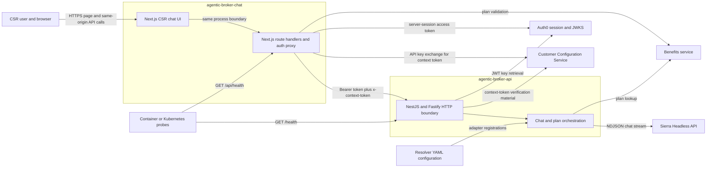
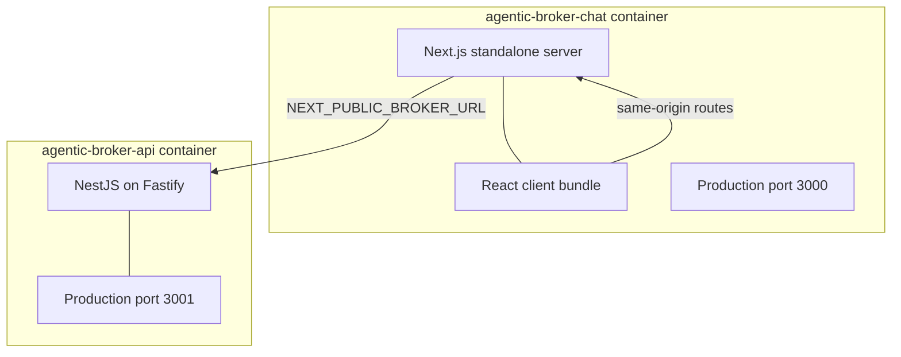
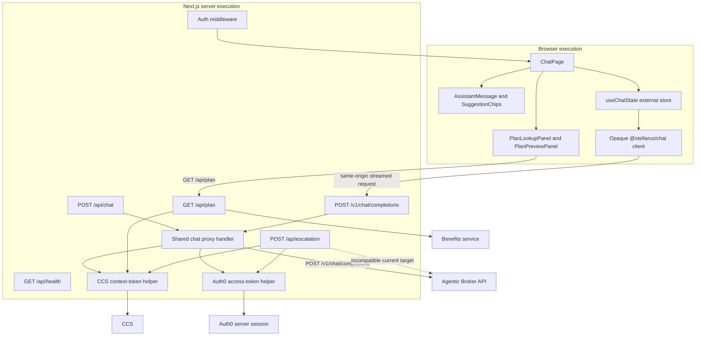
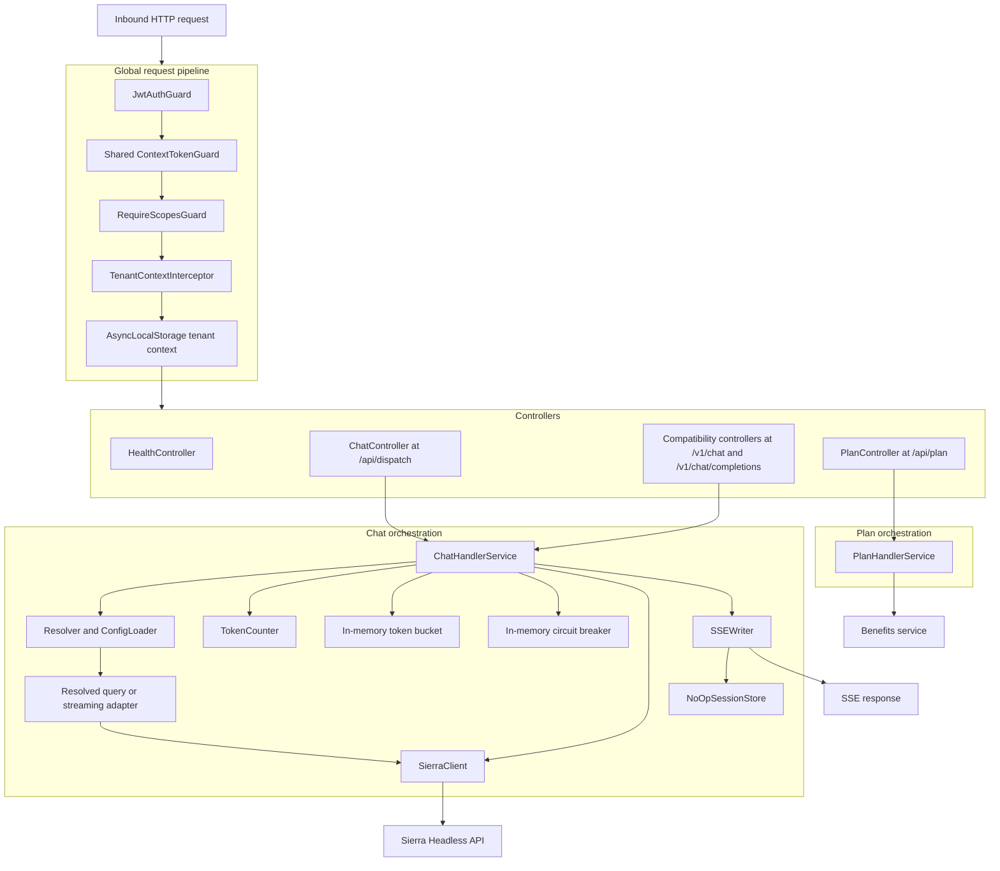
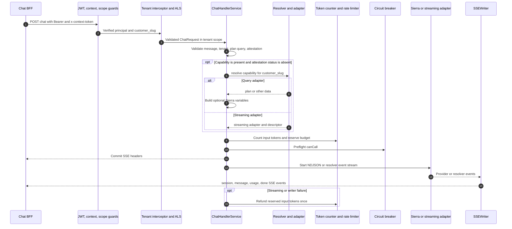
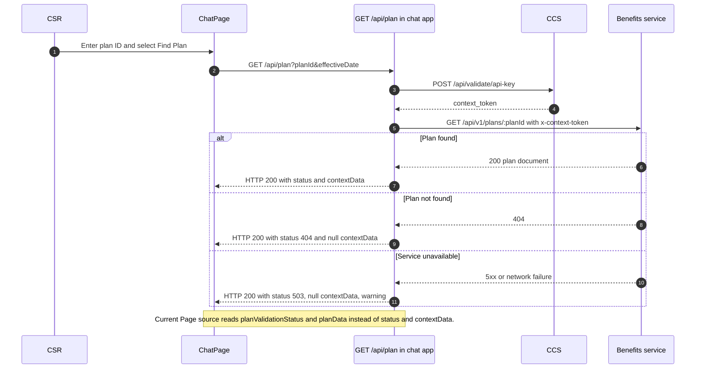
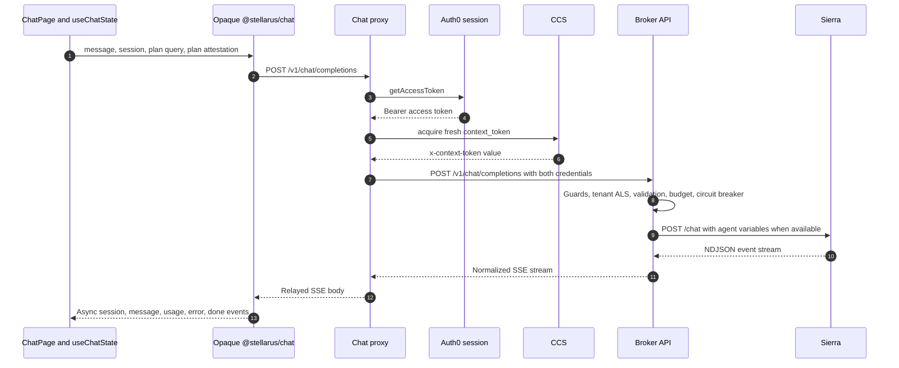
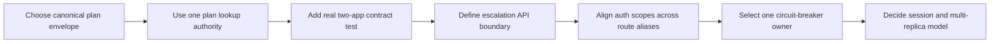

# Agentic Broker Architecture

**Status:** Current-state evaluation  
**Reviewed:** 2026-08-14  
**Scope:** `agentic-broker-api` and `agentic-broker-chat` only

## Scope and interpretation

This document describes the architecture evidenced by these two application directories:

- `stellarus-dev/stellarus-apps/apps/agentic-broker-api/`
- `stellarus-dev/stellarus-apps/apps/agentic-broker-chat/`

No implementation, configuration, or documentation outside those directories was used to infer behavior. Workspace packages imported by the applications—such as `@stellarus/auth`, `@stellarus/chat`, `@stellarus/resolver`, and `@stellarus/redactor`—are shown as opaque dependencies. Their internals are deliberately not described.

## Executive summary

The system has two independently deployable Node.js applications:

1. **Agentic Broker Chat** is a Next.js application containing the CSR browser experience and a server-side backend-for-frontend (BFF). The BFF owns browser-session authentication, obtains a fresh Customer Configuration Service (CCS) context token, performs plan lookup, and proxies streamed chat requests.
2. **Agentic Broker API** is a NestJS/Fastify orchestration service. It validates Auth0 identity and CCS tenant context, establishes request-local tenant state, optionally resolves a capability adapter, enforces token budgets and circuit-breaker state, calls Sierra or a resolved streaming adapter, and emits normalized Server-Sent Events (SSE).

The principal happy-path architecture is coherent: the browser never calls the broker directly, the BFF supplies both identity and tenant-context credentials, and the API separates preflight failures from post-commit stream failures. However, the current source contains two material cross-application contract breaks:

- Plan-attestation fields use incompatible names across the BFF route, browser page/hook, and broker API.
- The BFF escalation route targets a generic `/dispatch` JSON interface that the broker API does not expose in the observed implementation.

These gaps are represented explicitly below.

## Standalone Mermaid sources

Each embedded diagram is also available as an individual Mermaid source file:

- [System context](Agentic-Broker-Architecture-Diagrams/agentic-broker-system-context.mmd)
- [Deployment boundaries](Agentic-Broker-Architecture-Diagrams/agentic-broker-deployment-boundaries.mmd)
- [Agentic Broker Chat internals](Agentic-Broker-Architecture-Diagrams/agentic-broker-chat-internals.mmd)
- [Agentic Broker API internals](Agentic-Broker-Architecture-Diagrams/agentic-broker-api-internals.mmd)
- [Chat orchestration lifecycle](Agentic-Broker-Architecture-Diagrams/agentic-broker-chat-orchestration-sequence.mmd)
- [Plan-validation flow](Agentic-Broker-Architecture-Diagrams/agentic-broker-plan-validation-sequence.mmd)
- [Streamed chat flow](Agentic-Broker-Architecture-Diagrams/agentic-broker-streamed-chat-sequence.mmd)
- [Recommended target decisions](Agentic-Broker-Architecture-Diagrams/agentic-broker-recommended-decisions.mmd)

## System context

### Integration responsibilities

| Integration | Initiator | Purpose | Protocol and credential evidence |
|---|---|---|---|
| Browser → Chat BFF | Browser UI and `@stellarus/chat` client | Plan lookup and streamed chat | Same-origin HTTP; browser authentication is enforced by the Next.js auth middleware. |
| Chat BFF → Auth0 | `@stellarus/auth/server` | Obtain the user access token | Server-session helper; the implementation is outside scope. |
| Chat BFF → CCS | Shared `acquireCcsContextToken` helper | Exchange an API key for a fresh tenant context token | `POST /api/validate/api-key`; API key in JSON body and APIM shared secret in a header; five-second timeout. |
| Chat BFF → Benefits service | `GET /api/plan` handler | Validate and retrieve plan data | `GET /api/v1/plans/:planId`; fresh `x-context-token` on each request. |
| Chat BFF → Broker API | Chat proxy | Stream an agent response | `POST /v1/chat/completions`; Auth0 Bearer token plus CCS `x-context-token`; response body relayed as SSE. |
| Broker API → Auth0 | Global JWT guard | Validate caller identity | RS256 verification against one or two configured Auth0 JWKS issuers and a configured audience. |
| Broker API → CCS verification authority | Shared context-token guard | Validate tenant and scopes | CCS issuer, audience, and JWKS configuration are declared by the application; shared guard internals are outside scope. |
| Broker API → Benefits service | Broker plan handler or resolved adapter | Retrieve plan data | Broker `GET /api/plan` forwards the inbound context token. Adapter details beyond the broker directory are outside scope. |
| Broker API → Sierra | Sierra client or Sierra resolver adapter | Run the conversational agent | `POST {SIERRA_BASE_URL}/chat`; org API key in Bearer header, agent token in body, NDJSON response stream. |

## Deployment boundaries

The chat application is built as a Next.js standalone image. The API is compiled as a Node-targeted webpack bundle. Both images use Node 22 Alpine and run as non-root users.

## Agentic Broker Chat internals

### Browser state and behavior

- `ChatPage` owns plan identifier input, effective date input, current plan attestation, outage acknowledgement, input text, and lookup-in-flight state.
- Chat cannot be submitted until the plan gate reports success, or until the user explicitly acknowledges a plan-service outage.
- `useChatState` owns append-only user and assistant messages, stream state, errors, session identifier, token counts, and time-to-first-token.
- Each assistant message is grown incrementally from SSE `message` events. `session`, `usage`, `error`, and `done` events update their corresponding state.
- The hook deliberately avoids `localStorage` and `sessionStorage`; browser state is lost on reload.
- The browser-side chat client is configured with an empty broker base URL, forcing same-origin BFF routing instead of a direct cross-origin broker call.

### BFF request pipeline

For chat, the shared proxy handler performs these steps in order:

1. Parse JSON and validate a non-empty message.
2. Require the plan-attestation fields expected by the BFF contract.
3. Validate all required environment variables.
4. Obtain the Auth0 access token from the server session.
5. Obtain a fresh CCS context token; no token cache is used.
6. Forward the original request body to the broker with both credentials.
7. Relay a successful broker response as `text/event-stream`; map broker or network failures to JSON errors.

`POST /api/chat` and `POST /v1/chat/completions` are aliases over the same handler.

### Route inventory

| Route | Authentication boundary | Responsibility | Downstream dependency |
|---|---|---|---|
| `GET /` | Next.js auth middleware | CSR plan-aware chat interface | Same-origin BFF routes |
| `GET /api/health` | Explicitly public | Shallow readiness response | None |
| `GET /api/plan` | Auth middleware | Acquire CCS token, retrieve plan, return three-state attestation | CCS and Benefits service |
| `POST /api/chat` | Auth middleware plus server access-token retrieval | Alias for streamed chat proxy | CCS and Broker API |
| `POST /v1/chat/completions` | Auth middleware plus server access-token retrieval | Primary same-origin streamed chat proxy | CCS and Broker API |
| `POST /api/escalation` | Auth middleware plus server access-token retrieval | Retrieve conversation, redact it, and initiate escalation | CCS, opaque redactor package, intended broker dispatch interface |

## Agentic Broker API internals

### Global request lifecycle

1. The global JWT guard validates Auth0 issuer, audience, signature, and required identity claims, then attaches the authenticated principal.
2. The shared context-token guard validates `x-context-token` and attaches verified tenant claims.
3. The scope guard enforces route-declared scopes. Only `POST /api/dispatch` declares `chat:all` in the observed controllers.
4. The tenant interceptor reads `context.customer_slug` and creates an `AsyncLocalStorage` scope.
5. Controllers validate transport-level input and delegate to a service.

The public health route bypasses the identity and tenant guard chain. Its response confirms only that the process and router are responsive.

### Chat orchestration lifecycle

The handler intentionally divides work into two phases:

- **Preflight:** closed-state check, request validation, plan-attestation validation, optional resolver dispatch, token estimation, budget reservation, and circuit-breaker gate. Errors are still representable as ordinary HTTP responses.
- **Streaming:** SSE headers are committed, the provider stream begins, events are normalized, output tokens are counted, and failures are encoded into the stream. Once headers are committed, the handler does not try to replace the response with an HTTP error.

### Plan endpoint lifecycle

`GET /api/plan` is separately implemented by the broker API. It accepts `planId` and optional `effectiveDate`, forwards the already-validated inbound `x-context-token` to Benefits service, validates successful response bodies, and returns one of these attestation bodies under HTTP 200:

- `{ planValidationStatus: 200, planData: ... }`
- `{ planValidationStatus: 404, planData: null }`
- `{ planValidationStatus: 503, planData: null, warning: ... }`

Unexpected 4xx statuses and malformed successful bodies are mapped to HTTP 502; invalid requests map to 400; missing environment configuration maps to 500.

### Core runtime components

| Component | Role | State model |
|---|---|---|
| `ResolverModule` | Constructs a shared resolver, config loader, logger, and metrics service; loads adapter registrations from a configured directory or package defaults. | Global singleton; config loader watches registrations. |
| `SierraAdapter` | Registers `chat.completion` as a streaming resolver capability and translates Sierra events into resolver events. | Long-lived adapter with immutable descriptor and Sierra client reference. |
| `SierraClient` | Performs dual-auth Sierra requests and parses NDJSON incrementally. | Singleton; request state remains local; terminal `closed` flag. |
| `TokenCounter` | Estimates input tokens and accumulates streamed output tokens using `cl100k_base`. | New counter per chat request. |
| `RateLimiterService` | Enforces a token bucket keyed by `tenantId:budgetScope`; refunds reservations after stream failures. | In-memory, process-local map; configured for 10,000 tokens per 60 seconds by default. |
| `CircuitBreakerService` | Protects the Sierra provider with closed, open, and half-open behavior and exponential open-duration backoff. | In-memory, process-local provider state. |
| `SSEWriter` | Converts Sierra or resolver events to a stable SSE envelope and emits session and usage metadata. | New single-use writer per request. |
| `TenantContextService` | Makes verified `customer_slug` available through asynchronous call chains without passing it through every method. | Global service with request-local `AsyncLocalStorage`. |
| `SessionStoreService` | Implements an in-memory TTL session registry. | Present in source but not imported by `AppModule` or used by `ChatHandlerService`. |

## Plan-validation flow as currently implemented

The browser currently calls the chat application's plan endpoint directly. The broker API's own `GET /api/plan` implementation is not invoked by this flow.

## Streamed chat flow as currently intended

The scoped applications do not establish how the opaque `@stellarus/chat` package serializes its request object. Therefore, any field translation performed inside that package is unknown. This limitation does not remove the directly observable contract mismatch between the BFF's accepted wire body and the broker API's accepted wire body.

## State and data ownership

| State or data | Owner | Durability and isolation |
|---|---|---|
| Plan lookup inputs and attestation | Browser `ChatPage` | Component memory; reset on reload. |
| Conversation messages and stream metrics | Browser `useChatState` | Hook-local external store; no browser persistence. |
| Auth0 access token | Chat BFF server session helper | Opaque package behavior; not stored by scoped application code. |
| CCS context token | Chat BFF per request | Fresh token acquisition; no application cache. |
| Customer slug | Broker API tenant context | Verified request claim copied into per-request `AsyncLocalStorage`. |
| Token budget | Broker API rate limiter | In-memory and process-local; isolated by `tenantId:budgetScope`. |
| Circuit state | Broker API circuit breaker | In-memory and process-local per provider. |
| Resolver registrations | Broker API resolver/config loader | Global process state loaded from YAML configuration. |
| Sierra state | SSE writer plus no-op session store | State events are discarded in the live chat path; continuity is explicitly deferred. |
| Session identifier | Broker API SSE envelope and browser hook | Generated per request from tenant ID and time; retained by browser memory only. |

## Current-state evaluation

### Architectural strengths

1. **Clear browser/BFF/API separation.** The browser is kept away from broker credentials and direct broker networking.
2. **Dual-context authorization.** Auth0 represents who is calling; the CCS token represents tenant context and scopes. The broker validates them independently.
3. **Fail-fast tenant isolation.** Missing verified tenant context fails before capability dispatch instead of silently selecting a default tenant.
4. **Preflight-before-stream boundary.** Request, plan, budget, resolver, and circuit checks occur before SSE headers are committed.
5. **Provider abstraction.** Resolver configuration and adapter descriptors decouple capability selection from the chat orchestrator, while the Sierra client remains independently testable.
6. **Stream normalization.** Provider-specific NDJSON events are converted to a stable browser-facing SSE contract with session and usage events.
7. **Failure containment.** Rate limiting, circuit breaking, request timeouts, typed error mapping, and one-time budget refunds are explicitly modeled.
8. **Secret-handling intent.** Token values are forwarded verbatim where required but generally excluded from application logs and client error envelopes.

### Integration risks and gaps

#### R1 — Critical: plan-attestation wire contract is inconsistent

Four locally observable interfaces disagree:

| Producer or consumer | Expected field names |
|---|---|
| Chat BFF `GET /api/plan` response | `status`, `contextData` |
| Browser `ChatPage` response parser and hook call | `planValidationStatus`, `planData` |
| Chat BFF chat proxy request validator | `status`, `contextData` |
| Broker API chat request and preflight gate | `planValidationStatus`, `planQuery` |

Likely effects include the plan-success state failing to enable chat, the BFF rejecting a browser submission, or the broker skipping the intended attestation path and taking the resolver path instead. The chat package could perform some translation, but no translation can reconcile the direct `GET /api/plan` response-to-page mismatch because that fetch is implemented locally in `page.tsx`.

The tests also encode the split: the plan-route tests assert `status/contextData`, while the page-chain tests mock `planValidationStatus/planData`. Each side can pass independently without testing their actual integration.

**Recommendation:** define one shared wire envelope and use it unchanged across the plan route, page state, chat client request, BFF proxy, and broker DTO. If two domain models must remain, introduce one explicit, tested mapping function at the boundary and run an end-to-end test using the real route output as the page input.

#### R2 — Critical: escalation route is not compatible with the observed broker API

The chat BFF calls:

- `POST {NEXT_PUBLIC_BROKER_URL}/dispatch` with `{ capability: "conversation.history", payload: ... }`
- `POST {NEXT_PUBLIC_BROKER_URL}/dispatch` with `{ capability: "escalation.initiate", payload: ... }`

The broker exposes `POST /api/dispatch`, not `/dispatch`, because the `dispatch` controller is under the global `/api` prefix. More importantly, that controller accepts a chat body requiring `message`, delegates to the SSE chat handler, and does not expose a generic JSON request/response dispatch contract. The BFF escalation route expects ordinary JSON for both operations.

No value of `NEXT_PUBLIC_BROKER_URL` can make both the chat path (`/v1/chat/completions`) and escalation path (`/dispatch`) align with the observed API routes by simple concatenation.

**Recommendation:** either implement and document a dedicated broker escalation/conversation API, or change the BFF to target an existing, contract-compatible interface. Add a cross-application test that boots the actual broker controllers rather than mocking a generic dispatch server.

#### R3 — High: plan lookup is duplicated and has already drifted

Both applications implement a direct Benefits service lookup, context-token forwarding, schema validation, and three-state attestation mapping. The chat UI uses the BFF version; no chat-app path calls the broker version. The two implementations return different field names, demonstrating active contract drift.

**Recommendation:** select one authority. Prefer either routing the BFF through the broker's `GET /api/plan` or removing the unused broker endpoint. If both must exist for distinct clients, generate both envelopes from one explicitly versioned contract.

#### R4 — High: compatibility chat routes do not declare the dispatch scope

`POST /api/dispatch` declares `@RequireScopes('chat:all')`. The compatibility routes `/v1/chat` and `/v1/chat/completions` do not. The current chat BFF uses `/v1/chat/completions`, so it receives JWT and context-token validation but not the controller-declared `chat:all` scope check.

**Recommendation:** confirm whether the omission is intentional compatibility policy. If it is not, apply equivalent scope metadata to all contract-equal chat routes and add a route-matrix authorization test.

#### R5 — Medium: the Sierra circuit breaker is gated twice

`ChatHandlerService` calls `canCall('sierra')` during preflight, and `SierraClient.chat()` calls the same circuit breaker again before its HTTP request. This preserves a strong preflight check but can double-count admission attempts, particularly in half-open state.

**Recommendation:** choose one admission owner. A clean split is for the Sierra client to own circuit state completely while the handler maps pre-commit client admission errors to HTTP responses.

#### R6 — Medium: session continuity code exists but is not connected

The repository includes a TTL-based `SessionStoreService`, but `AppModule` does not import it and `ChatHandlerService` constructs a `NoOpSessionStore` for every request. Sierra `state` events are therefore discarded. Rate-limit and circuit-breaker state are also process-local.

**Recommendation:** treat this explicitly as a single-instance/stateless-chat constraint, or wire a session provider and define multi-replica consistency requirements before relying on conversation continuity or globally consistent quotas.

#### R7 — Medium: current tests isolate contracts instead of exercising the seams

The strongest test coverage is contract-oriented within each component, but divergent fixtures allow incompatible boundaries to remain green. The same issue appears in escalation tests, which mock a broker shape not exposed by the broker application.

**Recommendation:** add a minimal two-app compatibility suite covering:

1. real BFF plan-route response → real page parser/state transition;
2. real hook serialization → real BFF validator → real broker DTO;
3. real BFF escalation request → real broker route;
4. authorization equivalence across all chat aliases.

#### R8 — Low: health endpoints are shallow

Both health routes return process-local success without checking Auth0 JWKS, CCS, Benefits service, Sierra, resolver readiness, or internal budget/circuit subsystems. This is suitable for liveness but not full readiness.

**Recommendation:** keep the shallow endpoint for liveness and add a separate readiness contract if deployment orchestration needs dependency-aware routing.

## Recommended target decisions

The highest-leverage first change is the canonical plan envelope because it affects the plan route, browser state machine, chat serialization, broker preflight, and Sierra grounding behavior. The escalation interface is the next independent blocking decision.

## Source evidence index

The main architectural claims are grounded in these files inside the two scoped applications:

### Agentic Broker Chat

- `src/app/page.tsx` — browser plan gate, message composition, and submit flow
- `src/hooks/use-chat-state.ts` — browser chat state and SSE event processing
- `src/app/api/chat/proxy-handler.ts` — BFF validation, Auth0/CCS acquisition, broker proxying
- `src/lib/ccs/acquire-context-token.ts` — CCS token exchange
- `src/app/api/plan/route.ts` — direct Benefits service lookup and attestation envelope
- `src/app/api/escalation/route.ts` — conversation retrieval, redaction, and escalation intent
- `src/proxy.ts` — Next.js route authentication boundary
- `package.json`, `next.config.js`, `Dockerfile`, `project.json` — runtime and deployment model

### Agentic Broker API

- `src/main.ts`, `src/app.module.ts` — HTTP bootstrap, route prefix, and root dependency graph
- `src/auth/*` — Auth0 JWT and scope enforcement
- `src/common/context/*` — verified tenant context and `AsyncLocalStorage`
- `src/chat-handler/*` — transport shaping and two-phase chat orchestration
- `src/resolver/resolver.module.ts`, `src/adapters/sierra-adapter.ts` — capability resolution and Sierra adapter registration
- `src/sierra-client/*` — Sierra dual-auth NDJSON client
- `src/sse-writer/*` — provider-to-SSE event normalization
- `src/rate-limiter/*`, `src/circuit-breaker/*`, `src/token-counter/*` — resilience and accounting
- `src/plan/*` — broker-owned plan lookup endpoint
- `src/session-store/*` — currently unwired in-memory session implementation
- `package.json`, `Dockerfile`, `project.json` — runtime and deployment model
