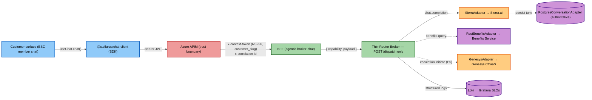
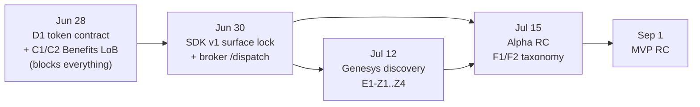

# Compass Platform — Architecture Overview

> Multi-tenant conversational AI platform. First customer: BSC member chat. MVP gate: Sep 1 2026. Owner: Jason Jackson.
>
> **Thesis**: Ship BSC member chat through Stellarus primitives (SDK + Broker), not a vendor one-off. The SDK and Broker are the platform moat. Every external system sits behind a Stellarus-owned adapter.

---

## Runtime Path

**Trust spine**: Auth0 PKCE → APIM validates → CCS mints RS256 context token → `ContextTokenGuard` re-verifies on every internal hop. `customer_slug` is resolved at APIM/CCS, never client-supplied, and drives all tenant scoping.

---

## The Six Projects

| # | Project | Lead | Target | Gate |
|---|---------|------|--------|------|
| P1 | SDK / `@stellarus/chat-client` — Auth0 PKCE, `StellarusProvider`, `useChat`, `fetchPlan` | Julie Hughes | Aug 15 | SDK v2 blocked on E1 |
| P2 | Thin-Router Broker — `POST /dispatch`, YAML adapters, `PostgresConversationAdapter` | Jason | Aug 15 | — |
| P3 | Benefits Grounding — `RestBenefitsAdapter`, LoB coverage/fallback | Jason | Aug 15 | **Jun 28** (C1/C2 Benefits LoB) |
| P4 | Tenant/Auth Spine — CCS context-token contract, `chat` scope, RS256 JWKS | Jason | Jul 15 | **Jun 28** (D1 token contract) |
| P5 | Escalation — PII/PHI Redactor (fail-closed), `GenesysAdapter`, SDK v2 event shape | Julie Hughes | Aug 15 | BLOCKED on BSC/PTP (E1-Z1..Z4) |
| P6 | Telemetry — Loki-only SLOs (5 groups), F1 launch gates, Jason sign-off | Jason | Aug 25 | Thresholds TBD (ACT-JASON) |

---

## Critical Path

---

## Platform Boundaries

| Compass Platform **owns** | Compass Platform does **NOT** own |
|---|---|
| Edge trust boundary — `customer_slug` in CCS RS256 token | The AI model — Sierra.ai is runtime-only, behind `SierraAdapter` |
| SDK surface (`@stellarus/chat-client`) — PKCE, streaming, plan lookup | Human auth — Auth0 authenticates humans; CCS does not |
| Capability-neutral routing — `POST /dispatch` + YAML adapter registry | Benefits data of record — Benefits Service is the governed source |
| Authoritative conversation store — `PostgresConversationAdapter`, per-tenant Postgres | Live contact center — Genesys CCaaS, behind `GenesysAdapter` |
| PII/PHI redaction gate — mandatory fail-closed before any external transmission | Semantic routing — BFF apps own per-surface routes; broker never does |
| Launch telemetry + SLOs + F1 go/no-go evidence chain | |

---

## Hard Invariants (non-negotiable review gates)

| ID | Rule |
|---|---|
| **INV-01** | Broker exposes `POST /dispatch` only. Any named semantic endpoint on `agentic-broker-api` = architectural violation (drift guard). |
| **INV-02** | Broker never references `chat`, `benefits`, or any capability by name in routing logic. All capabilities are opaque strings resolved via YAML. |
| **INV-06** | `PostgresConversationAdapter` is the authoritative conversation store. Sierra native session storage is NOT the source of truth. |
| **INV-08** | Rate limiter operates on `customer_slug` from the verified context token. Never on IP or API key alone. |
| **E1E2-INV-01** | PII/PHI Redactor is a mandatory fail-closed gate. Scrub failure cancels escalation. Nothing reaches Genesys without passing `scrub()`. |
| **CL16** | No credential in any image, env var, or text file. All secrets resolve from Azure Key Vault via `DefaultAzureCredential` at runtime. |

---

## Open Decisions (blocking)

| # | Decision | Owner | Blocks |
|---|---|---|---|
| D1 | `chat` scope persona grants + `0003_chat_scopes.sql` (IRREVERSIBLE) | Ketema / Jason | Broker `@RequireScopes('chat')`, SDK scopes, Benefits RS256 — **everything downstream** |
| C1/C2 | Benefits LoB coverage matrix + fallback A/B/C | Jason + Data/App | Benefits grounding accuracy; Jun 28 gate |
| E1-Z1..Z4 | Genesys API mechanics, routing metadata, PII allow-list, SLA | Julie + BSC/PTP | All of P5 escalation |
| F1-Z1 | SLO threshold values (all TBD) | Jason (due Jul 15) | Dashboard build; every F1 launch gate |
